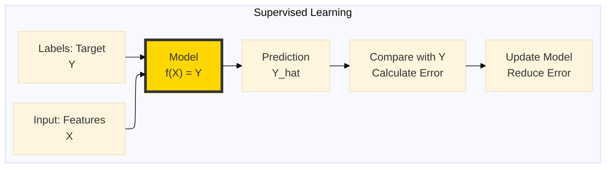
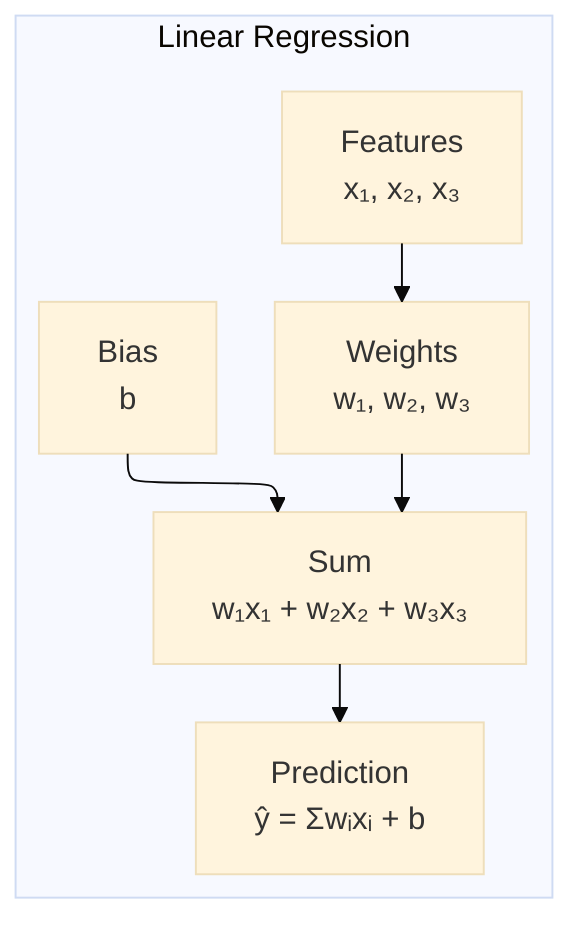
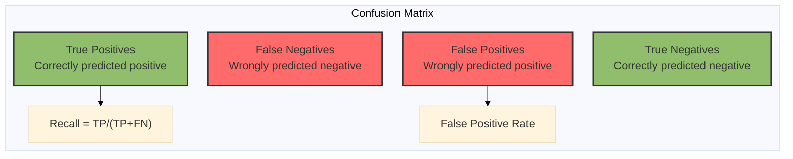
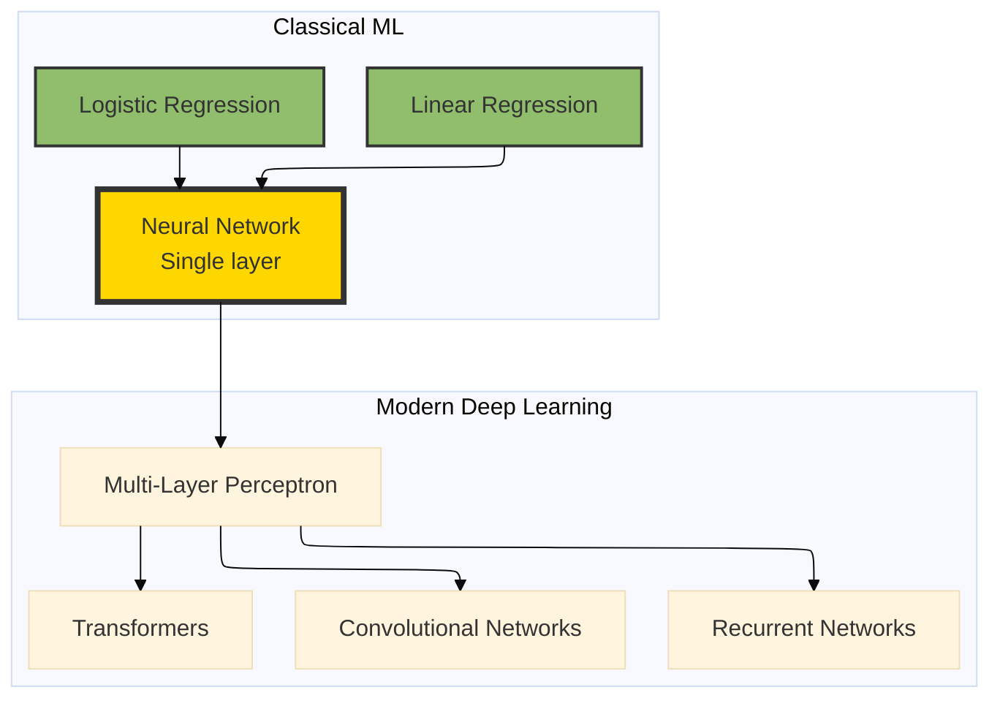

# The 2026 AI Metromap: Regression & Classification – The Grand Central Station of AI

## Series B: Supervised Learning Line | Story 1 of 4


## 📖 Introduction

**Welcome to the Supervised Learning Line—the classic route that built modern AI.**

You've completed Foundations Station. You have the terminal skills, the linear algebra intuition, the data cleaning expertise, and the ethics framework. You're ready to ride the express lines.

Now it's time to start with the line that started it all.

Before Transformers. Before LLMs. Before diffusion models. There was supervised learning—the foundation upon which everything else is built. Every modern AI system, no matter how complex, still uses the core principles you'll learn here.

Regression and classification are the **Grand Central Station of AI**. Every line passes through here. Every AI professional needs to understand them—not just because they're still used daily, but because they teach you the language of learning itself.

This story—**The 2026 AI Metromap: Regression & Classification – The Grand Central Station of AI**—is your introduction to supervised learning. We'll build linear regression from scratch with gradient descent. We'll understand classification through logistic regression. We'll master evaluation metrics that every AI engineer uses. And we'll connect these classical techniques to the modern deep learning you'll encounter later.

**Let's arrive at Grand Central.**

---

## 📚 Where You Are in the Journey

### The Master Story Arc: The 2026 AI Metromap Series (Complete)

- 🗺️ **[The 2026 AI Metromap: Why the Old Learning Routes Are Obsolete](#)** – A paradigm shift from linear learning to transit-system mastery.
- 🧭 **[The 2026 AI Metromap: Reading the Map](#)** – Strategic navigation across the three core lines.
- 🎒 **[The 2026 AI Metromap: Avoiding Derailments](#)** – Diagnosing and preventing the most common learning pitfalls.
- 🏁 **[The 2026 AI Metromap: From Passenger to Driver](#)** – Building your portfolio using the Metromap structure.

### Series A: Foundations Station (Complete)

- 🏗️ **[The 2026 AI Metromap: Foundations Station – Why Data Cleaning and Git Are Your Board Games, Not Just Chores](#)**
- 🖥️ **[The 2026 AI Metromap: Command Line & Version Control – Navigating the Terminal Like a Conductor](#)**
- 🧮 **[The 2026 AI Metromap: Linear Algebra for ML – The Language of the Map](#)**
- 📊 **[The 2026 AI Metromap: Data Cleaning & Visualization – Turning Raw Data into Tracks](#)**
- 🔄 **[The 2026 AI Metromap: Ethics & Responsible AI – The Safety Systems of the Metro](#)**

### Series B: Supervised Learning Line (4 Stories)

- 📊 **The 2026 AI Metromap: Regression & Classification – The Grand Central Station of AI** – Linear regression from scratch; logistic regression; evaluation metrics; connecting classical ML to modern deep learning. **⬅️ YOU ARE HERE**

- 🧬 **[The 2026 AI Metromap: Neural Network Architecture – From Perceptron to MLP](#)** – The biological inspiration; perceptron implementation; multi-layer perceptrons; forward propagation; universal approximation theorem. 🔜 *Up Next*

- ⚡ **[The 2026 AI Metromap: Activation Functions & Backpropagation – The Electrical Grid of the Network](#)** – Sigmoid, tanh, ReLU, Leaky ReLU, Swish, GELU; the chain rule explained visually; backpropagation step-by-step; vanishing and exploding gradients.

- 🎯 **[The 2026 AI Metromap: Loss Functions & Optimization – Navigating to the Minimum](#)** – Cross-entropy, MSE, MAE, Huber loss; gradient descent variants (SGD, Momentum, Adam, AdamW); learning rate schedules.

### The Complete Story Catalog

For a complete view of all upcoming stories across every series, visit the **[Complete 2026 AI Metromap Story Catalog](#)**.

---

## 🚂 What Is Supervised Learning?

At its core, supervised learning is simple: **Learn a mapping from inputs to outputs using labeled examples.**



**Two Main Types:**

| Type | What It Does | Example |
|------|--------------|---------|
| **Regression** | Predicts a continuous number | House price: $450,000 |
| **Classification** | Predicts a category | Spam: Yes/No |

---

## 📈 Regression: Predicting Continuous Values

### The Problem

You have a house with 3 bedrooms, 2 bathrooms, and 2,000 square feet. What's it worth?

Regression finds the relationship between features (bedrooms, bathrooms, sqft) and the target (price).

### Linear Regression: The Simplest Model



**The Equation:**
```
ŷ = w₁x₁ + w₂x₂ + w₃x₃ + b
```

### Building Linear Regression from Scratch

```python
import numpy as np
import matplotlib.pyplot as plt
from sklearn.datasets import make_regression
from sklearn.model_selection import train_test_split

class LinearRegression:
    """
    Linear Regression trained with Gradient Descent.
    This is the foundation of all neural networks.
    """
    
    def __init__(self, learning_rate=0.01, n_iterations=1000):
        self.lr = learning_rate
        self.n_iterations = n_iterations
        self.weights = None
        self.bias = None
        self.loss_history = []
    
    def fit(self, X, y):
        """
        Train the model using gradient descent.
        
        Args:
            X: Training features (n_samples, n_features)
            y: Training targets (n_samples,)
        """
        n_samples, n_features = X.shape
        
        # Initialize weights and bias
        self.weights = np.zeros(n_features)
        self.bias = 0
        
        # Gradient descent
        for i in range(self.n_iterations):
            # Forward pass: make predictions
            y_pred = self.predict(X)
            
            # Calculate loss (Mean Squared Error)
            loss = np.mean((y_pred - y) ** 2)
            self.loss_history.append(loss)
            
            # Backward pass: calculate gradients
            # ∂L/∂w = (2/n) * X^T * (y_pred - y)
            dw = (2 / n_samples) * X.T @ (y_pred - y)
            # ∂L/∂b = (2/n) * sum(y_pred - y)
            db = (2 / n_samples) * np.sum(y_pred - y)
            
            # Update parameters
            self.weights -= self.lr * dw
            self.bias -= self.lr * db
            
            # Print progress
            if i % 100 == 0:
                print(f"Iteration {i}: Loss = {loss:.4f}")
    
    def predict(self, X):
        """Make predictions"""
        return X @ self.weights + self.bias
    
    def score(self, X, y):
        """R² score (coefficient of determination)"""
        y_pred = self.predict(X)
        ss_res = np.sum((y - y_pred) ** 2)
        ss_tot = np.sum((y - np.mean(y)) ** 2)
        return 1 - (ss_res / ss_tot)

# Generate synthetic data
X, y = make_regression(n_samples=100, n_features=1, noise=20, random_state=42)
X_train, X_test, y_train, y_test = train_test_split(X, y, test_size=0.2, random_state=42)

# Train model
model = LinearRegression(learning_rate=0.1, n_iterations=500)
model.fit(X_train, y_train)

# Evaluate
train_score = model.score(X_train, y_train)
test_score = model.score(X_test, y_test)

print(f"\nTrain R² Score: {train_score:.4f}")
print(f"Test R² Score: {test_score:.4f}")

# Visualize
plt.figure(figsize=(12, 4))

plt.subplot(1, 2, 1)
plt.scatter(X_train, y_train, alpha=0.6, label='Training Data')
plt.scatter(X_test, y_test, alpha=0.6, color='orange', label='Test Data')
X_line = np.linspace(X.min(), X.max(), 100).reshape(-1, 1)
y_line = model.predict(X_line)
plt.plot(X_line, y_line, 'r-', label='Linear Regression', linewidth=2)
plt.xlabel('Feature')
plt.ylabel('Target')
plt.title('Linear Regression Fit')
plt.legend()

plt.subplot(1, 2, 2)
plt.plot(model.loss_history)
plt.xlabel('Iteration')
plt.ylabel('Loss (MSE)')
plt.title('Training Loss')
plt.yscale('log')
plt.grid(True, alpha=0.3)

plt.tight_layout()
plt.show()
```

**What Just Happened?**

- **Forward pass** – Made predictions using current weights
- **Loss calculation** – Measured how wrong we were (MSE)
- **Backward pass** – Calculated gradients (which direction to move weights)
- **Update** – Moved weights slightly in the direction that reduces loss

This is exactly how neural networks learn—just with more layers.

---

## 🏷️ Classification: Predicting Categories

### The Problem

You have customer data. Will they churn? Yes or no?

Classification finds the decision boundary that separates categories.

### Logistic Regression: Classification's Foundation

Despite the name, logistic regression is a **classification** algorithm. It predicts the probability of belonging to a class.

```mermaid
---
config:
  theme: base
  layout: elk
---
graph TD
    subgraph LogisticRegression["Logistic Regression"]
        X["Features\nx&#8321;, x&#8322;, x&#8323;"] --> Z["Linear Combination\nz = Σw&#8320;x&#8320; + b"]
        Z --> S["Sigmoid Function\nσ(z) = 1/(1+e⁻ᶻ)"]
        S --> P["Probability\nP(y=1|x)"]
        P --> D["Decision\nIf P > 0.5 → Class 1"]
    end

```



**The Sigmoid Function:** Squashes any real number into a probability between 0 and 1.

```python
import numpy as np
import matplotlib.pyplot as plt

def sigmoid(z):
    """Sigmoid function: squashes any real number to (0, 1)"""
    return 1 / (1 + np.exp(-z))

# Visualize sigmoid
z = np.linspace(-10, 10, 100)
s = sigmoid(z)

plt.figure(figsize=(10, 4))

plt.subplot(1, 2, 1)
plt.plot(z, s, 'b-', linewidth=2)
plt.axhline(y=0.5, color='r', linestyle='--', alpha=0.5)
plt.axvline(x=0, color='r', linestyle='--', alpha=0.5)
plt.xlabel('z (linear combination)')
plt.ylabel('σ(z)')
plt.title('Sigmoid Function')
plt.grid(True, alpha=0.3)

plt.subplot(1, 2, 2)
plt.plot(z, s, 'b-', linewidth=2)
plt.fill_between(z, 0, s, where=(s >= 0.5), color='green', alpha=0.3, label='Predict Class 1')
plt.fill_between(z, 0, s, where=(s < 0.5), color='red', alpha=0.3, label='Predict Class 0')
plt.xlabel('z')
plt.ylabel('σ(z)')
plt.title('Decision Boundary at z=0')
plt.legend()
plt.grid(True, alpha=0.3)

plt.tight_layout()
plt.show()
```

### Building Logistic Regression from Scratch

```python
import numpy as np
from sklearn.datasets import make_classification
from sklearn.model_selection import train_test_split
from sklearn.metrics import accuracy_score, confusion_matrix

class LogisticRegression:
    """
    Logistic Regression trained with Gradient Descent.
    The foundation of binary classification.
    """
    
    def __init__(self, learning_rate=0.01, n_iterations=1000):
        self.lr = learning_rate
        self.n_iterations = n_iterations
        self.weights = None
        self.bias = None
        self.loss_history = []
    
    def sigmoid(self, z):
        """Sigmoid activation function"""
        return 1 / (1 + np.exp(-z))
    
    def fit(self, X, y):
        """
        Train the model using gradient descent.
        
        Args:
            X: Training features (n_samples, n_features)
            y: Training targets (n_samples,) with values 0 or 1
        """
        n_samples, n_features = X.shape
        
        # Initialize parameters
        self.weights = np.zeros(n_features)
        self.bias = 0
        
        # Gradient descent
        for i in range(self.n_iterations):
            # Forward pass: linear combination + sigmoid
            linear_output = X @ self.weights + self.bias
            y_pred = self.sigmoid(linear_output)
            
            # Calculate loss (Binary Cross-Entropy)
            # L = -[y·log(ŷ) + (1-y)·log(1-ŷ)]
            loss = -np.mean(y * np.log(y_pred + 1e-8) + 
                           (1 - y) * np.log(1 - y_pred + 1e-8))
            self.loss_history.append(loss)
            
            # Backward pass: calculate gradients
            # ∂L/∂w = (1/n) * X^T * (ŷ - y)
            dw = (1 / n_samples) * X.T @ (y_pred - y)
            # ∂L/∂b = (1/n) * sum(ŷ - y)
            db = (1 / n_samples) * np.sum(y_pred - y)
            
            # Update parameters
            self.weights -= self.lr * dw
            self.bias -= self.lr * db
            
            # Print progress
            if i % 100 == 0:
                print(f"Iteration {i}: Loss = {loss:.4f}")
    
    def predict_proba(self, X):
        """Predict probabilities"""
        linear_output = X @ self.weights + self.bias
        return self.sigmoid(linear_output)
    
    def predict(self, X, threshold=0.5):
        """Predict class labels"""
        probabilities = self.predict_proba(X)
        return (probabilities >= threshold).astype(int)
    
    def score(self, X, y):
        """Accuracy score"""
        y_pred = self.predict(X)
        return accuracy_score(y, y_pred)

# Generate synthetic classification data
X, y = make_classification(
    n_samples=500, 
    n_features=2, 
    n_redundant=0, 
    n_clusters_per_class=1,
    random_state=42
)

X_train, X_test, y_train, y_test = train_test_split(X, y, test_size=0.2, random_state=42)

# Train model
model = LogisticRegression(learning_rate=0.1, n_iterations=500)
model.fit(X_train, y_train)

# Evaluate
train_acc = model.score(X_train, y_train)
test_acc = model.score(X_test, y_test)

print(f"\nTrain Accuracy: {train_acc:.4f}")
print(f"Test Accuracy: {test_acc:.4f}")

# Visualize decision boundary
def plot_decision_boundary(X, y, model):
    """Plot the decision boundary of the classifier"""
    x_min, x_max = X[:, 0].min() - 0.5, X[:, 0].max() + 0.5
    y_min, y_max = X[:, 1].min() - 0.5, X[:, 1].max() + 0.5
    xx, yy = np.meshgrid(np.arange(x_min, x_max, 0.02),
                         np.arange(y_min, y_max, 0.02))
    Z = model.predict(np.c_[xx.ravel(), yy.ravel()])
    Z = Z.reshape(xx.shape)
    
    plt.figure(figsize=(12, 4))
    
    plt.subplot(1, 2, 1)
    plt.contourf(xx, yy, Z, alpha=0.3, cmap='RdYlBu')
    plt.scatter(X_train[:, 0], X_train[:, 1], c=y_train, cmap='RdYlBu', edgecolors='k')
    plt.xlabel('Feature 1')
    plt.ylabel('Feature 2')
    plt.title('Training Data + Decision Boundary')
    
    plt.subplot(1, 2, 2)
    plt.plot(model.loss_history)
    plt.xlabel('Iteration')
    plt.ylabel('Binary Cross-Entropy Loss')
    plt.title('Training Loss')
    plt.grid(True, alpha=0.3)
    
    plt.tight_layout()
    plt.show()

plot_decision_boundary(X_train, y_train, model)
```

---

## 📊 Evaluation Metrics: How to Measure Success

Accuracy isn't always enough. Here's the metrics toolkit every AI engineer needs.



### Essential Metrics

```python
from sklearn.metrics import (
    accuracy_score, precision_score, recall_score, f1_score,
    roc_auc_score, roc_curve, confusion_matrix, classification_report
)
import matplotlib.pyplot as plt
import seaborn as sns

# Make predictions
y_pred = model.predict(X_test)
y_pred_proba = model.predict_proba(X_test)

# 1. Accuracy: Overall correctness
acc = accuracy_score(y_test, y_pred)
print(f"Accuracy: {acc:.4f}")

# 2. Precision: Of predicted positives, how many were correct?
# Important when false positives are costly (e.g., spam detection)
precision = precision_score(y_test, y_pred)
print(f"Precision: {precision:.4f}")

# 3. Recall: Of actual positives, how many did we catch?
# Important when false negatives are costly (e.g., disease detection)
recall = recall_score(y_test, y_pred)
print(f"Recall: {recall:.4f}")

# 4. F1 Score: Harmonic mean of precision and recall
f1 = f1_score(y_test, y_pred)
print(f"F1 Score: {f1:.4f}")

# 5. ROC-AUC: Ability to separate classes across thresholds
auc = roc_auc_score(y_test, y_pred_proba)
print(f"ROC-AUC: {auc:.4f}")

# 6. Classification Report (all metrics at once)
print("\nClassification Report:")
print(classification_report(y_test, y_pred, target_names=['No Churn', 'Churn']))

# 7. Confusion Matrix Visualization
cm = confusion_matrix(y_test, y_pred)

plt.figure(figsize=(8, 6))
sns.heatmap(cm, annot=True, fmt='d', cmap='Blues', 
            xticklabels=['No Churn', 'Churn'],
            yticklabels=['No Churn', 'Churn'])
plt.xlabel('Predicted')
plt.ylabel('Actual')
plt.title('Confusion Matrix')
plt.show()

# 8. ROC Curve
fpr, tpr, thresholds = roc_curve(y_test, y_pred_proba)

plt.figure(figsize=(8, 6))
plt.plot(fpr, tpr, 'b-', linewidth=2, label=f'ROC Curve (AUC = {auc:.3f})')
plt.plot([0, 1], [0, 1], 'r--', label='Random Classifier')
plt.xlabel('False Positive Rate')
plt.ylabel('True Positive Rate')
plt.title('ROC Curve')
plt.legend()
plt.grid(True, alpha=0.3)
plt.show()
```

### When to Use Which Metric

| Scenario | Best Metric | Why |
|----------|-------------|-----|
| Balanced classes | Accuracy | Simple, interpretable |
| Imbalanced classes | F1 Score | Balances precision and recall |
| Spam detection | Precision | False positives annoy users |
| Disease screening | Recall | False negatives risk lives |
| Ranking problems | ROC-AUC | Threshold-independent |
| Multi-class | Macro F1 | Averages across classes |

---

## 🔗 Connecting Classical to Modern Deep Learning

Everything you just built is the foundation of modern neural networks.



**The Connection:**

- **Linear regression** = Neural network with 1 layer, linear activation
- **Logistic regression** = Neural network with 1 layer, sigmoid activation
- **Neural networks** = Stacked linear regressions with non-linear activations

You already know how neural networks learn. You just built the simplest one. The rest is stacking more layers.

---

## 📊 Takeaway from This Story

**What You Learned:**

- **Supervised Learning** – Learning mappings from inputs to outputs using labeled examples. Two main types: regression (continuous values) and classification (categories).

- **Linear Regression** – The simplest model. Predicts continuous values. Trained with gradient descent to minimize mean squared error.

- **Logistic Regression** – Classification model. Uses sigmoid to output probabilities. Trained to minimize binary cross-entropy.

- **Evaluation Metrics** – Accuracy, precision, recall, F1, ROC-AUC. Choose based on your problem and class balance.

- **The Connection** – Everything you built is the foundation of modern neural networks. You're already 80% of the way to deep learning.

---

## 🔗 Navigation

- **⬅️ Previous Story:** [The 2026 AI Metromap: Ethics & Responsible AI – The Safety Systems of the Metro](#) – The final story of Foundations Station.

- **📚 Series B Catalog:** [Series B: Supervised Learning Line](#) – View all 4 stories in this series.

- **📚 Complete Story Catalog:** [Complete 2026 AI Metromap Story Catalog](#) – Your navigation guide to all 39+ stories.

- **➡️ Next Story:** **[The 2026 AI Metromap: Neural Network Architecture – From Perceptron to MLP](#)** – The biological inspiration; perceptron implementation; multi-layer perceptrons; forward propagation; universal approximation theorem.

---

## 📝 Your Invitation

Before the next story arrives, practice your supervised learning skills:

1. **Implement from scratch** – Don't use sklearn. Write your own linear and logistic regression.

2. **Experiment with learning rates** – What happens when learning rate is too high? Too low?

3. **Visualize loss curves** – Understand when your model is converging or diverging.

4. **Apply to real data** – Use a dataset from Kaggle. Build models. Evaluate properly.

**You've arrived at Grand Central. Now it's time to build the network.**

---

*Found this helpful? Clap, comment, and share your first regression or classification model. Next stop: Neural Network Architecture!* 🚇