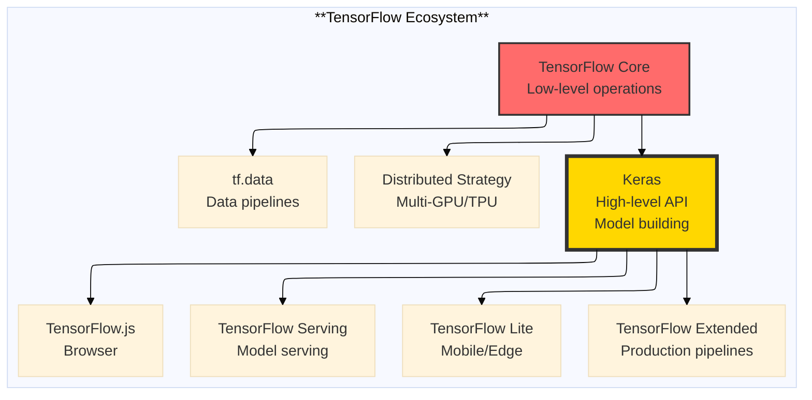

# The 2026 AI Metromap: TensorFlow & Keras – The Production-Ready Alternative

## Series D: Engineering & Optimization Yard | Story 2 of 5


## 📖 Introduction

**Welcome to the second stop in the Engineering & Optimization Yard.**

In our last story, we mastered PyTorch—the locomotive of modern AI research. We built models from scratch, created custom training loops, and scaled with distributed training. PyTorch is the research darling—flexible, Pythonic, and beloved by academics.

But there's another world. The world of production.

When you need to deploy a model to billions of users, when you need to serve predictions at scale, when you need to run on mobile devices—PyTorch isn't always the answer. That's where TensorFlow comes in.

TensorFlow isn't just a framework. It's an ecosystem. From training to deployment, from cloud to mobile, from Python to JavaScript—TensorFlow is built for production. And at its heart is Keras—the high-level API that makes building models as simple as stacking Lego bricks.

This story—**The 2026 AI Metromap: TensorFlow & Keras – The Production-Ready Alternative**—is your journey into the framework that powers production AI at Google, Uber, Airbnb, and thousands of other companies. We'll understand the TensorFlow ecosystem. We'll build models with Keras—from simple to complex. We'll master tf.data—the secret to efficient data pipelines. And we'll deploy models to production with TensorFlow Serving and TensorFlow Lite.

**Let's go production-ready.**

---

## 📚 Where You Are in the Journey

### The Master Story Arc: The 2026 AI Metromap Series (Complete)

- 🗺️ **[The 2026 AI Metromap: Why the Old Learning Routes Are Obsolete](#)** – A paradigm shift from linear learning to transit-system mastery.
- 🧭 **[The 2026 AI Metromap: Reading the Map](#)** – Strategic navigation across the three core lines.
- 🎒 **[The 2026 AI Metromap: Avoiding Derailments](#)** – Diagnosing and preventing the most common learning pitfalls.
- 🏁 **[The 2026 AI Metromap: From Passenger to Driver](#)** – Building your portfolio using the Metromap structure.

### Series A: Foundations Station (Complete)
### Series B: Supervised Learning Line (Complete)
### Series C: Modern Architecture Line (Complete)

### Series D: Engineering & Optimization Yard (5 Stories)

- 🔧 **[The 2026 AI Metromap: PyTorch Mastery – The Locomotive of Modern AI](#)** – Tensors and autograd; nn.Module; custom layers; dataloaders; training loops; saving and loading models; TensorBoard.

- 🏭 **The 2026 AI Metromap: TensorFlow & Keras – The Production-Ready Alternative** – Eager execution vs graph mode; tf.data for pipelines; Keras API; TensorFlow Serving; TensorFlow Lite for edge deployment. **⬅️ YOU ARE HERE**

- ⚡ **[The 2026 AI Metromap: Model Optimization – Keeping the Train on Time](#)** – Quantization (INT8, FP16); pruning; knowledge distillation; model compression; inference optimization with ONNX, TensorRT, and OpenVINO. 🔜 *Up Next*

- 🛡️ **[The 2026 AI Metromap: Batch Norm & Dropout – The Safety Systems of Deep Learning](#)** – Batch normalization implementation; layer normalization; dropout for regularization; preventing overfitting; training stability techniques.

- 📈 **[The 2026 AI Metromap: Training Strategies – Learning Rate Scheduling & Beyond](#)** – Learning rate warmup; cosine annealing; cyclical learning rates; gradient accumulation; mixed precision training (AMP); distributed training.

### The Complete Story Catalog

For a complete view of all upcoming stories across every series, visit the **[Complete 2026 AI Metromap Story Catalog](#)**.

---

## 🌐 The TensorFlow Ecosystem

TensorFlow is more than a framework—it's a complete ecosystem for ML.



```python
import tensorflow as tf
import numpy as np
import matplotlib.pyplot as plt

def tensorflow_ecosystem_intro():
    """Introduction to TensorFlow ecosystem"""
    
    print("="*60)
    print("TENSORFLOW ECOSYSTEM")
    print("="*60)
    
    # Check version and hardware
    print(f"TensorFlow version: {tf.__version__}")
    print(f"GPU available: {tf.config.list_physical_devices('GPU')}")
    
    # Basic tensor operations
    print("\n1. TENSOR OPERATIONS:")
    print("-"*40)
    
    # Create tensors
    a = tf.constant([[1, 2], [3, 4]], dtype=tf.float32)
    b = tf.constant([[5, 6], [7, 8]], dtype=tf.float32)
    
    print(f"a: {a.shape}, dtype: {a.dtype}")
    print(f"a + b = \n{a + b}")
    print(f"a @ b = \n{a @ b}")
    
    # Eager execution (default)
    print("\n2. EAGER EXECUTION:")
    print("-"*40)
    x = tf.constant(2.0)
    with tf.GradientTape() as tape:
        y = x ** 2
    grad = tape.gradient(y, x)
    print(f"x = {x}, y = x² = {y}, dy/dx = {grad}")
    
    # Graph mode (via @tf.function)
    print("\n3. GRAPH MODE (@TF.FUNCTION):")
    print("-"*40)
    
    @tf.function
    def square_fn(x):
        return x ** 2
    
    result = square_fn(tf.constant(3.0))
    print(f"square_fn(3) = {result}")
    print(f"Function is traced: {square_fn.experimental_get_tracing_count()} times")
    
    # Keras overview
    print("\n4. KERAS HIGH-LEVEL API:")
    print("-"*40)
    print("Keras provides three ways to build models:")
    print("  • Sequential API (simple stack)")
    print("  • Functional API (complex graphs)")
    print("  • Subclassing API (full control)")

tensorflow_ecosystem_intro()
```

---

## 🏗️ Building Models with Keras

Keras offers three APIs for building models, each with different trade-offs.

```python
def keras_model_building():
    """Demonstrate the three Keras APIs"""
    
    print("="*60)
    print("KERAS MODEL BUILDING APIs")
    print("="*60)
    
    # 1. SEQUENTIAL API (Simple stacks)
    print("\n1. SEQUENTIAL API:")
    print("-"*40)
    
    model_seq = tf.keras.Sequential([
        tf.keras.layers.Dense(128, activation='relu', input_shape=(784,)),
        tf.keras.layers.Dropout(0.2),
        tf.keras.layers.Dense(64, activation='relu'),
        tf.keras.layers.Dense(10, activation='softmax')
    ])
    
    model_seq.compile(
        optimizer='adam',
        loss='sparse_categorical_crossentropy',
        metrics=['accuracy']
    )
    
    model_seq.summary()
    
    # 2. FUNCTIONAL API (Complex graphs, multiple inputs/outputs)
    print("\n2. FUNCTIONAL API:")
    print("-"*40)
    
    # Input
    input_a = tf.keras.Input(shape=(784,), name='input_a')
    input_b = tf.keras.Input(shape=(784,), name='input_b')
    
    # Shared layers
    shared_dense = tf.keras.layers.Dense(128, activation='relu')
    
    # Process each input
    x_a = shared_dense(input_a)
    x_b = shared_dense(input_b)
    
    # Merge
    merged = tf.keras.layers.concatenate([x_a, x_b])
    
    # Output
    output = tf.keras.layers.Dense(10, activation='softmax')(merged)
    
    model_func = tf.keras.Model(inputs=[input_a, input_b], outputs=output)
    model_func.compile(optimizer='adam', loss='sparse_categorical_crossentropy')
    
    model_func.summary()
    
    # 3. SUBCLASSING API (Full control)
    print("\n3. SUBCLASSING API:")
    print("-"*40)
    
    class CustomModel(tf.keras.Model):
        def __init__(self, num_classes=10):
            super().__init__()
            self.dense1 = tf.keras.layers.Dense(128, activation='relu')
            self.dense2 = tf.keras.layers.Dense(64, activation='relu')
            self.dense3 = tf.keras.layers.Dense(num_classes, activation='softmax')
            self.dropout = tf.keras.layers.Dropout(0.2)
        
        def call(self, inputs, training=False):
            x = self.dense1(inputs)
            x = self.dropout(x, training=training)
            x = self.dense2(x)
            x = self.dense3(x)
            return x
    
    model_sub = CustomModel()
    model_sub.build(input_shape=(None, 784))
    model_sub.compile(optimizer='adam', loss='sparse_categorical_crossentropy')
    
    model_sub.summary()
    
    print("\nWHICH API TO USE?")
    print("• Sequential: Simple stacks, quick prototyping")
    print("• Functional: Multiple inputs/outputs, shared layers, complex graphs")
    print("• Subclassing: Full control, custom logic, research")
    
    return model_seq, model_func, model_sub

seq_model, func_model, sub_model = keras_model_building()
```

---

## 📊 tf.data: Efficient Data Pipelines

The secret to fast TensorFlow training is `tf.data`—a powerful API for building efficient data pipelines.

```python
def tfdata_pipelines():
    """Master tf.data for efficient data loading"""
    
    print("="*60)
    print("TF.DATA: EFFICIENT DATA PIPELINES")
    print("="*60)
    
    # Create synthetic dataset
    print("\n1. CREATING DATASETS:")
    print("-"*40)
    
    # From numpy arrays
    x_np = np.random.randn(1000, 784).astype(np.float32)
    y_np = np.random.randint(0, 10, size=(1000,))
    
    dataset = tf.data.Dataset.from_tensor_slices((x_np, y_np))
    print(f"Dataset from numpy: {dataset}")
    
    # From generator
    def data_generator():
        for i in range(1000):
            yield (np.random.randn(784), np.random.randint(0, 10))
    
    dataset_gen = tf.data.Dataset.from_generator(
        data_generator,
        output_types=(tf.float32, tf.int32),
        output_shapes=((784,), ())
    )
    print(f"Dataset from generator: {dataset_gen}")
    
    # 2. DATA PIPELINE OPTIMIZATIONS
    print("\n2. DATA PIPELINE OPTIMIZATIONS:")
    print("-"*40)
    
    # Create a pipeline
    pipeline = tf.data.Dataset.range(1000)
    
    # Batch
    batched = pipeline.batch(32)
    print(f"Batched: {batched}")
    
    # Shuffle (buffer size should be larger than dataset)
    shuffled = pipeline.shuffle(buffer_size=1000)
    
    # Prefetch (overlap data loading and training)
    prefetched = pipeline.prefetch(tf.data.AUTOTUNE)
    
    # Map with parallelization
    def preprocess(x):
        return x * 2
    
    mapped = pipeline.map(preprocess, num_parallel_calls=tf.data.AUTOTUNE)
    print(f"Parallel map: {mapped}")
    
    # 3. COMPLETE PIPELINE EXAMPLE
    print("\n3. COMPLETE PIPELINE EXAMPLE:")
    print("-"*40)
    
    # Simulate image loading
    def load_and_preprocess_image(filename, label):
        # In reality, this would load and decode an image
        image = tf.random.normal([224, 224, 3])
        return image, label
    
    # Create file list
    filenames = [f"image_{i}.jpg" for i in range(1000)]
    labels = np.random.randint(0, 100, size=(1000,))
    
    # Build efficient pipeline
    dataset = tf.data.Dataset.from_tensor_slices((filenames, labels))
    dataset = dataset.shuffle(1000)
    dataset = dataset.map(load_and_preprocess_image, num_parallel_calls=tf.data.AUTOTUNE)
    dataset = dataset.batch(32)
    dataset = dataset.prefetch(tf.data.AUTOTUNE)
    
    print(f"Complete pipeline: {dataset}")
    
    # 4. PERFORMANCE COMPARISON
    print("\n4. PERFORMANCE COMPARISON:")
    print("-"*40)
    
    # Without optimizations
    def slow_pipeline():
        dataset = tf.data.Dataset.range(10000)
        dataset = dataset.map(lambda x: x * 2)
        dataset = dataset.batch(32)
        return dataset
    
    # With optimizations
    def fast_pipeline():
        dataset = tf.data.Dataset.range(10000)
        dataset = dataset.map(lambda x: x * 2, num_parallel_calls=tf.data.AUTOTUNE)
        dataset = dataset.batch(32)
        dataset = dataset.prefetch(tf.data.AUTOTUNE)
        return dataset
    
    # Measure performance
    import time
    
    # Slow
    start = time.time()
    for _ in slow_pipeline().take(100):
        pass
    slow_time = time.time() - start
    
    # Fast
    start = time.time()
    for _ in fast_pipeline().take(100):
        pass
    fast_time = time.time() - start
    
    print(f"Slow pipeline: {slow_time:.4f}s")
    print(f"Fast pipeline (parallel + prefetch): {fast_time:.4f}s")
    print(f"Speedup: {slow_time/fast_time:.2f}x")
    
    # Visualize pipeline
    fig, ax = plt.subplots(figsize=(12, 4))
    ax.set_xlim(0, 10)
    ax.set_ylim(0, 5)
    ax.axis('off')
    
    # Pipeline steps
    steps = [
        ("Raw Data", 1, 4),
        ("Shuffle", 3, 4),
        ("Parallel Map", 5, 4),
        ("Batch", 7, 4),
        ("Prefetch", 9, 4)
    ]
    
    for name, x, y in steps:
        rect = plt.Rectangle((x-0.8, y-0.5), 1.6, 1, facecolor='lightblue', edgecolor='blue')
        ax.add_patch(rect)
        ax.text(x, y, name, ha='center', va='center')
        
        # Arrows
        if name != steps[-1][0]:
            ax.annotate('', xy=(x+1, y), xytext=(x+0.9, y),
                       arrowprops=dict(arrowstyle='->', lw=2))
    
    ax.set_title('tf.data Pipeline: Overlap I/O and Computation')
    plt.tight_layout()
    plt.show()
    
    return dataset

tfdata_pipelines()
```

---

## 🎯 Training with Keras

Keras provides multiple ways to train models, from simple to custom.

```python
def keras_training():
    """Explore Keras training APIs"""
    
    print("="*60)
    print("KERAS TRAINING APIS")
    print("="*60)
    
    # Create synthetic data
    x_train = np.random.randn(5000, 784).astype(np.float32)
    y_train = np.random.randint(0, 10, size=(5000,))
    x_val = np.random.randn(1000, 784).astype(np.float32)
    y_val = np.random.randint(0, 10, size=(1000,))
    
    # Create model
    model = tf.keras.Sequential([
        tf.keras.layers.Dense(128, activation='relu', input_shape=(784,)),
        tf.keras.layers.Dropout(0.2),
        tf.keras.layers.Dense(64, activation='relu'),
        tf.keras.layers.Dense(10, activation='softmax')
    ])
    
    # 1. BASIC FIT
    print("\n1. BASIC FIT WITH CALLBACKS:")
    print("-"*40)
    
    model.compile(
        optimizer='adam',
        loss='sparse_categorical_crossentropy',
        metrics=['accuracy']
    )
    
    # Callbacks
    callbacks = [
        tf.keras.callbacks.ModelCheckpoint(
            'best_model.h5', 
            save_best_only=True, 
            monitor='val_accuracy'
        ),
        tf.keras.callbacks.EarlyStopping(
            monitor='val_loss', 
            patience=5, 
            restore_best_weights=True
        ),
        tf.keras.callbacks.ReduceLROnPlateau(
            monitor='val_loss', 
            factor=0.5, 
            patience=3
        ),
        tf.keras.callbacks.TensorBoard('logs/experiment_1')
    ]
    
    history = model.fit(
        x_train, y_train,
        validation_data=(x_val, y_val),
        epochs=10,
        batch_size=32,
        callbacks=callbacks,
        verbose=1
    )
    
    print(f"Training complete. Final val accuracy: {history.history['val_accuracy'][-1]:.4f}")
    
    # 2. CUSTOM TRAINING LOOP
    print("\n2. CUSTOM TRAINING LOOP:")
    print("-"*40)
    
    # Reset model
    model_custom = tf.keras.Sequential([
        tf.keras.layers.Dense(128, activation='relu', input_shape=(784,)),
        tf.keras.layers.Dense(10, activation='softmax')
    ])
    
    optimizer = tf.keras.optimizers.Adam(learning_rate=0.001)
    loss_fn = tf.keras.losses.SparseCategoricalCrossentropy()
    
    # Create datasets
    train_dataset = tf.data.Dataset.from_tensor_slices((x_train, y_train))
    train_dataset = train_dataset.shuffle(5000).batch(32).prefetch(tf.data.AUTOTUNE)
    
    val_dataset = tf.data.Dataset.from_tensor_slices((x_val, y_val)).batch(32)
    
    @tf.function
    def train_step(x, y):
        with tf.GradientTape() as tape:
            predictions = model_custom(x, training=True)
            loss = loss_fn(y, predictions)
        
        gradients = tape.gradient(loss, model_custom.trainable_variables)
        optimizer.apply_gradients(zip(gradients, model_custom.trainable_variables))
        
        return loss
    
    # Training loop
    print("Training with custom loop:")
    for epoch in range(5):
        epoch_loss = 0
        num_batches = 0
        
        for x_batch, y_batch in train_dataset:
            loss = train_step(x_batch, y_batch)
            epoch_loss += loss
            num_batches += 1
        
        print(f"Epoch {epoch+1}: Loss = {epoch_loss/num_batches:.4f}")
    
    # 3. MULTI-GPU TRAINING
    print("\n3. MULTI-GPU TRAINING:")
    print("-"*40)
    
    gpus = tf.config.list_physical_devices('GPU')
    if len(gpus) >= 2:
        strategy = tf.distribute.MirroredStrategy()
        print(f"Number of GPUs: {strategy.num_replicas_in_sync}")
        
        with strategy.scope():
            model_multi = tf.keras.Sequential([
                tf.keras.layers.Dense(128, activation='relu', input_shape=(784,)),
                tf.keras.layers.Dense(10, activation='softmax')
            ])
            model_multi.compile(optimizer='adam', loss='sparse_categorical_crossentropy')
        
        model_multi.fit(x_train, y_train, epochs=2, batch_size=128)
    else:
        print("Multi-GPU training not available (need 2+ GPUs)")
    
    # 4. VISUALIZE TRAINING
    print("\n4. VISUALIZING TRAINING:")
    print("-"*40)
    
    fig, axes = plt.subplots(1, 2, figsize=(12, 4))
    
    # Loss
    axes[0].plot(history.history['loss'], label='Train Loss', linewidth=2)
    axes[0].plot(history.history['val_loss'], label='Val Loss', linewidth=2)
    axes[0].set_xlabel('Epoch')
    axes[0].set_ylabel('Loss')
    axes[0].set_title('Training and Validation Loss')
    axes[0].legend()
    axes[0].grid(True, alpha=0.3)
    
    # Accuracy
    axes[1].plot(history.history['accuracy'], label='Train Acc', linewidth=2)
    axes[1].plot(history.history['val_accuracy'], label='Val Acc', linewidth=2)
    axes[1].set_xlabel('Epoch')
    axes[1].set_ylabel('Accuracy')
    axes[1].set_title('Training and Validation Accuracy')
    axes[1].legend()
    axes[1].grid(True, alpha=0.3)
    
    plt.tight_layout()
    plt.show()
    
    return history

# Uncomment to run training
# history = keras_training()
```

---

## 🚀 TensorFlow Serving: Production Deployment

TensorFlow Serving is the standard for serving models in production.

```python
def tensorflow_serving():
    """Deploy models with TensorFlow Serving"""
    
    print("="*60)
    print("TENSORFLOW SERVING")
    print("="*60)
    
    # Create and save a model
    model = tf.keras.Sequential([
        tf.keras.layers.Dense(128, activation='relu', input_shape=(784,)),
        tf.keras.layers.Dense(10, activation='softmax')
    ])
    
    # Save in SavedModel format
    model.save('models/1/')
    print("Model saved to models/1/")
    
    print("\nDEPLOYMENT OPTIONS:")
    print("-"*40)
    
    print("""
1. TENSORFLOW SERVING (DOCKER):
   docker pull tensorflow/serving
   docker run -p 8501:8501 \\
     --mount type=bind,source=$(pwd)/models,target=/models \\
     -e MODEL_NAME=model \\
     -t tensorflow/serving
   
   # Query the model
   curl -X POST http://localhost:8501/v1/models/model:predict \\
        -d '{"instances": [[...]]}'

2. TENSORFLOW SERVING (LOCAL):
   tensorflow_model_server \\
     --rest_api_port=8501 \\
     --model_name=model \\
     --model_base_path=$(pwd)/models

3. CLOUD DEPLOYMENT:
   • Google Cloud AI Platform
   • Amazon SageMaker
   • Azure Machine Learning

4. CLIENT CODE:
   import requests
   
   def predict(instances):
       response = requests.post(
           'http://localhost:8501/v1/models/model:predict',
           json={'instances': instances}
       )
       return response.json()['predictions']
    """)
    
    # Visualize serving architecture
    fig, ax = plt.subplots(figsize=(10, 6))
    ax.set_xlim(0, 10)
    ax.set_ylim(0, 6)
    ax.axis('off')
    
    # Components
    components = [
        ("Client", 1, 5),
        ("REST/gRPC", 3, 5),
        ("TensorFlow Serving", 5, 5),
        ("Model Version 1", 7, 5),
        ("Model Version 2", 9, 5)
    ]
    
    for name, x, y in components:
        rect = plt.Rectangle((x-0.8, y-0.5), 1.6, 1, facecolor='lightblue', edgecolor='blue')
        ax.add_patch(rect)
        ax.text(x, y, name, ha='center', va='center')
    
    # Arrows
    for i in range(len(components)-1):
        ax.annotate('', xy=(components[i+1][1]-0.8, components[i][2]), 
                   xytext=(components[i][1]+0.8, components[i][2]),
                   arrowprops=dict(arrowstyle='->', lw=2))
    
    # Model versions arrow
    ax.annotate('', xy=(8.2, 5), xytext=(6.8, 5),
               arrowprops=dict(arrowstyle='->', lw=2, color='green'))
    ax.annotate('', xy=(9.2, 5), xytext=(8.2, 5),
               arrowprops=dict(arrowstyle='->', lw=2, color='green'))
    
    ax.text(8, 4.2, 'Versioned Models', ha='center', fontsize=10)
    
    ax.set_title('TensorFlow Serving Architecture')
    plt.tight_layout()
    plt.show()

tensorflow_serving()
```

---

## 📱 TensorFlow Lite: Edge Deployment

TensorFlow Lite runs models on mobile and edge devices.

```python
def tensorflow_lite():
    """Convert and deploy models with TensorFlow Lite"""
    
    print("="*60)
    print("TENSORFLOW LITE: EDGE DEPLOYMENT")
    print("="*60)
    
    # Create a simple model
    model = tf.keras.Sequential([
        tf.keras.layers.Dense(128, activation='relu', input_shape=(784,)),
        tf.keras.layers.Dense(10, activation='softmax')
    ])
    
    # Convert to TensorFlow Lite
    converter = tf.lite.TFLiteConverter.from_keras_model(model)
    tflite_model = converter.convert()
    
    # Save the model
    with open('model.tflite', 'wb') as f:
        f.write(tflite_model)
    
    print(f"Original model size: {model.count_params() * 4 / 1024:.1f} KB")
    print(f"TFLite model size: {len(tflite_model) / 1024:.1f} KB")
    
    print("\nQUANTIZATION OPTIONS:")
    print("-"*40)
    
    # 8-bit quantization (post-training)
    converter = tf.lite.TFLiteConverter.from_keras_model(model)
    converter.optimizations = [tf.lite.Optimize.DEFAULT]
    tflite_quantized = converter.convert()
    
    print(f"8-bit quantized size: {len(tflite_quantized) / 1024:.1f} KB")
    
    # Float16 quantization
    converter = tf.lite.TFLiteConverter.from_keras_model(model)
    converter.optimizations = [tf.lite.Optimize.DEFAULT]
    converter.target_spec.supported_types = [tf.float16]
    tflite_fp16 = converter.convert()
    
    print(f"FP16 quantized size: {len(tflite_fp16) / 1024:.1f} KB")
    
    print("\nDEPLOYMENT OPTIONS:")
    print("-"*40)
    
    print("""
1. ANDROID:
   // Load model
   Interpreter tflite = new Interpreter(loadModelFile());
   
   // Run inference
   tflite.run(inputArray, outputArray);

2. iOS:
   guard let model = try? Interpreter(modelPath: modelPath) else { return }
   try model.run()

3. PYTHON (for edge devices):
   interpreter = tf.lite.Interpreter(model_path="model.tflite")
   interpreter.allocate_tensors()
   interpreter.set_tensor(input_index, input_data)
   interpreter.invoke()
   output = interpreter.get_tensor(output_index)

4. MICROCONTROLLERS (TensorFlow Lite Micro):
   • Runs on Arduino, ESP32, Raspberry Pi Pico
   • Models as small as 10KB
   • Voice recognition, gesture detection
    """)
    
    # Visualize size comparison
    sizes = [
        ('SavedModel', 500),
        ('TFLite (FP32)', 125),
        ('TFLite (FP16)', 70),
        ('TFLite (INT8)', 35),
        ('TFLite Micro', 10)
    ]
    
    names = [s[0] for s in sizes]
    values = [s[1] for s in sizes]
    
    fig, ax = plt.subplots(figsize=(10, 6))
    bars = ax.barh(names, values, color=['#ff6b6b', '#ffa500', '#ffd700', '#90be6d', '#4d908e'])
    ax.set_xlabel('Model Size (KB)')
    ax.set_title('TensorFlow Lite Model Size Reduction')
    
    for bar, val in zip(bars, values):
        ax.text(bar.get_width() + 2, bar.get_y() + bar.get_height()/2,
                f'{val}KB', ha='left', va='center')
    
    plt.tight_layout()
    plt.show()

tensorflow_lite()
```

---

## 🔄 TensorFlow vs PyTorch: When to Choose Which

```python
def framework_comparison():
    """Compare TensorFlow and PyTorch for different use cases"""
    
    print("="*60)
    print("TENSORFLOW VS PYTORCH: WHICH TO CHOOSE?")
    print("="*60)
    
    comparison = {
        "Research/Experimentation": {
            "PyTorch": "⭐⭐⭐⭐⭐ (Pythonic, flexible)",
            "TensorFlow": "⭐⭐⭐ (Eager mode helps, but less flexible)"
        },
        "Production Deployment": {
            "PyTorch": "⭐⭐⭐⭐ (TorchScript, TorchServe)",
            "TensorFlow": "⭐⭐⭐⭐⭐ (TF Serving, TFX, mature ecosystem)"
        },
        "Mobile/Edge": {
            "PyTorch": "⭐⭐⭐ (PyTorch Mobile, good but newer)",
            "TensorFlow": "⭐⭐⭐⭐⭐ (TF Lite, TF Micro, mature)"
        },
        "Large-Scale Training": {
            "PyTorch": "⭐⭐⭐⭐ (DDP, FSDP, PyTorch Lightning)",
            "TensorFlow": "⭐⭐⭐⭐⭐ (TPU support, distributed strategy)"
        },
        "Industry Adoption": {
            "PyTorch": "⭐⭐⭐⭐⭐ (Research, startups)",
            "TensorFlow": "⭐⭐⭐⭐⭐ (Enterprise, Google, Uber, Airbnb)"
        },
        "Learning Curve": {
            "PyTorch": "⭐⭐⭐⭐ (Pythonic, easy to start)",
            "TensorFlow": "⭐⭐⭐ (More concepts, steeper curve)"
        }
    }
    
    for category, scores in comparison.items():
        print(f"\n{category}:")
        print(f"  PyTorch: {scores['PyTorch']}")
        print(f"  TensorFlow: {scores['TensorFlow']}")
    
    print("\n" + "="*60)
    print("RECOMMENDATIONS")
    print("="*60)
    print("Choose PyTorch when:")
    print("  • Research and experimentation")
    print("  • Custom architectures and dynamic graphs")
    print("  • Academic collaboration")
    print("  • Python-first development")
    
    print("\nChoose TensorFlow when:")
    print("  • Production deployment at scale")
    print("  • Mobile and edge devices")
    print("  • TPU training")
    print("  • Mature MLOps tooling")
    print("  • Enterprise environment")
    
    print("\nChoose BOTH when:")
    print("  • You can—they're complementary skills")
    print("  • Research in PyTorch, deploy with TF")
    print("  • Use ONNX to convert between them")

framework_comparison()
```

---

## 📊 Takeaway from This Story

**What You Learned:**

- **TensorFlow Ecosystem** – Complete platform from research (Keras) to production (Serving) to edge (Lite). More than just a framework.

- **Keras APIs** – Sequential (simple stacks), Functional (complex graphs), Subclassing (full control). Choose based on complexity.

- **tf.data Pipelines** – The secret to fast training. Shuffle, parallel map, batch, prefetch. Up to 5x speedup.

- **Training Options** – Simple `fit()` with callbacks, or custom training loops for full control. Multi-GPU with `MirroredStrategy`.

- **TensorFlow Serving** – Production deployment with versioned models, REST/gRPC APIs. Industry standard for serving at scale.

- **TensorFlow Lite** – Deploy to mobile and edge. 4x size reduction with quantization. Run on Android, iOS, microcontrollers.

- **PyTorch vs TensorFlow** – PyTorch for research flexibility, TensorFlow for production maturity. Both valuable skills.

---

## 🔗 Navigation

- **⬅️ Previous Story:** [The 2026 AI Metromap: PyTorch Mastery – The Locomotive of Modern AI](#)

- **📚 Series D Catalog:** [Series D: Engineering & Optimization Yard](#) – View all 5 stories in this series.

- **📚 Complete Story Catalog:** [Complete 2026 AI Metromap Story Catalog](#) – Your navigation guide to all 39+ stories.

- **➡️ Next Story:** **[The 2026 AI Metromap: Model Optimization – Keeping the Train on Time](#)** – Quantization (INT8, FP16); pruning; knowledge distillation; model compression; inference optimization with ONNX, TensorRT, and OpenVINO.

---

## 📝 Your Invitation

Before the next story arrives, build and deploy with TensorFlow:

1. **Build a Keras model** – Use Sequential and Functional APIs. Compare the code structure.

2. **Create a tf.data pipeline** – Load a dataset, apply parallel preprocessing, measure performance.

3. **Save and serve a model** – Export as SavedModel. Run TensorFlow Serving locally. Query with curl.

4. **Convert to TFLite** – Quantize a model. Compare size and accuracy. Deploy to a simulated edge device.

**You've mastered the production-ready framework. Next stop: Model Optimization!**

---

*Found this helpful? Clap, comment, and share your TensorFlow deployments. Next stop: Model Optimization!* 🚇