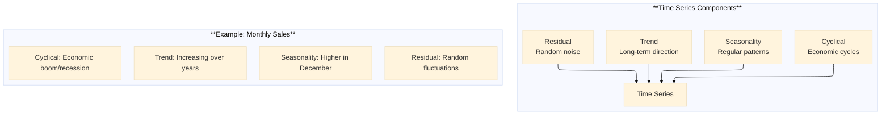

# The 2026 AI Metromap: Time Series Forecasting – ARIMA, LSTM, and Transformers

## Series E: Applied AI & Agents Line | Story 8 of 15+


## 📖 Introduction

**Welcome to the eighth stop on the Applied AI & Agents Line.**

In our last seven stories, we mastered prompt engineering, RAG, AI agents, voice assistants, computer vision, image generation, and core NLP tasks. Your systems can now understand text, generate images, see the world, and converse naturally. You've built applications across multiple domains.

But there's a type of data you haven't tackled yet: **time series**.

Time series data is everywhere. Stock prices, weather patterns, sales forecasts, sensor readings, energy consumption, website traffic—all are sequences of measurements over time. Predicting the future from the past is one of the most valuable and challenging problems in AI.

Time series forecasting has evolved dramatically. Classical methods like ARIMA and exponential smoothing still work well for many problems. Deep learning brought LSTMs that can capture complex temporal dependencies. And now Transformers—the same architecture that revolutionized NLP—are setting new records in forecasting.

This story—**The 2026 AI Metromap: Time Series Forecasting – ARIMA, LSTM, and Transformers**—is your guide to predicting the future. We'll master classical methods with statsmodels. We'll build LSTMs that learn from sequences. We'll implement Transformer-based forecasting with models like Informer and Autoformer. And we'll build complete forecasting pipelines for real-world applications.

**Let's predict the future.**

---

## 📚 Where You Are in the Journey

### The Master Story Arc: The 2026 AI Metromap Series (Complete)

- 🗺️ **[The 2026 AI Metromap: Why the Old Learning Routes Are Obsolete](#)** – A paradigm shift from linear learning to transit-system mastery.
- 🧭 **[The 2026 AI Metromap: Reading the Map](#)** – Strategic navigation across the three core lines.
- 🎒 **[The 2026 AI Metromap: Avoiding Derailments](#)** – Diagnosing and preventing the most common learning pitfalls.
- 🏁 **[The 2026 AI Metromap: From Passenger to Driver](#)** – Building your portfolio using the Metromap structure.

### Series A: Foundations Station (Complete)
### Series B: Supervised Learning Line (Complete)
### Series C: Modern Architecture Line (Complete)
### Series D: Engineering & Optimization Yard (Complete)

### Series E: Applied AI & Agents Line (15+ Stories)

- 💬 **[The 2026 AI Metromap: Prompt Engineering 101 – The Art of Talking to AI](#)**
- 📚 **[The 2026 AI Metromap: RAG – Retrieval-Augmented Generation for Knowledge-Intensive Tasks](#)**
- 🤖 **[The 2026 AI Metromap: AI Agents & Autonomous Workflows – The Self-Driving Trains](#)**
- 🗣️ **[The 2026 AI Metromap: Voice Assistants & Speech Models – Making AI Talk](#)**
- 👁️ **[The 2026 AI Metromap: Computer Vision Projects – From OCR to Face Recognition](#)**
- 🎨 **[The 2026 AI Metromap: Image Generation & Editing – Diffusion Models in Practice](#)**
- 🔤 **[The 2026 AI Metromap: NLP Tasks – NER, Translation, Summarization, and Beyond](#)**
- 📈 **The 2026 AI Metromap: Time Series Forecasting – ARIMA, LSTM, and Transformers** – Classical methods (ARIMA, SARIMA); LSTM networks; Transformer for time series; forecasting stock prices, weather, and demand. **⬅️ YOU ARE HERE**

- 👍 **[The 2026 AI Metromap: Recommendation Systems – From Collaborative Filtering to Two-Tower Networks](#)** – Content-based filtering; collaborative filtering; matrix factorization; neural collaborative filtering; two-tower architectures. 🔜 *Up Next*

**Industry Applications**
- 🏥 **[The 2026 AI Metromap: AI in Healthcare – Medical Research, Diagnostics, and Wellness](#)**
- 💰 **[The 2026 AI Metromap: AI in Finance – Banking, Insurance, and Trading](#)**
- 🎮 **[The 2026 AI Metromap: AI in Gaming, VR/AR, and Entertainment](#)**
- 🏭 **[The 2026 AI Metromap: AI in Robotics, Manufacturing, and Supply Chain](#)**
- 🌱 **[The 2026 AI Metromap: AI for Social Good – Climate Action, Agriculture, and Sustainability](#)**
- 🎓 **[The 2026 AI Metromap: AI in Education – Personalized Learning and Training](#)**

### The Complete Story Catalog

For a complete view of all upcoming stories across every series, visit the **[Complete 2026 AI Metromap Story Catalog](#)**.

---

## 📊 Time Series Basics: Understanding the Data

Before forecasting, we need to understand time series components.



```python
def time_series_basics():
    """Understand time series components and visualization"""
    
    print("="*60)
    print("TIME SERIES BASICS")
    print("="*60)
    
    print("""
    import pandas as pd
    import numpy as np
    import matplotlib.pyplot as plt
    from statsmodels.tsa.seasonal import seasonal_decompose
    
    # Create sample time series
    dates = pd.date_range('2020-01-01', periods=365, freq='D')
    
    # Components
    trend = np.linspace(0, 10, 365)  # Increasing trend
    seasonality = 5 * np.sin(2 * np.pi * dates.dayofyear / 365)  # Yearly cycle
    noise = np.random.randn(365) * 2  # Random noise
    
    # Combine
    ts = trend + seasonality + noise
    
    df = pd.DataFrame({'value': ts}, index=dates)
    
    # Decompose
    decomposition = seasonal_decompose(df['value'], model='additive', period=365)
    
    fig, axes = plt.subplots(4, 1, figsize=(12, 10))
    
    decomposition.observed.plot(ax=axes[0], title='Observed')
    decomposition.trend.plot(ax=axes[1], title='Trend')
    decomposition.seasonal.plot(ax=axes[2], title='Seasonal')
    decomposition.resid.plot(ax=axes[3], title='Residual')
    
    plt.tight_layout()
    plt.show()
    
    # Stationarity test
    from statsmodels.tsa.stattools import adfuller
    
    result = adfuller(df['value'])
    print(f'ADF Statistic: {result[0]:.4f}')
    print(f'p-value: {result[1]:.4f}')
    
    if result[1] < 0.05:
        print("Series is stationary")
    else:
        print("Series is non-stationary (needs differencing)")
    """)
    
    print("\n" + "="*60)
    print("KEY CONCEPTS")
    print("="*60)
    
    concepts = [
        ("Trend", "Long-term increase/decrease", "Detrending, differencing"),
        ("Seasonality", "Fixed periodic patterns", "Seasonal differencing"),
        ("Stationarity", "Constant mean/variance", "ADF test, differencing"),
        ("Autocorrelation", "Correlation with lagged values", "ACF/PACF plots"),
        ("Lag", "Previous time steps", "Feature engineering")
    ]
    
    print(f"\n{'Concept':<15} {'Description':<25} {'Treatment':<25}")
    print("-"*70)
    for concept, desc, treatment in concepts:
        print(f"{concept:<15} {desc:<25} {treatment:<25}")

time_series_basics()
```

---

## 📈 Classical Methods: ARIMA and SARIMA

ARIMA and SARIMA are the foundation of time series forecasting.

```python
def arima_sarima():
    """Implement ARIMA and SARIMA models"""
    
    print("="*60)
    print("ARIMA AND SARIMA")
    print("="*60)
    
    print("""
    import pandas as pd
    import numpy as np
    from statsmodels.tsa.arima.model import ARIMA
    from statsmodels.tsa.statespace.sarimax import SARIMAX
    from statsmodels.graphics.tsaplots import plot_acf, plot_pacf
    import matplotlib.pyplot as plt
    
    # Generate sample data
    np.random.seed(42)
    dates = pd.date_range('2020-01-01', periods=200, freq='M')
    trend = np.linspace(0, 10, 200)
    seasonality = 5 * np.sin(2 * np.pi * np.arange(200) / 12)
    noise = np.random.randn(200) * 2
    ts = trend + seasonality + noise
    
    df = pd.DataFrame({'value': ts}, index=dates)
    
    # Plot ACF and PACF to determine ARIMA orders
    fig, axes = plt.subplots(2, 1, figsize=(12, 8))
    plot_acf(df['value'], ax=axes[0], lags=40)
    plot_pacf(df['value'], ax=axes[1], lags=40)
    plt.show()
    
    # ARIMA model (AutoRegressive Integrated Moving Average)
    # Order: (p, d, q) where:
    # p = AR order (autoregressive)
    # d = differencing order
    # q = MA order (moving average)
    
    # Fit ARIMA
    model_arima = ARIMA(df['value'], order=(2, 1, 2))
    results_arima = model_arima.fit()
    print(results_arima.summary())
    
    # Forecast
    forecast_arima = results_arima.forecast(steps=12)
    
    # SARIMA (Seasonal ARIMA)
    # Adds seasonal order: (P, D, Q, S)
    # S = seasonal period (12 for monthly)
    
    model_sarima = SARIMAX(
        df['value'],
        order=(1, 1, 1),
        seasonal_order=(1, 1, 1, 12)
    )
    results_sarima = model_sarima.fit()
    print(results_sarima.summary())
    
    # Forecast
    forecast_sarima = results_sarima.forecast(steps=12)
    
    # Visualize
    plt.figure(figsize=(12, 6))
    plt.plot(df.index, df['value'], label='Actual')
    plt.plot(forecast_arima.index, forecast_arima, label='ARIMA Forecast', linestyle='--')
    plt.plot(forecast_sarima.index, forecast_sarima, label='SARIMA Forecast', linestyle='--')
    plt.legend()
    plt.title('ARIMA vs SARIMA Forecast')
    plt.show()
    
    # Auto-ARIMA (automatically find best parameters)
    # pip install pmdarima
    import pmdarima as pm
    
    auto_model = pm.auto_arima(
        df['value'],
        seasonal=True,
        m=12,
        start_p=0, start_q=0,
        max_p=5, max_q=5,
        trace=True
    )
    
    print(f"Best ARIMA order: {auto_model.order}")
    print(f"Best seasonal order: {auto_model.seasonal_order}")
    """)
    
    print("\n" + "="*60)
    print("ARIMA PARAMETERS GUIDE")
    print("="*60)
    
    params = [
        ("p (AR)", "Autoregressive order", "High if ACF decays slowly"),
        ("d (I)", "Differencing order", "1 for non-stationary, 0 for stationary"),
        ("q (MA)", "Moving average order", "High if PACF decays slowly"),
        ("P (Seasonal AR)", "Seasonal autoregressive", "Based on seasonal ACF"),
        ("D (Seasonal I)", "Seasonal differencing", "1 if seasonal pattern present"),
        ("Q (Seasonal MA)", "Seasonal moving average", "Based on seasonal PACF"),
        ("S (Period)", "Seasonal period", "4 for quarterly, 12 for monthly")
    ]
    
    print(f"\n{'Parameter':<10} {'Meaning':<30} {'Guidance':<30}")
    print("-"*75)
    for param, meaning, guidance in params:
        print(f"{param:<10} {meaning:<30} {guidance:<30}")

arima_sarima()
```

---

## 🧠 LSTM Networks: Deep Learning for Sequences

LSTMs (Long Short-Term Memory) capture long-range dependencies in sequences.

```python
def lstm_forecasting():
    """Implement LSTM for time series forecasting"""
    
    print("="*60)
    print("LSTM FOR TIME SERIES")
    print("="*60)
    
    print("""
    import numpy as np
    import pandas as pd
    import matplotlib.pyplot as plt
    from sklearn.preprocessing import MinMaxScaler
    from tensorflow.keras.models import Sequential
    from tensorflow.keras.layers import LSTM, Dense, Dropout
    from tensorflow.keras.callbacks import EarlyStopping
    
    # Generate sample data
    np.random.seed(42)
    dates = pd.date_range('2020-01-01', periods=500, freq='D')
    trend = np.linspace(0, 20, 500)
    seasonality = 10 * np.sin(2 * np.pi * np.arange(500) / 30)
    noise = np.random.randn(500) * 2
    ts = trend + seasonality + noise
    
    df = pd.DataFrame({'value': ts}, index=dates)
    
    # Prepare data for LSTM
    def create_sequences(data, seq_length):
        X, y = [], []
        for i in range(len(data) - seq_length):
            X.append(data[i:i+seq_length])
            y.append(data[i+seq_length])
        return np.array(X), np.array(y)
    
    # Scale data
    scaler = MinMaxScaler()
    scaled_data = scaler.fit_transform(df[['value']])
    
    # Create sequences
    seq_length = 30
    X, y = create_sequences(scaled_data, seq_length)
    
    # Train/test split
    split = int(len(X) * 0.8)
    X_train, X_test = X[:split], X[split:]
    y_train, y_test = y[:split], y[split:]
    
    # Build LSTM model
    model = Sequential([
        LSTM(100, return_sequences=True, input_shape=(seq_length, 1)),
        Dropout(0.2),
        LSTM(100, return_sequences=False),
        Dropout(0.2),
        Dense(50, activation='relu'),
        Dense(1)
    ])
    
    model.compile(optimizer='adam', loss='mse')
    
    # Train
    early_stop = EarlyStopping(monitor='val_loss', patience=10, restore_best_weights=True)
    
    history = model.fit(
        X_train, y_train,
        validation_data=(X_test, y_test),
        epochs=100,
        batch_size=32,
        callbacks=[early_stop],
        verbose=1
    )
    
    # Predict
    train_pred = model.predict(X_train)
    test_pred = model.predict(X_test)
    
    # Inverse transform
    train_pred = scaler.inverse_transform(train_pred)
    test_pred = scaler.inverse_transform(test_pred)
    y_train_actual = scaler.inverse_transform(y_train)
    y_test_actual = scaler.inverse_transform(y_test)
    
    # Plot results
    plt.figure(figsize=(12, 6))
    plt.plot(df.index[seq_length:seq_length+len(y_train_actual)], y_train_actual, label='Actual Train')
    plt.plot(df.index[seq_length:seq_length+len(train_pred)], train_pred, label='LSTM Train Predictions')
    
    test_start = seq_length + len(y_train_actual)
    test_end = test_start + len(y_test_actual)
    plt.plot(df.index[test_start:test_end], y_test_actual, label='Actual Test')
    plt.plot(df.index[test_start:test_end], test_pred, label='LSTM Test Predictions')
    
    plt.legend()
    plt.title('LSTM Time Series Forecast')
    plt.show()
    
    # Multi-step forecasting
    def forecast_future(model, last_sequence, steps, scaler):
        predictions = []
        current_seq = last_sequence.copy()
        
        for _ in range(steps):
            pred = model.predict(current_seq.reshape(1, seq_length, 1), verbose=0)
            predictions.append(pred[0, 0])
            current_seq = np.roll(current_seq, -1)
            current_seq[-1] = pred[0, 0]
        
        return scaler.inverse_transform(np.array(predictions).reshape(-1, 1))
    
    last_seq = scaled_data[-seq_length:]
    future_30 = forecast_future(model, last_seq, 30, scaler)
    """)
    
    print("\n" + "="*60)
    print("LSTM ARCHITECTURE GUIDE")
    print("="*60)
    
    architecture = [
        ("LSTM Units", "50-200", "More units = more capacity, risk of overfitting"),
        ("Layers", "1-3", "More layers = more complex patterns"),
        ("Dropout", "0.2-0.5", "Regularization to prevent overfitting"),
        ("Batch Size", "16-64", "Smaller = slower but better generalization"),
        ("Sequence Length", "30-90", "How many past steps to use for prediction")
    ]
    
    print(f"\n{'Component':<15} {'Typical Range':<15} {'Effect':<35}")
    print("-"*70)
    for comp, range_, effect in architecture:
        print(f"{comp:<15} {range_:<15} {effect:<35}")

lstm_forecasting()
```

---

## 🔄 Transformer for Time Series: The New Frontier

Transformers are increasingly used for time series forecasting with models like Informer, Autoformer, and PatchTST.

```python
def transformer_forecasting():
    """Implement Transformer-based time series forecasting"""
    
    print("="*60)
    print("TRANSFORMER FOR TIME SERIES")
    print("="*60)
    
    print("""
    # Using Informer (for long sequence forecasting)
    # pip install informer-timer
    
    import torch
    import numpy as np
    from informer import Informer, InformerConfig
    
    # Generate sample data
    seq_len = 96  # Input length
    pred_len = 24  # Prediction length
    
    # Create synthetic data
    train_data = np.random.randn(1000, seq_len, 1).astype(np.float32)
    train_labels = np.random.randn(1000, pred_len, 1).astype(np.float32)
    
    # Configure Informer
    config = InformerConfig(
        seq_len=seq_len,
        pred_len=pred_len,
        enc_in=1,  # Number of features
        dec_in=1,
        c_out=1,
        d_model=512,
        n_heads=8,
        e_layers=3,
        d_layers=2,
        dropout=0.1
    )
    
    model = Informer(config)
    
    # Train (simplified)
    optimizer = torch.optim.Adam(model.parameters())
    
    for epoch in range(50):
        model.train()
        optimizer.zero_grad()
        
        # Forward pass
        outputs = model(
            torch.tensor(train_data),
            torch.tensor(train_labels[:, :seq_len, :])  # Decoder input
        )
        
        loss = torch.nn.functional.mse_loss(outputs, torch.tensor(train_labels))
        loss.backward()
        optimizer.step()
        
        if epoch % 10 == 0:
            print(f"Epoch {epoch}, Loss: {loss.item():.4f}")
    
    # Using PatchTST (simple but effective)
    # pip install patchts
    
    from patchts import PatchTST
    
    # PatchTST divides sequence into patches for efficiency
    model = PatchTST(
        input_length=seq_len,
        output_length=pred_len,
        patch_length=16,
        patch_stride=8,
        d_model=128,
        n_heads=8,
        n_layers=3
    )
    
    # Using Autoformer (for complex seasonality)
    from autoformer import Autoformer
    
    model = Autoformer(
        seq_len=seq_len,
        pred_len=pred_len,
        enc_in=1,
        dec_in=1,
        c_out=1,
        d_model=512,
        moving_avg=25  # For trend decomposition
    )
    
    # Using DLinear (simple baseline, often works well)
    from dlinear import DLinear
    
    model = DLinear(
        seq_len=seq_len,
        pred_len=pred_len,
        individual=False  # Share weights across features
    )
    """)
    
    print("\n" + "="*60)
    print("MODERN TRANSFORMER MODELS")
    print("="*60)
    
    models = [
        ("Informer", "ProbSparse attention", "Long sequences", "Excellent for long-term"),
        ("Autoformer", "Auto-correlation", "Complex seasonality", "Best for seasonal data"),
        ("PatchTST", "Patching + attention", "Efficient", "Strong baseline"),
        ("TimesNet", "Multi-periodicity", "Multiple frequencies", "Complex patterns"),
        ("DLinear", "Linear decomposition", "Simple, fast", "Strong baseline")
    ]
    
    print(f"\n{'Model':<12} {'Key Innovation':<25} {'Strength':<20} {'Best For':<20}")
    print("-"*80)
    for model, innovation, strength, best in models:
        print(f"{model:<12} {innovation:<25} {strength:<20} {best:<20}")

transformer_forecasting()
---

## 🎯 Complete Forecasting Pipeline

```python
def forecasting_pipeline():
    """Complete time series forecasting pipeline"""
    
    print("="*60)
    print("COMPLETE FORECASTING PIPELINE")
    print("="*60)
    
    print("""
    import pandas as pd
    import numpy as np
    from sklearn.preprocessing import StandardScaler
    from sklearn.metrics import mean_absolute_error, mean_squared_error
    import matplotlib.pyplot as plt
    
    class TimeSeriesForecaster:
        \"\"\"Complete forecasting pipeline\"\"\"
        
        def __init__(self, model_type='lstm'):
            self.model_type = model_type
            self.scaler = StandardScaler()
            self.model = None
            
        def prepare_data(self, df, target_col, seq_length=30, forecast_horizon=1):
            \"\"\"Prepare data for time series forecasting\"\"\"
            
            # Scale data
            scaled = self.scaler.fit_transform(df[[target_col]])
            
            # Create sequences
            X, y = [], []
            for i in range(len(scaled) - seq_length - forecast_horizon + 1):
                X.append(scaled[i:i+seq_length])
                y.append(scaled[i+seq_length:i+seq_length+forecast_horizon])
            
            return np.array(X), np.array(y)
        
        def build_model(self, input_shape, output_shape):
            \"\"\"Build model based on type\"\"\"
            from tensorflow.keras.models import Sequential
            from tensorflow.keras.layers import LSTM, Dense, Dropout
            
            if self.model_type == 'lstm':
                model = Sequential([
                    LSTM(100, return_sequences=True, input_shape=input_shape),
                    Dropout(0.2),
                    LSTM(100),
                    Dropout(0.2),
                    Dense(50, activation='relu'),
                    Dense(output_shape)
                ])
                model.compile(optimizer='adam', loss='mse')
                return model
            
            elif self.model_type == 'simple':
                # Simple linear baseline
                from sklearn.linear_model import LinearRegression
                return LinearRegression()
            
            else:
                raise ValueError(f"Unknown model type: {self.model_type}")
        
        def fit(self, X, y, validation_split=0.2, epochs=100):
            \"\"\"Train the model\"\"\"
            if self.model_type == 'lstm':
                self.model = self.build_model((X.shape[1], X.shape[2]), y.shape[1])
                history = self.model.fit(
                    X, y,
                    validation_split=validation_split,
                    epochs=epochs,
                    batch_size=32,
                    verbose=0
                )
                return history
            else:
                # Flatten for simple models
                X_flat = X.reshape(X.shape[0], -1)
                self.model = self.build_model(None, None)
                self.model.fit(X_flat, y)
                return None
        
        def predict(self, X):
            \"\"\"Make predictions\"\"\"
            if self.model_type == 'lstm':
                pred = self.model.predict(X, verbose=0)
            else:
                X_flat = X.reshape(X.shape[0], -1)
                pred = self.model.predict(X_flat)
            return self.scaler.inverse_transform(pred)
        
        def evaluate(self, X, y_true):
            \"\"\"Evaluate predictions\"\"\"
            y_pred = self.predict(X)
            y_true_inv = self.scaler.inverse_transform(y_true)
            
            mae = mean_absolute_error(y_true_inv, y_pred)
            rmse = np.sqrt(mean_squared_error(y_true_inv, y_pred))
            
            return {'MAE': mae, 'RMSE': rmse}
        
        def forecast_future(self, last_sequence, steps, forecast_horizon=1):
            \"\"\"Generate future forecasts\"\"\"
            if self.model_type != 'lstm':
                raise NotImplementedError("Future forecasting only for LSTM")
            
            predictions = []
            current_seq = last_sequence.copy()
            
            for _ in range(steps):
                pred = self.model.predict(current_seq.reshape(1, *current_seq.shape), verbose=0)
                pred_val = pred[0, 0]
                predictions.append(pred_val)
                current_seq = np.roll(current_seq, -1)
                current_seq[-1] = pred_val
            
            return self.scaler.inverse_transform(np.array(predictions).reshape(-1, 1))
    
    # Usage example
    np.random.seed(42)
    dates = pd.date_range('2020-01-01', periods=500, freq='D')
    trend = np.linspace(0, 20, 500)
    seasonality = 10 * np.sin(2 * np.pi * np.arange(500) / 30)
    noise = np.random.randn(500) * 2
    ts = trend + seasonality + noise
    
    df = pd.DataFrame({'sales': ts}, index=dates)
    
    # Create forecaster
    forecaster = TimeSeriesForecaster(model_type='lstm')
    
    # Prepare data
    seq_length = 30
    forecast_horizon = 7  # Predict next 7 days
    X, y = forecaster.prepare_data(df, 'sales', seq_length, forecast_horizon)
    
    # Train/test split
    split = int(len(X) * 0.8)
    X_train, X_test = X[:split], X[split:]
    y_train, y_test = y[:split], y[split:]
    
    # Train
    forecaster.fit(X_train, y_train, epochs=50)
    
    # Evaluate
    metrics = forecaster.evaluate(X_test, y_test)
    print(f"Test Metrics: MAE={metrics['MAE']:.2f}, RMSE={metrics['RMSE']:.2f}")
    
    # Forecast future
    last_seq = X_test[-1]  # Last sequence from test
    future_30 = forecaster.forecast_future(last_seq, steps=30, forecast_horizon=forecast_horizon)
    """)
    
    print("\n" + "="*60)
    print("EVALUATION METRICS")
    print("="*60)
    
    metrics = [
        ("MAE", "Mean Absolute Error", "Easy to interpret, robust to outliers"),
        ("RMSE", "Root Mean Squared Error", "Penalizes large errors more"),
        ("MAPE", "Mean Absolute Percentage Error", "Relative error, scale-invariant"),
        ("sMAPE", "Symmetric MAPE", "Handles near-zero values"),
        ("MASE", "Mean Absolute Scaled Error", "Compares to naive forecast")
    ]
    
    print(f"\n{'Metric':<8} {'Name':<20} {'Characteristics':<35}")
    print("-"*70)
    for metric, name, chars in metrics:
        print(f"{metric:<8} {name:<20} {chars:<35}")

forecasting_pipeline()
```

---

## 📊 Takeaway from This Story

**What You Learned:**

- **Time Series Components** – Trend, seasonality, cyclical, residual. Decompose to understand patterns. Stationarity required for ARIMA.

- **ARIMA/SARIMA** – Classical statistical methods. ARIMA for non-seasonal, SARIMA for seasonal data. Auto-ARIMA finds optimal parameters.

- **LSTM Networks** – Deep learning for sequences. Captures long-range dependencies. Sequence length, layers, units are key hyperparameters.

- **Transformer Models** – Informer (long sequences), Autoformer (seasonality), PatchTST (efficient), DLinear (strong baseline). State-of-the-art for many tasks.

- **Forecasting Pipeline** – Data preparation → scaling → sequence creation → model training → evaluation → future forecasting.

- **Evaluation Metrics** – MAE (interpretable), RMSE (penalizes outliers), MAPE (percentage error), MASE (compares to baseline).

---

## 🔗 Navigation

- **⬅️ Previous Story:** [The 2026 AI Metromap: NLP Tasks – NER, Translation, Summarization, and Beyond](#)

- **📚 Series E Catalog:** [Series E: Applied AI & Agents Line](#) – View all 15+ stories in this series.

- **📚 Complete Story Catalog:** [Complete 2026 AI Metromap Story Catalog](#) – Your navigation guide to all 39+ stories.

- **➡️ Next Story:** **[The 2026 AI Metromap: Recommendation Systems – From Collaborative Filtering to Two-Tower Networks](#)** – Content-based filtering; collaborative filtering; matrix factorization; neural collaborative filtering; two-tower architectures.

---

## 📝 Your Invitation

Before the next story arrives, build a forecasting system:

1. **Implement ARIMA** – Load a time series dataset. Use auto_arima to find parameters. Forecast future values.

2. **Build an LSTM** – Create sequences, train an LSTM model. Compare with ARIMA.

3. **Try a Transformer** – Use a library like darts or pytorch-forecasting. Implement a Transformer model.

4. **Create a pipeline** – Combine data loading, preprocessing, training, and evaluation into a single class.

5. **Evaluate on real data** – Download stock prices, weather data, or sales data. Compare multiple models.

**You've mastered time series forecasting. Next stop: Recommendation Systems!**

---

*Found this helpful? Clap, comment, and share your forecasting results. Next stop: Recommendation Systems!* 🚇