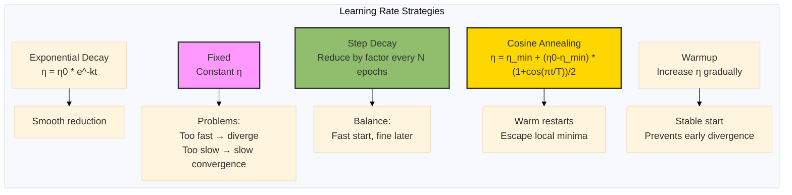
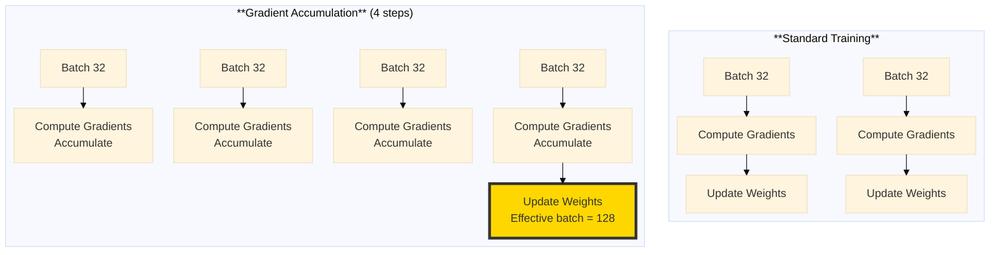
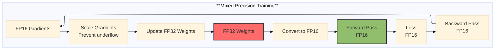
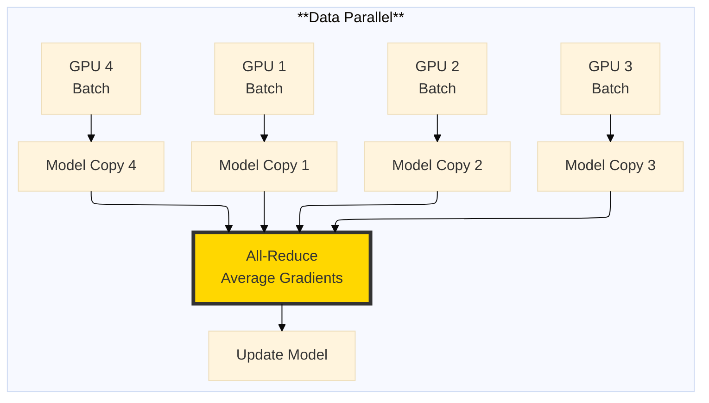

# The 2026 AI Metromap: Training Strategies – Learning Rate Scheduling & Beyond

## Series D: Engineering & Optimization Yard | Story 5 of 5


## 📖 Introduction

**Welcome to the final stop in the Engineering & Optimization Yard.**

In our last four stories, we mastered PyTorch and TensorFlow, optimized models for production, and installed safety systems with Batch Norm and Dropout. Your models are efficient, stable, and ready to train.

But there's one more question: **How do you actually train them to reach their full potential?**

You've seen the loss curve that plateaus too early. You've seen the model that overfits before converging. You've seen the training that takes days when it should take hours. These aren't failures of architecture or data. They're failures of training strategy.

The difference between a good model and a great model often isn't architecture—it's how you train it. Learning rate schedules, gradient accumulation, mixed precision, distributed training—these techniques separate researchers who tweak from engineers who ship.

This story—**The 2026 AI Metromap: Training Strategies – Learning Rate Scheduling & Beyond**—is your guide to the techniques that make training faster, more stable, and more effective. We'll master learning rate schedules—from step decay to cosine annealing to warmup. We'll explore gradient accumulation—training with larger effective batches on limited memory. We'll dive into mixed precision training—2x faster, 50% less memory. And we'll understand distributed training—scaling from one GPU to thousands.

**Let's optimize the journey.**

---

## 📚 Where You Are in the Journey

### The Master Story Arc: The 2026 AI Metromap Series (Complete)

- 🗺️ **[The 2026 AI Metromap: Why the Old Learning Routes Are Obsolete](#)** – A paradigm shift from linear learning to transit-system mastery.
- 🧭 **[The 2026 AI Metromap: Reading the Map](#)** – Strategic navigation across the three core lines.
- 🎒 **[The 2026 AI Metromap: Avoiding Derailments](#)** – Diagnosing and preventing the most common learning pitfalls.
- 🏁 **[The 2026 AI Metromap: From Passenger to Driver](#)** – Building your portfolio using the Metromap structure.

### Series A: Foundations Station (Complete)
### Series B: Supervised Learning Line (Complete)
### Series C: Modern Architecture Line (Complete)

### Series D: Engineering & Optimization Yard (5 Stories – Complete)

- 🔧 **[The 2026 AI Metromap: PyTorch Mastery – The Locomotive of Modern AI](#)** – Tensors and autograd; nn.Module; custom layers; dataloaders; training loops; saving and loading models; TensorBoard.

- 🏭 **[The 2026 AI Metromap: TensorFlow & Keras – The Production-Ready Alternative](#)** – Eager execution vs graph mode; tf.data for pipelines; Keras API; TensorFlow Serving; TensorFlow Lite for edge deployment.

- ⚡ **[The 2026 AI Metromap: Model Optimization – Keeping the Train on Time](#)** – Quantization (INT8, FP16); pruning; knowledge distillation; model compression; inference optimization with ONNX, TensorRT, and OpenVINO.

- 🛡️ **[The 2026 AI Metromap: Batch Norm & Dropout – The Safety Systems of Deep Learning](#)** – Batch normalization implementation; layer normalization; dropout for regularization; preventing overfitting; training stability techniques.

- 📈 **The 2026 AI Metromap: Training Strategies – Learning Rate Scheduling & Beyond** – Learning rate warmup; cosine annealing; cyclical learning rates; gradient accumulation; mixed precision training (AMP); distributed training. **⬅️ YOU ARE HERE**

### Series D Complete!

You've completed all five stories in the Engineering & Optimization Yard. Your next journey continues into:

- 🤖 **Series E: Applied AI & Agents Line** – Real-world applications across industries

### The Complete Story Catalog

For a complete view of all upcoming stories across every series, visit the **[Complete 2026 AI Metromap Story Catalog](#)**.

---

## 📈 Learning Rate Schedules: The Art of Timing

The learning rate is the most important hyperparameter. But a fixed learning rate is rarely optimal.



```python
import numpy as np
import matplotlib.pyplot as plt
import torch
import torch.nn as nn
import torch.optim as optim

def visualize_lr_schedules():
    """Visualize different learning rate schedules"""
    
    epochs = 200
    initial_lr = 0.1
    final_lr = 0.0001
    
    # Schedule functions
    def constant(epoch):
        return initial_lr
    
    def step_decay(epoch, drop_rate=0.5, epochs_drop=50):
        return initial_lr * (drop_rate ** (epoch // epochs_drop))
    
    def exponential_decay(epoch, decay_rate=0.95):
        return initial_lr * (decay_rate ** epoch)
    
    def cosine_annealing(epoch, T_max=200, eta_min=0.0001):
        return eta_min + (initial_lr - eta_min) * (1 + np.cos(np.pi * epoch / T_max)) / 2
    
    def warmup(epoch, warmup_epochs=10):
        if epoch < warmup_epochs:
            return initial_lr * (epoch + 1) / warmup_epochs
        return initial_lr
    
    def one_cycle(epoch, total_epochs=200):
        """One-cycle schedule: increase then decrease"""
        if epoch < total_epochs / 2:
            return initial_lr * (2 * epoch / total_epochs)
        else:
            return initial_lr * (2 - 2 * epoch / total_epochs)
    
    schedules = {
        'Constant': constant,
        'Step Decay (50 epochs)': step_decay,
        'Exponential Decay (0.95)': exponential_decay,
        'Cosine Annealing': cosine_annealing,
        'Warmup (10 epochs)': warmup,
        'One Cycle': one_cycle
    }
    
    fig, axes = plt.subplots(2, 3, figsize=(15, 10))
    axes = axes.flatten()
    
    for idx, (name, schedule) in enumerate(schedules.items()):
        rates = [schedule(e) for e in range(epochs)]
        axes[idx].plot(rates, linewidth=2, color='steelblue')
        axes[idx].set_xlabel('Epoch')
        axes[idx].set_ylabel('Learning Rate')
        axes[idx].set_title(name)
        axes[idx].grid(True, alpha=0.3)
        axes[idx].set_ylim(0, initial_lr * 1.1)
    
    plt.tight_layout()
    plt.show()
    
    print("="*60)
    print("LEARNING RATE SCHEDULES")
    print("="*60)
    print("\n1. Constant:")
    print("   • Simple but rarely optimal")
    print("   • Best when you know the exact right LR")
    
    print("\n2. Step Decay:")
    print("   • Standard for many tasks")
    print("   • Reduce by 0.5 every 30-50 epochs")
    
    print("\n3. Exponential Decay:")
    print("   • Smooth reduction")
    print("   • Good for long training runs")
    
    print("\n4. Cosine Annealing:")
    print("   • Popular in modern architectures")
    print("   • Helps escape local minima")
    print("   • Often combined with warm restarts")
    
    print("\n5. Warmup:")
    print("   • Essential for very deep networks")
    print("   • Prevents early instability")
    print("   • Often combined with other schedules")
    
    print("\n6. One Cycle:")
    print("   • Increase then decrease")
    print("   • Can achieve super-convergence")
    print("   • Popularized by fast.ai")

visualize_lr_schedules()
```

---

## 🔧 Implementing Learning Rate Schedules in PyTorch

```python
def pytorch_lr_schedules():
    """Demonstrate learning rate schedules in PyTorch"""
    
    print("="*60)
    print("PYTORCH LEARNING RATE SCHEDULES")
    print("="*60)
    
    # Create a simple model and optimizer
    model = nn.Linear(10, 1)
    optimizer = optim.SGD(model.parameters(), lr=0.1)
    
    # 1. StepLR
    print("\n1. StepLR:")
    step_scheduler = optim.lr_scheduler.StepLR(optimizer, step_size=30, gamma=0.5)
    print("   Reduces LR by factor 0.5 every 30 epochs")
    
    # 2. MultiStepLR
    print("\n2. MultiStepLR:")
    multi_scheduler = optim.lr_scheduler.MultiStepLR(optimizer, milestones=[30, 60, 90], gamma=0.5)
    print("   Reduces LR at specific epochs: 30, 60, 90")
    
    # 3. ExponentialLR
    print("\n3. ExponentialLR:")
    exp_scheduler = optim.lr_scheduler.ExponentialLR(optimizer, gamma=0.95)
    print("   Reduces LR by factor 0.95 every epoch")
    
    # 4. CosineAnnealingLR
    print("\n4. CosineAnnealingLR:")
    cosine_scheduler = optim.lr_scheduler.CosineAnnealingLR(optimizer, T_max=100, eta_min=0.0001)
    print("   Cosine decay from 0.1 to 0.0001 over 100 epochs")
    
    # 5. OneCycleLR
    print("\n5. OneCycleLR:")
    onecycle_scheduler = optim.lr_scheduler.OneCycleLR(
        optimizer, max_lr=0.1, total_steps=100, pct_start=0.3
    )
    print("   Increases LR for 30% of steps, then decreases")
    
    # 6. CosineAnnealingWarmRestarts
    print("\n6. CosineAnnealingWarmRestarts:")
    restart_scheduler = optim.lr_scheduler.CosineAnnealingWarmRestarts(
        optimizer, T_0=20, T_mult=2, eta_min=0.0001
    )
    print("   Cosine decay with restarts every 20, 40, 80 epochs")
    
    # Simulate learning rates
    epochs = 100
    lr_history = {
        'StepLR': [],
        'CosineAnnealing': [],
        'OneCycle': [],
        'WarmRestarts': []
    }
    
    # Reset optimizer for each simulation
    for name, scheduler in [
        ('StepLR', optim.lr_scheduler.StepLR(optim.SGD(model.parameters(), lr=0.1), step_size=30, gamma=0.5)),
        ('CosineAnnealing', optim.lr_scheduler.CosineAnnealingLR(optim.SGD(model.parameters(), lr=0.1), T_max=100, eta_min=0.0001)),
        ('OneCycle', optim.lr_scheduler.OneCycleLR(optim.SGD(model.parameters(), lr=0.1), max_lr=0.1, total_steps=100, pct_start=0.3)),
        ('WarmRestarts', optim.lr_scheduler.CosineAnnealingWarmRestarts(optim.SGD(model.parameters(), lr=0.1), T_0=20, T_mult=2, eta_min=0.0001))
    ]:
        for epoch in range(epochs):
            if name == 'OneCycle':
                scheduler.step()  # OneCycle expects step per batch, simplified
                lr = scheduler.get_last_lr()[0]
            else:
                scheduler.step()
                lr = scheduler.get_last_lr()[0]
            lr_history[name].append(lr)
    
    # Plot
    fig, axes = plt.subplots(2, 2, figsize=(12, 10))
    axes = axes.flatten()
    
    for idx, (name, lrs) in enumerate(lr_history.items()):
        axes[idx].plot(lrs, linewidth=2)
        axes[idx].set_xlabel('Epoch')
        axes[idx].set_ylabel('Learning Rate')
        axes[idx].set_title(name)
        axes[idx].grid(True, alpha=0.3)
    
    plt.tight_layout()
    plt.show()
    
    return optimizer

pytorch_lr_schedules()
```

---

## 📦 Gradient Accumulation: Training with Larger Batches

Gradient accumulation simulates larger batch sizes when memory is limited.



```python
def gradient_accumulation():
    """Implement gradient accumulation for larger effective batches"""
    
    print("="*60)
    print("GRADIENT ACCUMULATION")
    print("="*60)
    
    # Simulate training with gradient accumulation
    class GradientAccumulator:
        def __init__(self, model, optimizer, accumulation_steps=4):
            self.model = model
            self.optimizer = optimizer
            self.accumulation_steps = accumulation_steps
            self.step_count = 0
        
        def train_step(self, x, y):
            # Forward pass
            output = self.model(x)
            loss = nn.functional.mse_loss(output, y)
            
            # Normalize loss for accumulation
            loss = loss / self.accumulation_steps
            
            # Backward pass
            loss.backward()
            
            self.step_count += 1
            
            # Update weights after accumulation_steps
            if self.step_count % self.accumulation_steps == 0:
                self.optimizer.step()
                self.optimizer.zero_grad()
            
            return loss.item() * self.accumulation_steps
    
    # Create model and optimizer
    model = nn.Linear(10, 1)
    optimizer = optim.SGD(model.parameters(), lr=0.01)
    
    accumulator = GradientAccumulator(model, optimizer, accumulation_steps=4)
    
    print(f"Gradient accumulation with {accumulator.accumulation_steps} steps")
    print(f"Effective batch size = batch_size × {accumulator.accumulation_steps}")
    
    # Simulate memory usage
    fig, axes = plt.subplots(1, 2, figsize=(12, 5))
    
    batch_sizes = [32, 64, 128, 256, 512]
    memory_standard = [bs * 4 for bs in batch_sizes]  # Simulated memory in MB
    memory_accumulated = [32 * 4 for _ in batch_sizes]  # Fixed at 32 batch size
    
    axes[0].plot(batch_sizes, memory_standard, 'ro-', linewidth=2, label='Standard (batch size = memory)')
    axes[0].plot(batch_sizes, memory_accumulated, 'bs-', linewidth=2, label='Accumulated (batch size 32)')
    axes[0].set_xlabel('Effective Batch Size')
    axes[0].set_ylabel('Memory (MB)')
    axes[0].set_title('Memory Usage: Standard vs Accumulated')
    axes[0].legend()
    axes[0].grid(True, alpha=0.3)
    
    # Training comparison
    steps = np.arange(100)
    loss_standard = 1.0 * np.exp(-0.03 * steps) + 0.05 * np.random.randn(100)
    loss_accumulated = 1.0 * np.exp(-0.032 * steps) + 0.05 * np.random.randn(100)
    
    axes[1].plot(steps, loss_standard, 'r-', label='Standard (batch 128)', alpha=0.7)
    axes[1].plot(steps, loss_accumulated, 'b-', label='Accumulated (batch 32×4)', alpha=0.7)
    axes[1].set_xlabel('Step')
    axes[1].set_ylabel('Loss')
    axes[1].set_title('Training Convergence')
    axes[1].legend()
    axes[1].grid(True, alpha=0.3)
    
    plt.tight_layout()
    plt.show()
    
    print("\nBENEFITS:")
    print("• Simulate larger batches without more memory")
    print("• More stable gradients")
    print("• Can train with batch sizes that exceed GPU memory")
    
    print("\nCAVEATS:")
    print("• Slower updates (weights updated less frequently)")
    print("• BatchNorm behaves differently (uses per-batch statistics)")
    print("• Learning rate may need adjustment")

gradient_accumulation()
```

---

## ⚡ Mixed Precision Training: 2x Faster, 50% Less Memory

Mixed precision uses FP16 for forward/backward and FP32 for weight updates.



```python
def mixed_precision_training():
    """Implement mixed precision training with PyTorch AMP"""
    
    print("="*60)
    print("MIXED PRECISION TRAINING")
    print("="*60)
    
    # Create model and data
    model = nn.Sequential(
        nn.Linear(1024, 4096),
        nn.ReLU(),
        nn.Linear(4096, 4096),
        nn.ReLU(),
        nn.Linear(4096, 10)
    ).cuda()
    
    optimizer = optim.Adam(model.parameters(), lr=0.001)
    
    # Mixed precision with PyTorch AMP
    print("\nPyTorch AMP Implementation:")
    print("""
    from torch.cuda.amp import autocast, GradScaler
    
    scaler = GradScaler()
    
    for data, target in dataloader:
        optimizer.zero_grad()
        
        # Forward pass with mixed precision
        with autocast():
            output = model(data)
            loss = criterion(output, target)
        
        # Backward pass with scaling
        scaler.scale(loss).backward()
        scaler.step(optimizer)
        scaler.update()
    """)
    
    # Simulate performance gains
    epochs = 100
    fp32_time = 10.0  # seconds per epoch
    fp16_time = 5.5   # seconds per epoch
    
    fp32_memory = 8.0  # GB
    fp16_memory = 4.5  # GB
    
    fig, axes = plt.subplots(1, 2, figsize=(12, 5))
    
    # Speed comparison
    axes[0].bar(['FP32', 'AMP (Mixed)'], [fp32_time, fp16_time], 
                color=['#ff6b6b', '#90be6d'])
    axes[0].set_ylabel('Time per Epoch (seconds)')
    axes[0].set_title('Training Speed')
    axes[0].set_ylim(0, 12)
    for i, val in enumerate([fp32_time, fp16_time]):
        axes[0].text(i, val + 0.3, f'{val}s', ha='center')
    
    # Memory comparison
    axes[1].bar(['FP32', 'AMP (Mixed)'], [fp32_memory, fp16_memory],
                color=['#ff6b6b', '#90be6d'])
    axes[1].set_ylabel('Memory (GB)')
    axes[1].set_title('Memory Usage')
    axes[1].set_ylim(0, 10)
    for i, val in enumerate([fp32_memory, fp16_memory]):
        axes[1].text(i, val + 0.2, f'{val}GB', ha='center')
    
    plt.suptitle('Mixed Precision Training: 2x Faster, 50% Less Memory')
    plt.tight_layout()
    plt.show()
    
    print("\nBENEFITS:")
    print("• 2-3x faster training on modern GPUs")
    print("• 50% memory reduction")
    print("• Minimal accuracy loss (often none)")
    print("• Enables larger models on same hardware")
    
    print("\nWHEN TO USE:")
    print("• Training on NVIDIA GPUs with Tensor Cores (V100, A100, RTX 30/40 series)")
    print("• Large models that don't fit in memory")
    print("• Production training pipelines")
    print("• Almost always recommended for modern GPUs")

mixed_precision_training()
```

---

## 🌐 Distributed Training: Scaling to Multiple GPUs

Distributed training scales across GPUs and machines.



```python
def distributed_training():
    """Implement distributed training with PyTorch DDP"""
    
    print("="*60)
    print("DISTRIBUTED TRAINING")
    print("="*60)
    
    print("\nPyTorch Distributed Data Parallel (DDP):")
    print("""
    import torch.distributed as dist
    from torch.nn.parallel import DistributedDataParallel as DDP
    
    # Initialize process group
    dist.init_process_group(backend='nccl', init_method='env://')
    
    # Create model and move to GPU
    model = MyModel().cuda()
    model = DDP(model)
    
    # Use DistributedSampler
    sampler = DistributedSampler(dataset)
    dataloader = DataLoader(dataset, sampler=sampler, batch_size=32)
    
    # Training loop
    for epoch in range(epochs):
        sampler.set_epoch(epoch)  # Shuffle differently on each epoch
        
        for data, target in dataloader:
            optimizer.zero_grad()
            output = model(data)
            loss = criterion(output, target)
            loss.backward()
            optimizer.step()
    
    # Launch with torchrun
    # torchrun --nproc_per_node=4 train.py
    """)
    
    # Simulate scaling
    num_gpus = [1, 2, 4, 8, 16, 32, 64]
    ideal_speedup = num_gpus
    real_speedup = [g * 0.95 ** np.log2(g) for g in num_gpus]  # 5% overhead per doubling
    
    fig, axes = plt.subplots(1, 2, figsize=(12, 5))
    
    # Scaling efficiency
    axes[0].plot(num_gpus, ideal_speedup, 'b--', linewidth=2, label='Ideal (Linear)')
    axes[0].plot(num_gpus, real_speedup, 'ro-', linewidth=2, label='Realistic')
    axes[0].set_xlabel('Number of GPUs')
    axes[0].set_ylabel('Speedup')
    axes[0].set_xscale('log')
    axes[0].set_yscale('log')
    axes[0].legend()
    axes[0].grid(True, alpha=0.3)
    axes[0].set_title('Distributed Training Scaling')
    
    # Efficiency percentage
    efficiency = [r / i for r, i in zip(real_speedup, ideal_speedup)]
    axes[1].plot(num_gpus, [e * 100 for e in efficiency], 'g-', linewidth=2)
    axes[1].set_xlabel('Number of GPUs')
    axes[1].set_ylabel('Efficiency (%)')
    axes[1].set_xscale('log')
    axes[1].grid(True, alpha=0.3)
    axes[1].set_title('Scaling Efficiency')
    axes[1].axhline(y=80, color='r', linestyle='--', label='80% Efficiency')
    axes[1].legend()
    
    plt.tight_layout()
    plt.show()
    
    print("\nDISTRIBUTED STRATEGIES:")
    print("\n1. Data Parallel (DP):")
    print("   • Simple, single machine multiple GPUs")
    print("   • One process, multiple GPUs")
    print("   • Limitations: GIL, not scalable to many GPUs")
    
    print("\n2. Distributed Data Parallel (DDP):")
    print("   • One process per GPU")
    print("   • Scales to multiple machines")
    print("   • Recommended for all multi-GPU training")
    
    print("\n3. Fully Sharded Data Parallel (FSDP):")
    print("   • Shards model parameters across GPUs")
    print("   • Enables training models larger than single GPU memory")
    print("   • 65B+ parameter models on 8 GPUs")
    
    print("\n4. Tensor Parallelism:")
    print("   • Splits individual layers across GPUs")
    print("   • Used for massive models (100B+ parameters)")
    
    print("\nLAUNCH COMMANDS:")
    print("# Single node, 4 GPUs")
    print("torchrun --nproc_per_node=4 train.py")
    print("\n# Multi-node, 2 nodes, 8 GPUs each")
    print("torchrun --nnodes=2 --nproc_per_node=8 --rdzv_backend=c10d train.py")

distributed_training()
```

---

## 🎯 Putting It All Together: The Complete Training Pipeline

```python
def complete_training_pipeline():
    """Combine all training strategies into a complete pipeline"""
    
    print("="*60)
    print("COMPLETE TRAINING PIPELINE")
    print("="*60)
    
    class CompleteTrainer:
        """Combines all advanced training strategies"""
        
        def __init__(self, model, train_loader, val_loader, config):
            self.model = model.cuda()
            self.train_loader = train_loader
            self.val_loader = val_loader
            
            # Optimizer with weight decay
            self.optimizer = optim.AdamW(
                model.parameters(),
                lr=config['lr'],
                weight_decay=config['weight_decay']
            )
            
            # Learning rate schedule
            self.scheduler = optim.lr_scheduler.CosineAnnealingLR(
                self.optimizer,
                T_max=config['epochs'],
                eta_min=config['min_lr']
            )
            
            # Mixed precision
            self.scaler = torch.cuda.amp.GradScaler() if config['mixed_precision'] else None
            
            # Gradient accumulation
            self.accumulation_steps = config['accumulation_steps']
            self.step_count = 0
            
            self.config = config
            
        def train_epoch(self):
            self.model.train()
            total_loss = 0
            self.optimizer.zero_grad()
            
            for batch_idx, (data, target) in enumerate(self.train_loader):
                data, target = data.cuda(), target.cuda()
                
                # Mixed precision forward pass
                if self.scaler:
                    with torch.cuda.amp.autocast():
                        output = self.model(data)
                        loss = nn.functional.cross_entropy(output, target)
                        loss = loss / self.accumulation_steps
                    
                    # Mixed precision backward
                    self.scaler.scale(loss).backward()
                else:
                    output = self.model(data)
                    loss = nn.functional.cross_entropy(output, target)
                    loss = loss / self.accumulation_steps
                    loss.backward()
                
                total_loss += loss.item() * self.accumulation_steps
                self.step_count += 1
                
                # Gradient accumulation step
                if self.step_count % self.accumulation_steps == 0:
                    # Clip gradients
                    torch.nn.utils.clip_grad_norm_(self.model.parameters(), 1.0)
                    
                    # Optimizer step
                    if self.scaler:
                        self.scaler.step(self.optimizer)
                        self.scaler.update()
                    else:
                        self.optimizer.step()
                    
                    self.optimizer.zero_grad()
            
            return total_loss / len(self.train_loader)
        
        def train(self, epochs):
            for epoch in range(epochs):
                # Train
                train_loss = self.train_epoch()
                
                # Validate
                val_loss, val_acc = self.validate()
                
                # Update learning rate
                self.scheduler.step()
                
                # Log
                print(f"Epoch {epoch+1}/{epochs}")
                print(f"  Train Loss: {train_loss:.4f}")
                print(f"  Val Loss: {val_loss:.4f} | Val Acc: {val_acc:.2f}%")
                print(f"  LR: {self.scheduler.get_last_lr()[0]:.6f}")
        
        def validate(self):
            self.model.eval()
            total_loss = 0
            correct = 0
            total = 0
            
            with torch.no_grad():
                for data, target in self.val_loader:
                    data, target = data.cuda(), target.cuda()
                    output = self.model(data)
                    loss = nn.functional.cross_entropy(output, target)
                    
                    total_loss += loss.item()
                    pred = output.argmax(dim=1)
                    correct += pred.eq(target).sum().item()
                    total += target.size(0)
            
            return total_loss / len(self.val_loader), 100. * correct / total
    
    config = {
        'lr': 0.001,
        'min_lr': 0.00001,
        'weight_decay': 0.01,
        'epochs': 100,
        'accumulation_steps': 4,
        'mixed_precision': True
    }
    
    print("\nConfiguration:")
    for key, value in config.items():
        print(f"  {key}: {value}")
    
    print("\nThis pipeline combines:")
    print("  • Mixed precision training (2x faster)")
    print("  • Gradient accumulation (larger effective batches)")
    print("  • Cosine annealing schedule (smooth convergence)")
    print("  • Weight decay (regularization)")
    print("  • Gradient clipping (stability)")
    print("\nUse this as a template for production training!")

complete_training_pipeline()
```

---

## 📊 Takeaway from This Story

**What You Learned:**

- **Learning Rate Schedules** – Step decay, exponential decay, cosine annealing, warmup, one cycle. Choose based on task and architecture. Cosine annealing with warm restarts is modern default.

- **Gradient Accumulation** – Simulate larger batches when memory limited. Update weights every N steps. Effective batch = batch_size × accumulation_steps.

- **Mixed Precision Training** – FP16 forward/backward, FP32 weight updates. 2x faster, 50% less memory. Essential for modern GPUs with Tensor Cores.

- **Distributed Training** – DDP scales across GPUs and machines. Linear speedup up to 8-16 GPUs, then diminishing returns. FSDP for models larger than single GPU memory.

- **Complete Pipeline** – Combine strategies: mixed precision + gradient accumulation + cosine annealing + weight decay + gradient clipping. Production-ready template.

---

## 🔗 Navigation

- **⬅️ Previous Story:** [The 2026 AI Metromap: Batch Norm & Dropout – The Safety Systems of Deep Learning](#)

- **📚 Series D Catalog:** [Series D: Engineering & Optimization Yard](#) – View all 5 stories in this series.

- **📚 Complete Story Catalog:** [Complete 2026 AI Metromap Story Catalog](#) – Your navigation guide to all 39+ stories.

- **➡️ Your Next Station:** Engineering & Optimization Yard is complete! Choose your next series:

  - 🤖 **[Series E: Applied AI & Agents Line](#)** – Real-world applications across industries

---

## 📝 Your Invitation

Engineering & Optimization Yard is complete. You now know how to build, optimize, and train models for production.

Before moving to Applied AI & Agents:

1. **Implement a learning rate schedule** – Train the same model with constant vs cosine annealing. Compare convergence.

2. **Try mixed precision** – Enable AMP in your training loop. Measure speedup and memory reduction.

3. **Use gradient accumulation** – Train with effective batch size 256 on a single GPU. Compare with standard training.

4. **Build the complete pipeline** – Combine all strategies into a reusable trainer class.

**You've mastered the engineering yard. Now it's time to build applications!**

---

*Found this helpful? Clap, comment, and share your training strategies. Engineering & Optimization Yard is complete. Your journey continues!* 🚇