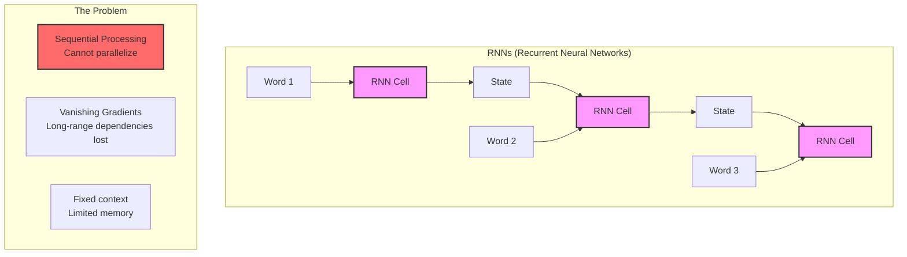
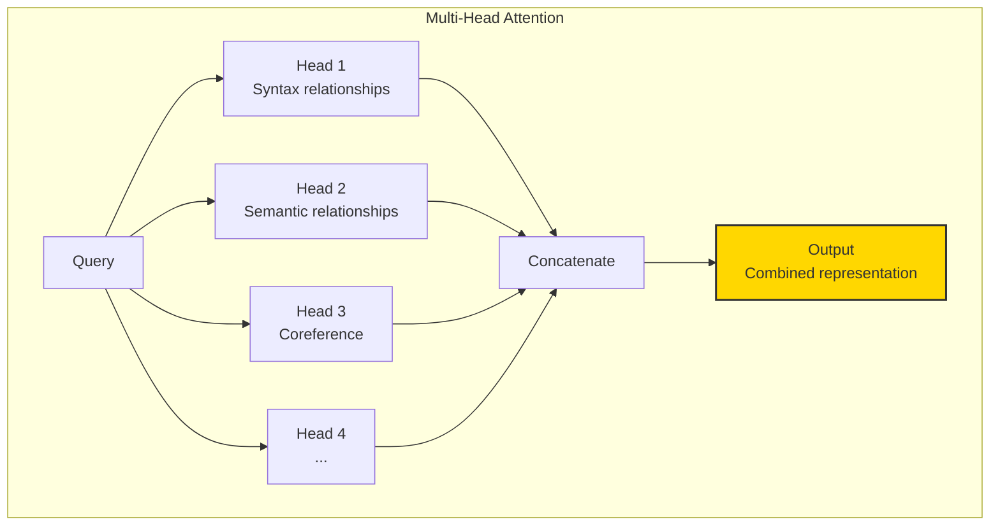
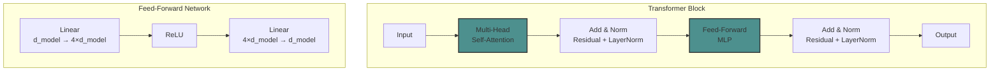
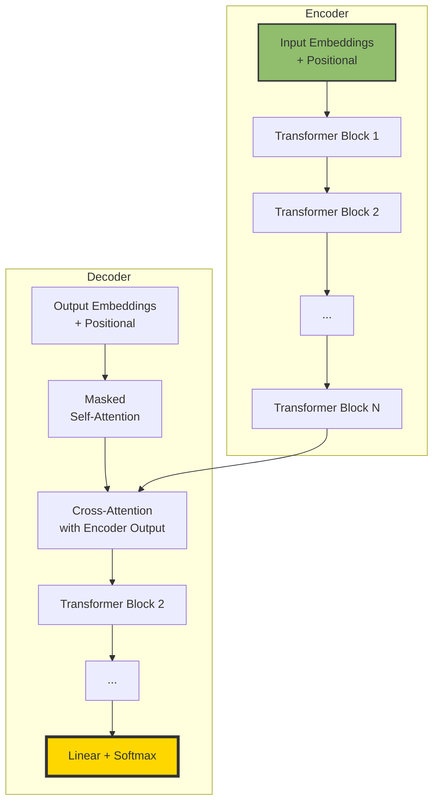

# The 2026 AI Metromap: Transformers & Attention – The Station That Changed Everything

## Series C: Modern Architecture Line | Story 1 of 6


## 📖 Introduction

**Welcome to the Modern Architecture Line—the express train to cutting-edge AI.**

You've completed Foundations Station. You've mastered the Supervised Learning Line. You understand how neural networks learn—from forward propagation to backpropagation to optimization.

Now it's time to board the express train.

In 2017, a paper titled "Attention Is All You Need" was published. It proposed a new architecture called the Transformer. It discarded recurrent networks and convolutional networks entirely. It was built on one idea: **attention**.

At the time, few realized what was about to happen. Within five years, Transformers would:
- Power GPT, Claude, Llama, and every modern LLM
- Revolutionize computer vision with Vision Transformers
- Enable multimodal systems like CLIP and Gemini
- Become the default architecture for almost everything

This story—**The 2026 AI Metromap: Transformers & Attention – The Station That Changed Everything**—is your journey into the architecture that defines modern AI. We'll understand why attention is so powerful. We'll decode the Transformer block—the building block of every LLM. We'll build a miniature Transformer from scratch. And we'll see how this one idea transformed the entire field.

**Let's board the express train.**

---

## 📚 Where You Are in the Journey

### The Master Story Arc: The 2026 AI Metromap Series (Complete)

- 🗺️ **[The 2026 AI Metromap: Why the Old Learning Routes Are Obsolete](#)** – A paradigm shift from linear learning to transit-system mastery.
- 🧭 **[The 2026 AI Metromap: Reading the Map](#)** – Strategic navigation across the three core lines.
- 🎒 **[The 2026 AI Metromap: Avoiding Derailments](#)** – Diagnosing and preventing the most common learning pitfalls.
- 🏁 **[The 2026 AI Metromap: From Passenger to Driver](#)** – Building your portfolio using the Metromap structure.

### Series A: Foundations Station (Complete)

- 🏗️ **[The 2026 AI Metromap: Foundations Station – Why Data Cleaning and Git Are Your Board Games, Not Just Chores](#)**
- 🖥️ **[The 2026 AI Metromap: Command Line & Version Control – Navigating the Terminal Like a Conductor](#)**
- 🧮 **[The 2026 AI Metromap: Linear Algebra for ML – The Language of the Map](#)**
- 📊 **[The 2026 AI Metromap: Data Cleaning & Visualization – Turning Raw Data into Tracks](#)**
- 🔄 **[The 2026 AI Metromap: Ethics & Responsible AI – The Safety Systems of the Metro](#)**

### Series B: Supervised Learning Line (Complete)

- 📊 **[The 2026 AI Metromap: Regression & Classification – The Grand Central Station of AI](#)**
- 🧬 **[The 2026 AI Metromap: Neural Network Architecture – From Perceptron to MLP](#)**
- ⚡ **[The 2026 AI Metromap: Activation Functions & Backpropagation – The Electrical Grid of the Network](#)**
- 🎯 **[The 2026 AI Metromap: Loss Functions & Optimization – Navigating to the Minimum](#)**

### Series C: Modern Architecture Line (6 Stories)

- 📖 **The 2026 AI Metromap: Transformers & Attention – The Station That Changed Everything** – The "Attention Is All You Need" paper decoded; self-attention mechanisms; multi-head attention; positional encoding; encoder-decoder architecture. **⬅️ YOU ARE HERE**

- 🤖 **[The 2026 AI Metromap: GPT & LLM Architecture – Understanding the Engine of the Express Train](#)** – Decoder-only architecture; causal masking; next token prediction; scaling laws; context windows; emergent abilities. 🔜 *Up Next*

- 🎨 **[The 2026 AI Metromap: Diffusion Models – The Scenic Route to Generative AI](#)** – How diffusion models work; forward diffusion process; reverse denoising; U-Net architecture; stable diffusion.

- 🌐 **[The 2026 AI Metromap: Multimodal Models – The Interchange Stations](#)** – CLIP: connecting images and text; Flamingo: few-shot multimodal learning; Gemini: native multimodality; contrastive learning.

- 🧩 **[The 2026 AI Metromap: Fine-Tuning vs. In-Context Learning – When to Train vs. When to Prompt](#)** – Parameter-efficient fine-tuning (LoRA, QLoRA); instruction tuning; RLHF; in-context learning; few-shot prompting.

- 📚 **[The 2026 AI Metromap: Open Source LLMs – LLaMA, Mistral, DeepSeek, and Beyond](#)** – Running LLMs locally; quantization (GGUF, GPTQ); inference optimization; model comparison; open-source ecosystem.

### The Complete Story Catalog

For a complete view of all upcoming stories across every series, visit the **[Complete 2026 AI Metromap Story Catalog](#)**.

---

## 🚂 Before Transformers: The Old Ways

To understand why Transformers revolutionized AI, we need to understand what came before.



**The RNN Problem:**

- **Sequential processing** – Can't process words in parallel. Must wait for each previous word.
- **Vanishing gradients** – Information from early words fades as sequence gets longer.
- **Fixed context** – Memory is limited to the hidden state size.

Transformers solved all of this with one idea: **process all words in parallel and let them attend to each other.**

---

## 💡 Attention Is All You Need

The core insight: Instead of processing sequentially, let every token look at every other token and decide how much attention to pay.

```mermaid
graph TD
    subgraph "Attention Mechanism"
        Q[Query<br/>"What am I looking for?"] --> S[Similarity<br/>Score]
        K[Key<br/>"What do I have?"] --> S
        S --> A[Attention<br/>Weights]
        A --> V[Value<br/>"What information do I pass?"]
        V --> O[Output<br/>Weighted sum of values]
    end
```

### The Attention Formula

```
Attention(Q, K, V) = softmax(Q·Kᵀ / √dₖ) · V
```

Let's decode this formula piece by piece.

```python
import numpy as np
import matplotlib.pyplot as plt

def visualize_attention():
    """Visualize how attention works step by step"""
    
    # Example: 3 words, 4-dimensional embeddings
    np.random.seed(42)
    
    # Word embeddings (simplified)
    words = ["The", "cat", "sat"]
    embeddings = np.random.randn(3, 4) * 0.5
    
    print("="*60)
    print("ATTENTION MECHANISM STEP BY STEP")
    print("="*60)
    
    print("\n1. INPUT EMBEDDINGS:")
    for i, word in enumerate(words):
        print(f"   {word}: {embeddings[i]}")
    
    # Create Query, Key, Value matrices
    d_k = 3  # Dimension of keys/queries
    
    # Random weight matrices
    W_Q = np.random.randn(4, d_k) * 0.1
    W_K = np.random.randn(4, d_k) * 0.1
    W_V = np.random.randn(4, d_k) * 0.1
    
    # Compute Q, K, V
    Q = embeddings @ W_Q
    K = embeddings @ W_K
    V = embeddings @ W_V
    
    print("\n2. QUERY, KEY, VALUE PROJECTIONS:")
    print(f"   Q shape: {Q.shape} (3 tokens × {d_k} dim)")
    print(f"   K shape: {K.shape}")
    print(f"   V shape: {V.shape}")
    
    # Compute attention scores
    scores = Q @ K.T
    print("\n3. ATTENTION SCORES (Q·Kᵀ):")
    print("   How much does each query attend to each key?")
    for i, word_i in enumerate(words):
        row = []
        for j, word_j in enumerate(words):
            row.append(f"{scores[i,j]:.2f}")
        print(f"   {word_i} → {word_j}: {row}")
    
    # Scale scores
    scaled_scores = scores / np.sqrt(d_k)
    print("\n4. SCALED SCORES (÷√dₖ):")
    print(f"   Scaling factor 1/√{d_k} = {1/np.sqrt(d_k):.3f}")
    
    # Apply softmax
    def softmax(x):
        exp_x = np.exp(x - np.max(x, axis=-1, keepdims=True))
        return exp_x / np.sum(exp_x, axis=-1, keepdims=True)
    
    attention_weights = softmax(scaled_scores)
    print("\n5. ATTENTION WEIGHTS (softmax):")
    print("   Probabilities summing to 1 per token:")
    for i, word_i in enumerate(words):
        row = []
        for j, word_j in enumerate(words):
            row.append(f"{attention_weights[i,j]:.3f}")
        print(f"   {word_i} → {word_j}: {row}")
    
    # Compute output
    output = attention_weights @ V
    print("\n6. OUTPUT (weighted sum of values):")
    for i, word in enumerate(words):
        print(f"   {word}: {output[i]}")
        print(f"      = {attention_weights[i,0]:.3f}×V₁ + {attention_weights[i,1]:.3f}×V₂ + {attention_weights[i,2]:.3f}×V₃")
    
    # Visualize attention weights
    fig, axes = plt.subplots(1, 2, figsize=(12, 5))
    
    # Attention weight heatmap
    im = axes[0].imshow(attention_weights, cmap='Blues', aspect='auto')
    axes[0].set_xticks(range(len(words)))
    axes[0].set_yticks(range(len(words)))
    axes[0].set_xticklabels(words)
    axes[0].set_yticklabels(words)
    axes[0].set_xlabel('Key (attended to)')
    axes[0].set_ylabel('Query (attending from)')
    axes[0].set_title('Attention Weights')
    plt.colorbar(im, ax=axes[0])
    
    # Add text annotations
    for i in range(len(words)):
        for j in range(len(words)):
            axes[0].text(j, i, f'{attention_weights[i,j]:.2f}',
                        ha='center', va='center', color='black' if attention_weights[i,j] < 0.5 else 'white')
    
    # Bar chart of attention per token
    x = np.arange(len(words))
    width = 0.25
    
    for i, word in enumerate(words):
        axes[1].bar(x + i*width, attention_weights[i], width, label=f'From "{word}"')
    
    axes[1].set_xlabel('Attended Token')
    axes[1].set_ylabel('Attention Weight')
    axes[1].set_title('Attention Distribution by Query')
    axes[1].set_xticks(x + width)
    axes[1].set_xticklabels(words)
    axes[1].legend()
    
    plt.tight_layout()
    plt.show()
    
    return attention_weights

attention_weights = visualize_attention()
```

---

## 🧠 Multi-Head Attention: Looking at Relationships from Multiple Angles

Single attention can only capture one type of relationship. Multi-head attention lets the model look at relationships from multiple perspectives.



```python
class MultiHeadAttention:
    """
    Multi-Head Attention - The core of Transformers.
    Allows the model to attend to different types of relationships.
    """
    
    def __init__(self, d_model, num_heads):
        """
        Args:
            d_model: Input embedding dimension
            num_heads: Number of attention heads
        """
        self.d_model = d_model
        self.num_heads = num_heads
        self.d_k = d_model // num_heads  # Dimension per head
        
        assert d_model % num_heads == 0, "d_model must be divisible by num_heads"
        
        # Weight matrices for Q, K, V
        self.W_Q = np.random.randn(d_model, d_model) * 0.01
        self.W_K = np.random.randn(d_model, d_model) * 0.01
        self.W_V = np.random.randn(d_model, d_model) * 0.01
        self.W_O = np.random.randn(d_model, d_model) * 0.01
    
    def softmax(self, x):
        exp_x = np.exp(x - np.max(x, axis=-1, keepdims=True))
        return exp_x / np.sum(exp_x, axis=-1, keepdims=True)
    
    def attention(self, Q, K, V, mask=None):
        """Scaled dot-product attention"""
        scores = Q @ K.transpose(0, 2, 1) / np.sqrt(self.d_k)
        
        if mask is not None:
            scores = scores.masked_fill(mask == 0, -1e9)
        
        attention_weights = self.softmax(scores)
        output = attention_weights @ V
        return output, attention_weights
    
    def forward(self, x):
        """
        Args:
            x: Input of shape (batch_size, seq_len, d_model)
        
        Returns:
            Output of shape (batch_size, seq_len, d_model)
        """
        batch_size, seq_len, _ = x.shape
        
        # Linear projections and reshape for multi-head
        Q = x @ self.W_Q
        K = x @ self.W_K
        V = x @ self.W_V
        
        # Reshape to (batch, num_heads, seq_len, d_k)
        Q = Q.reshape(batch_size, seq_len, self.num_heads, self.d_k).transpose(0, 2, 1, 3)
        K = K.reshape(batch_size, seq_len, self.num_heads, self.d_k).transpose(0, 2, 1, 3)
        V = V.reshape(batch_size, seq_len, self.num_heads, self.d_k).transpose(0, 2, 1, 3)
        
        # Apply attention
        attn_output, attn_weights = self.attention(Q, K, V)
        
        # Concatenate heads
        attn_output = attn_output.transpose(0, 2, 1, 3).reshape(batch_size, seq_len, self.d_model)
        
        # Final linear projection
        output = attn_output @ self.W_O
        
        return output, attn_weights

# Visualize multi-head attention
def visualize_multi_head():
    """Show how different heads focus on different patterns"""
    
    # Simulate 4 heads with different attention patterns
    num_heads = 4
    seq_len = 6
    words = ['The', 'quick', 'brown', 'fox', 'jumps', 'over']
    
    # Different attention patterns for each head
    # Head 1: attends to previous word
    head1 = np.zeros((seq_len, seq_len))
    for i in range(1, seq_len):
        head1[i, i-1] = 1
    
    # Head 2: attends to first word
    head2 = np.zeros((seq_len, seq_len))
    head2[:, 0] = 0.5
    head2 += np.eye(seq_len) * 0.5
    
    # Head 3: attends to next word
    head3 = np.zeros((seq_len, seq_len))
    for i in range(seq_len-1):
        head3[i, i+1] = 1
    
    # Head 4: attends to itself most, others uniformly
    head4 = np.ones((seq_len, seq_len)) * 0.1
    np.fill_diagonal(head4, 0.5)
    
    heads = [head1, head2, head3, head4]
    head_names = ['Previous Word', 'First Word', 'Next Word', 'Self + Uniform']
    
    fig, axes = plt.subplots(2, 2, figsize=(12, 10))
    axes = axes.flatten()
    
    for idx, (head, name) in enumerate(zip(heads, head_names)):
        im = axes[idx].imshow(head, cmap='Blues', aspect='auto', vmin=0, vmax=1)
        axes[idx].set_xticks(range(seq_len))
        axes[idx].set_yticks(range(seq_len))
        axes[idx].set_xticklabels(words, rotation=45, ha='right')
        axes[idx].set_yticklabels(words)
        axes[idx].set_title(f'Head {idx+1}: {name}')
        plt.colorbar(im, ax=axes[idx])
        
        # Add text annotations
        for i in range(seq_len):
            for j in range(seq_len):
                if head[i, j] > 0.1:
                    axes[idx].text(j, i, f'{head[i,j]:.1f}',
                                  ha='center', va='center', fontsize=8)
    
    plt.suptitle('Multi-Head Attention: Different Heads Learn Different Patterns', fontsize=14)
    plt.tight_layout()
    plt.show()

visualize_multi_head()
```

---

## 📍 Positional Encoding: Where Am I?

Attention doesn't know the order of words. "The cat sat" and "Sat cat the" would look the same. Positional encoding adds location information.

```python
def positional_encoding(seq_len, d_model):
    """
    Generate positional encodings using sine and cosine functions.
    """
    pe = np.zeros((seq_len, d_model))
    position = np.arange(seq_len)[:, np.newaxis]
    div_term = np.exp(np.arange(0, d_model, 2) * -(np.log(10000.0) / d_model))
    
    pe[:, 0::2] = np.sin(position * div_term)
    pe[:, 1::2] = np.cos(position * div_term)
    
    return pe

# Visualize positional encodings
seq_len = 50
d_model = 64
pe = positional_encoding(seq_len, d_model)

fig, axes = plt.subplots(1, 3, figsize=(15, 5))

# Heatmap of positional encodings
im = axes[0].imshow(pe, cmap='RdBu', aspect='auto')
axes[0].set_xlabel('Embedding Dimension')
axes[0].set_ylabel('Position')
axes[0].set_title('Positional Encodings')
plt.colorbar(im, ax=axes[0])

# Show first few positions
axes[1].plot(pe[:10, :20].T)
axes[1].set_xlabel('Position')
axes[1].set_ylabel('Encoding Value')
axes[1].set_title('First 10 Positions, First 20 Dimensions')

# Show similarity between positions
from scipy.spatial.distance import pdist, squareform
distances = squareform(pdist(pe, metric='cosine'))
axes[2].imshow(distances, cmap='viridis', aspect='auto')
axes[2].set_xlabel('Position')
axes[2].set_ylabel('Position')
axes[2].set_title('Cosine Similarity Between Positions')

plt.tight_layout()
plt.show()
```

---

## 🏗️ The Transformer Block

Now let's assemble the complete Transformer block.



```python
class TransformerBlock:
    """
    A single Transformer block.
    This is the building block of every Transformer model.
    """
    
    def __init__(self, d_model, num_heads, d_ff=None, dropout=0.1):
        """
        Args:
            d_model: Embedding dimension
            num_heads: Number of attention heads
            d_ff: Feed-forward hidden dimension (default: 4*d_model)
            dropout: Dropout rate
        """
        self.d_model = d_model
        self.num_heads = num_heads
        self.d_ff = d_ff if d_ff else 4 * d_model
        self.dropout = dropout
        
        # Multi-head attention
        self.attention = MultiHeadAttention(d_model, num_heads)
        
        # Feed-forward network
        self.W1 = np.random.randn(d_model, self.d_ff) * 0.01
        self.b1 = np.zeros((1, self.d_ff))
        self.W2 = np.random.randn(self.d_ff, d_model) * 0.01
        self.b2 = np.zeros((1, d_model))
        
        # Layer normalization parameters
        self.gamma1 = np.ones(d_model)
        self.beta1 = np.zeros(d_model)
        self.gamma2 = np.ones(d_model)
        self.beta2 = np.zeros(d_model)
    
    def layer_norm(self, x, gamma, beta, eps=1e-6):
        """Layer normalization"""
        mean = np.mean(x, axis=-1, keepdims=True)
        var = np.var(x, axis=-1, keepdims=True)
        x_norm = (x - mean) / np.sqrt(var + eps)
        return gamma * x_norm + beta
    
    def relu(self, x):
        return np.maximum(0, x)
    
    def feed_forward(self, x):
        """FFN(x) = ReLU(xW₁ + b₁)W₂ + b₂"""
        return (self.relu(x @ self.W1 + self.b1) @ self.W2) + self.b2
    
    def forward(self, x, mask=None):
        """
        Args:
            x: Input of shape (batch_size, seq_len, d_model)
            mask: Optional attention mask
        
        Returns:
            Output of shape (batch_size, seq_len, d_model)
        """
        # Multi-head attention with residual connection
        attn_out, attn_weights = self.attention.forward(x)
        x = x + attn_out
        x = self.layer_norm(x, self.gamma1, self.beta1)
        
        # Feed-forward with residual connection
        ff_out = self.feed_forward(x)
        x = x + ff_out
        x = self.layer_norm(x, self.gamma2, self.beta2)
        
        return x, attn_weights

# Visualize a Transformer block
def visualize_transformer_block():
    """Show the flow through a Transformer block"""
    
    batch_size = 1
    seq_len = 6
    d_model = 8
    num_heads = 2
    
    # Create random input
    x = np.random.randn(batch_size, seq_len, d_model) * 0.1
    
    # Create Transformer block
    block = TransformerBlock(d_model, num_heads)
    
    # Forward pass
    output, attention = block.forward(x)
    
    print("="*60)
    print("TRANSFORMER BLOCK FORWARD PASS")
    print("="*60)
    print(f"\nInput shape: {x.shape}")
    print(f"Output shape: {output.shape}")
    
    print(f"\nInput norm: {np.linalg.norm(x):.4f}")
    print(f"Output norm: {np.linalg.norm(output):.4f}")
    print(f"Change: {np.linalg.norm(output - x):.4f}")
    
    # Visualize attention patterns
    fig, axes = plt.subplots(1, num_heads, figsize=(12, 4))
    
    for h in range(num_heads):
        # Average attention across batch
        attn_h = np.mean(attention[:, h, :, :], axis=0)
        
        im = axes[h].imshow(attn_h, cmap='Blues', aspect='auto')
        axes[h].set_title(f'Head {h+1}')
        axes[h].set_xlabel('Key')
        axes[h].set_ylabel('Query')
        plt.colorbar(im, ax=axes[h])
    
    plt.suptitle('Attention Patterns in Transformer Block')
    plt.tight_layout()
    plt.show()
    
    return output, attention

output, attention = visualize_transformer_block()
```

---

## 🏛️ The Full Transformer: Encoder-Decoder Architecture

The original Transformer had two parts: encoder (reads input) and decoder (generates output).



**Encoder:** Reads the input sequence, builds rich representations.
**Decoder:** Generates output one token at a time, attending to both previous outputs and encoder representations.

---

## 📊 Takeaway from This Story

**What You Learned:**

- **The Attention Mechanism** – Query, Key, Value. Softmax(Q·Kᵀ/√dₖ)·V. Allows every token to attend to every other token in parallel.

- **Multi-Head Attention** – Multiple attention heads looking at different relationship types. Captures syntax, semantics, coreference, and more.

- **Positional Encoding** – Adds position information using sine/cosine functions. Essential because attention is permutation-invariant.

- **The Transformer Block** – Multi-head attention + feed-forward + residual connections + layer normalization. The building block of modern AI.

- **Encoder-Decoder Architecture** – Encoder reads input, decoder generates output. The foundation of translation, summarization, and many tasks.

- **Why Transformers Won** – Parallel processing, long-range dependencies, scalability. Attention is all you need.

---

## 🔗 Navigation

- **⬅️ Previous Story:** [The 2026 AI Metromap: Loss Functions & Optimization – Navigating to the Minimum](#) – The final story of Supervised Learning Line.

- **📚 Series C Catalog:** [Series C: Modern Architecture Line](#) – View all 6 stories in this series.

- **📚 Complete Story Catalog:** [Complete 2026 AI Metromap Story Catalog](#) – Your navigation guide to all 39+ stories.

- **➡️ Next Story:** **[The 2026 AI Metromap: GPT & LLM Architecture – Understanding the Engine of the Express Train](#)** – Decoder-only architecture; causal masking; next token prediction; scaling laws; context windows; emergent abilities.

---

## 📝 Your Invitation

Before the next story arrives, experiment with Transformers:

1. **Implement attention from scratch** – Write your own scaled dot-product attention. Visualize the attention patterns.

2. **Experiment with multi-head** – How do different heads learn different patterns? Visualize them.

3. **Build a mini-Transformer** – Use the TransformerBlock to build a small model. Train it on a simple task.

4. **Explore positional encodings** – How does position affect attention? Remove positional encoding and see what happens.

**You've boarded the express train. Next stop: GPT & LLM Architecture!**

---

*Found this helpful? Clap, comment, and share your Transformer experiments. Next stop: GPT & LLM Architecture!* 🚇