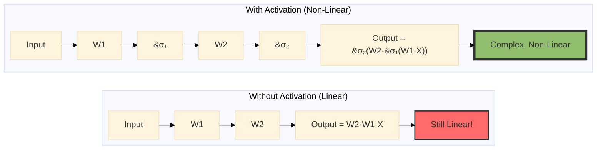

# Without activation functions, neural networks are 

```mermaid
---
config:
  theme: base
  layout: elk
---
flowchart LR
 subgraph Linear["Without Activation (Linear)"]
    direction LR
        B["W1"]
        A["Input"]
        C["W2"]
        D["Output = W2·W1·X"]
        E["Still Linear!"]
  end
 subgraph NonLinear["With Activation (Non-Linear)"]
    direction LR
        G["W1"]
        F["Input"]
        H["&fl°°963¶ß₁"]
        I["W2"]
        J["&fl°°963¶ß₂"]
        K["Output = &fl°°963¶ß₂(W2·&fl°°963¶ß₁(W1·X))"]
        L["Complex, Non-Linear"]
  end
    A --> B
    B --> C
    C --> D
    D --> E
    F --> G
    G --> H
    H --> I
    I --> J
    J --> K
    K --> L

    style E fill:#ff6b6b,stroke:#333,stroke-width:2px
    style L fill:#90be6d,stroke:#333,stroke-width:4px
```
