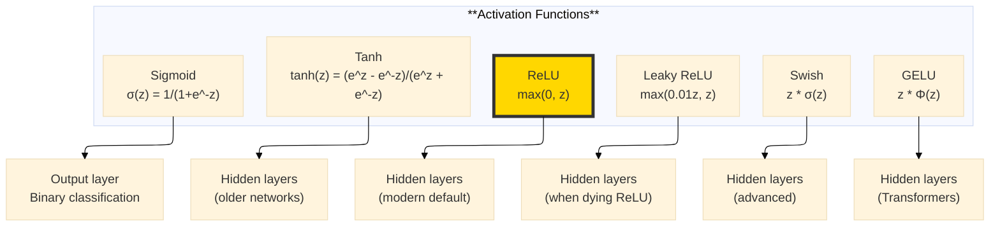

# Different activations for different purposes. Let'

```mermaid
---
config:
  theme: base
  layout: elk
---
graph TD
    subgraph "**Activation Functions**"
        S["Sigmoid<br/>σ(z) = 1/(1+e^-z)"]
        T["Tanh<br/>tanh(z) = (e^z - e^-z)/(e^z + e^-z)"]
        R["ReLU<br/>max(0, z)"]
        L["Leaky ReLU<br/>max(0.01z, z)"]
        SW["Swish<br/>z * σ(z)"]
        G["GELU<br/>z * Φ(z)"]
    end
    
    O["Output layer<br/>Binary classification"]
    H["Hidden layers<br/>(older networks)"]
    H2["Hidden layers<br/>(modern default)"]
    H3["Hidden layers<br/>(when dying ReLU)"]
    H4["Hidden layers<br/>(advanced)"]
    H5["Hidden layers<br/>(Transformers)"]
    
    S --> O
    T --> H
    R --> H2
    L --> H3
    SW --> H4
    G --> H5
    
    style R fill:#ffd700,stroke:#333,stroke-width:4px
```
