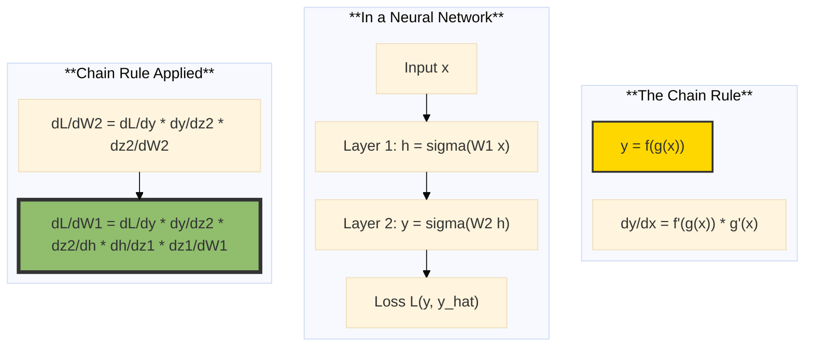

# Backpropagation is just the chain rule from calcul

```mermaid
---
config:
  theme: base
  layout: elk
---
graph TD
    subgraph Chain["**The Chain Rule**"]
    direction LR
        A["y = f(g(x))"] 
        B["dy/dx = f'(g(x)) * g'(x)"]
    end
    
    subgraph Network["**In a Neural Network**"]
    
        X["Input x"] --> L1["Layer 1: h = sigma(W1 x)"]
        L1 --> L2["Layer 2: y = sigma(W2 h)"]
        L2 --> L["Loss L(y, y_hat)"]
    end
    
    subgraph Applied["**Chain Rule Applied**"]
        C["dL/dW2 = dL/dy * dy/dz2 * dz2/dW2"] -->
        D["dL/dW1 = dL/dy * dy/dz2 * dz2/dh * dh/dz1 * dz1/dW1"]
    end
    
    style A fill:#ffd700,stroke:#333,stroke-width:2px
    style D fill:#90be6d,stroke:#333,stroke-width:4px
```
