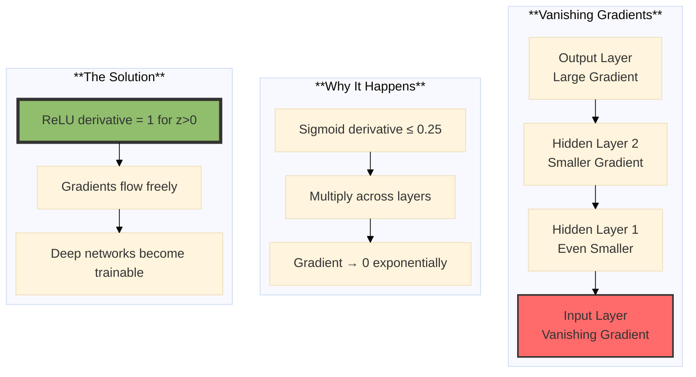

# Early deep networks used sigmoid and tanh activati

```mermaid
---
config:
  theme: base
  layout: elk
---
graph TD
    subgraph "**Vanishing Gradients**"
        O[Output Layer<br/>Large Gradient] --> H2[Hidden Layer 2<br/>Smaller Gradient]
        H2 --> H1[Hidden Layer 1<br/>Even Smaller]
        H1 --> I[Input Layer<br/>Vanishing Gradient]
    end
    
    subgraph "**Why It Happens**"
        S[Sigmoid derivative ≤ 0.25] --> M[Multiply across layers]
        M --> V[Gradient → 0 exponentially]
    end
    
    subgraph "**The Solution**"
        R[ReLU derivative = 1 for z>0] --> P[Gradients flow freely]
        P --> D[Deep networks become trainable]
    end
    
    style I fill:#ff6b6b,stroke:#333,stroke-width:2px
    style R fill:#90be6d,stroke:#333,stroke-width:4px
```
