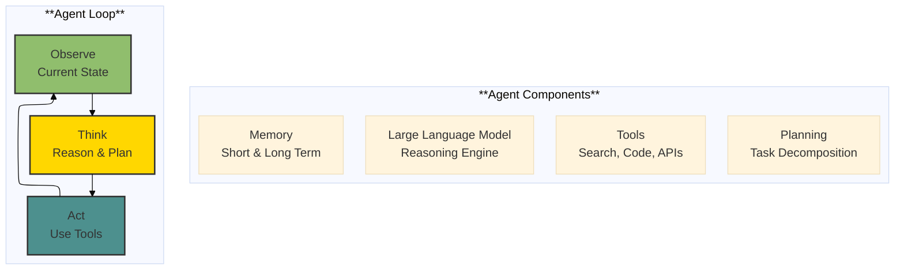

# An AI agent is a system that uses an LLM to reason

```mermaid
---
config:
  theme: base
  layout: elk
---
graph TD
    subgraph "**Agent Components**"

        LLM[Large Language Model<br/>Reasoning Engine]
        Tools[Tools<br/>Search, Code, APIs]
        Memory[Memory<br/>Short & Long Term]
        Planning[Planning<br/>Task Decomposition]
    end

    subgraph "**Agent Loop**"
        O[Observe<br/>Current State] --> T[Think<br/>Reason & Plan]
        T --> A[Act<br/>Use Tools]
        A --> O
    end
    

    
    style O fill:#90be6d,stroke:#333,stroke-width:2px
    style A fill:#4d908e,stroke:#333,stroke-width:2px
    style T fill:#ffd700,stroke:#333,stroke-width:2px

```
