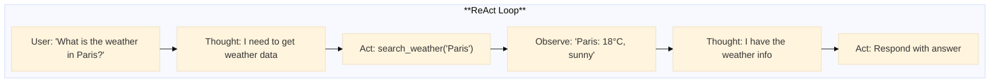

# ReAct (Reason + Act) is the foundational agent arc

```mermaid
---
config:
  theme: base
  layout: elk
---
graph LR
    subgraph ReActLoop["**ReAct Loop**"]
        Q["User: 'What is the weather in Paris?'"] --> T1["Thought: I need to get weather data"]
        T1 --> A1["Act: search_weather('Paris')"]
        A1 --> O1["Observe: 'Paris: 18°C, sunny'"]
        O1 --> T2["Thought: I have the weather info"]
        T2 --> A2["Act: Respond with answer"]
    end
```
