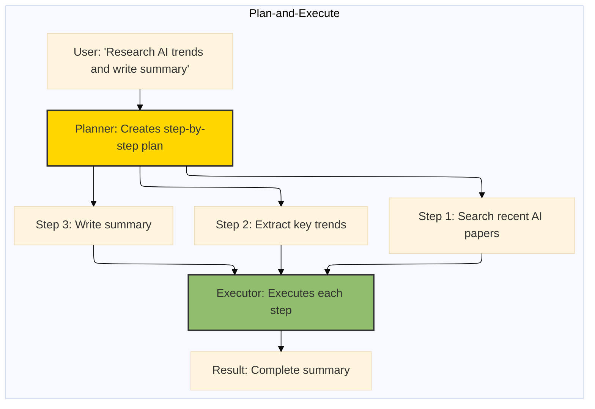

# Plan-and-Execute agents first create a plan, then 

```mermaid
---
config:
  theme: base
  layout: elk
---
graph TD
    subgraph PlanExecute["Plan-and-Execute"]
        Q["User: 'Research AI trends and write summary'"] --> P["Planner: Creates step-by-step plan"]
        
        P --> S1["Step 1: Search recent AI papers"]
        P --> S2["Step 2: Extract key trends"]
        P --> S3["Step 3: Write summary"]
        
        S1 --> E["Executor: Executes each step"]
        S2 --> E
        S3 --> E
        
        E --> R["Result: Complete summary"]
    end
    
    style P fill:#ffd700,stroke:#333,stroke-width:2px
    style E fill:#90be6d,stroke:#333,stroke-width:2px
```
