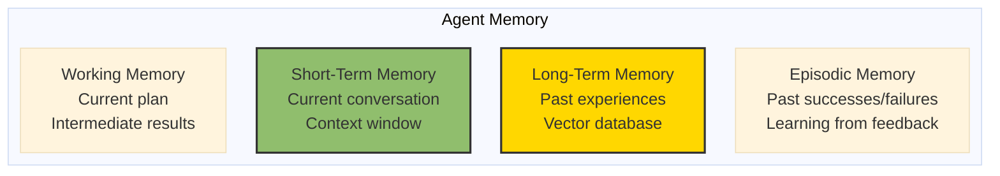

# Memory is essential for agents to maintain context

```mermaid
---
config:
  theme: base
  layout: elk
---
graph TD
    subgraph "Agent Memory"
        STM[Short-Term Memory<br/>Current conversation<br/>Context window]
        
        LTM[Long-Term Memory<br/>Past experiences<br/>Vector database]
        
        WM[Working Memory<br/>Current plan<br/>Intermediate results]
        
        EM[Episodic Memory<br/>Past successes/failures<br/>Learning from feedback]
    end
    
    style STM fill:#90be6d,stroke:#333,stroke-width:2px
    style LTM fill:#ffd700,stroke:#333,stroke-width:2px
```
