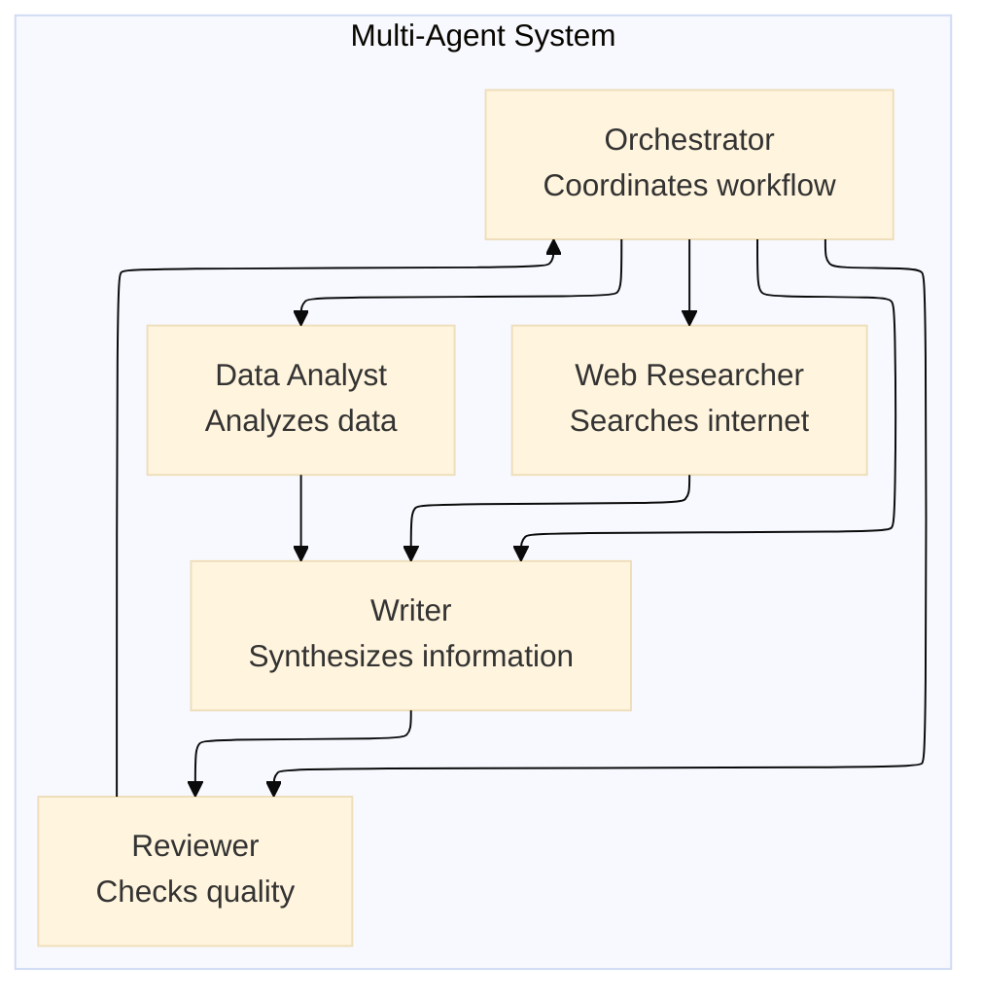

# Multiple agents can collaborate, each specializing

```mermaid
---
config:
  theme: base
  layout: elk
---
graph TD
    subgraph "Multi-Agent System"
        O[Orchestrator<br/>Coordinates workflow]
        
        O --> W1[Web Researcher<br/>Searches internet]
        O --> W2[Data Analyst<br/>Analyzes data]
        O --> W3[Writer<br/>Synthesizes information]
        O --> W4[Reviewer<br/>Checks quality]
        
        W1 --> W3
        W2 --> W3
        W3 --> W4
        W4 --> O
    end
```
