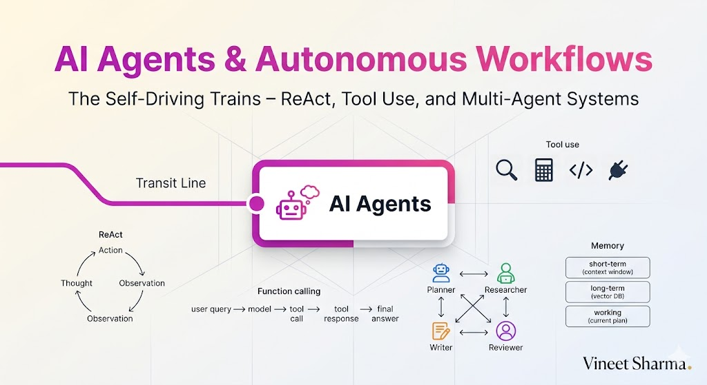
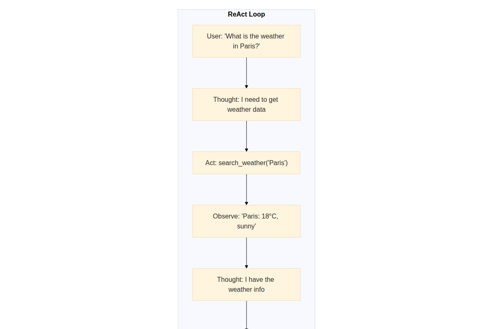
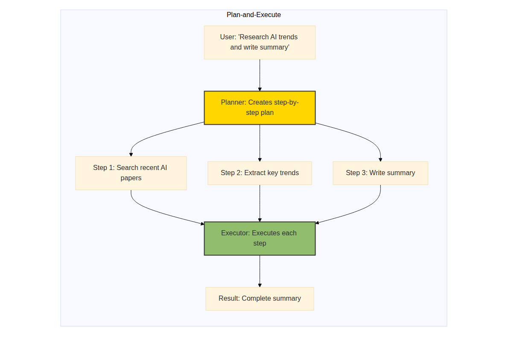
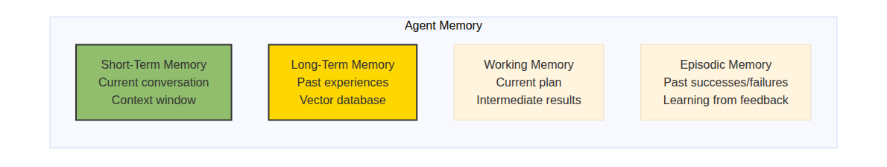
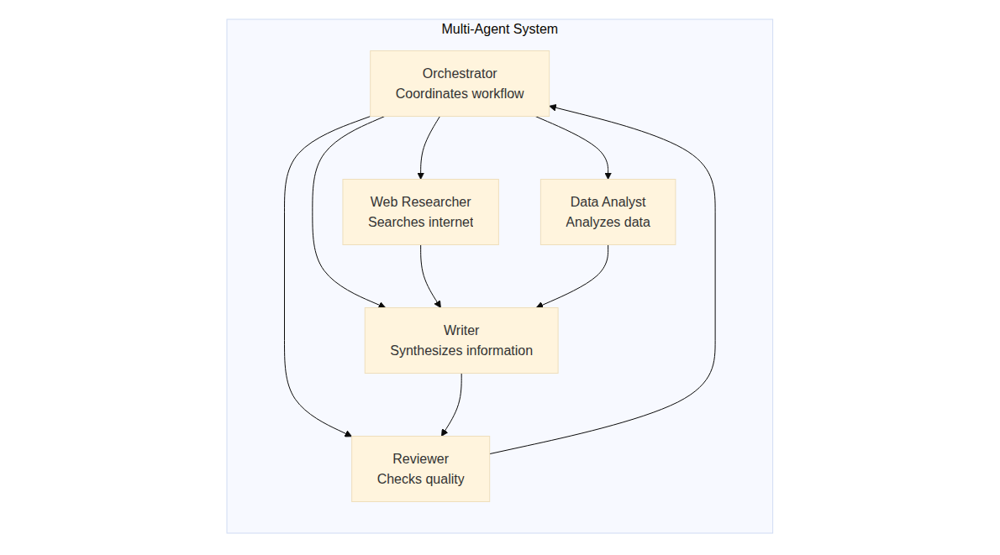

# The 2026 AI Metromap: AI Agents & Autonomous Workflows – The Self-Driving Trains

## Series E: Applied AI & Agents Line | Story 3 of 15+



## 📖 Introduction

**Welcome to the third stop on the Applied AI & Agents Line.**

In our last two stories, we mastered prompt engineering and RAG. You can now communicate precisely with LLMs and augment them with external knowledge. Your chatbots can answer questions about any document. Your applications are smarter than ever.

But there's something missing. Your AI is still reactive. It waits for a question, then answers. It doesn't take initiative. It doesn't plan. It doesn't act.

What if your AI could **do** things? What if it could search the web, write code, send emails, book appointments, and execute multi-step plans—all autonomously? What if it could reason about what tools to use, when to use them, and how to combine their results?

Welcome to the world of AI agents.

Agents are the next evolution of LLM applications. Instead of a single response, agents run in loops: think, act, observe, repeat. They can use tools, break down complex tasks, remember context, and adapt to new information. They're the self-driving trains of the AI world—capable of navigating complex workflows without constant human guidance.

This story—**The 2026 AI Metromap: AI Agents & Autonomous Workflows – The Self-Driving Trains**—is your complete guide to building AI agents. We'll understand agent architectures—ReAct, Plan-and-Execute, AutoGPT. We'll master tool use and function calling—giving agents the ability to interact with the world. We'll build multi-agent systems where specialized agents collaborate. And we'll implement memory systems that let agents remember and learn from experience.

**Let's build agents that act.**

---

## 📚 Where You Are in the Journey

### The Master Story Arc: The 2026 AI Metromap Series (Complete)

- 🗺️ **[The 2026 AI Metromap: Why the Old Learning Routes Are Obsolete](#)** – A paradigm shift from linear learning to transit-system mastery.
- 🧭 **[The 2026 AI Metromap: Reading the Map](#)** – Strategic navigation across the three core lines.
- 🎒 **[The 2026 AI Metromap: Avoiding Derailments](#)** – Diagnosing and preventing the most common learning pitfalls.
- 🏁 **[The 2026 AI Metromap: From Passenger to Driver](#)** – Building your portfolio using the Metromap structure.

### Series A: Foundations Station (Complete)
### Series B: Supervised Learning Line (Complete)
### Series C: Modern Architecture Line (Complete)
### Series D: Engineering & Optimization Yard (Complete)

### Series E: Applied AI & Agents Line (15+ Stories)

- 💬 **[The 2026 AI Metromap: Prompt Engineering 101 – The Art of Talking to AI](#)** – System prompts; few-shot prompting; chain-of-thought; tree of thoughts; self-consistency; prompt templates; building robust prompts for production.

- 📚 **[The 2026 AI Metromap: RAG – Retrieval-Augmented Generation for Knowledge-Intensive Tasks](#)** – Vector databases (Chroma, Pinecone, Weaviate, Milvus); embedding models; semantic search; hybrid search; reranking; building a document Q&A system.

- 🤖 **The 2026 AI Metromap: AI Agents & Autonomous Workflows – The Self-Driving Trains** – Agent architectures (ReAct, Plan-and-Execute, AutoGPT); tool use and function calling; multi-agent systems; memory management. **⬅️ YOU ARE HERE**

- 🗣️ **[The 2026 AI Metromap: Voice Assistants & Speech Models – Making AI Talk](#)** – Speech-to-text (Whisper); text-to-speech (ElevenLabs, Coqui); voice activity detection; real-time transcription. 🔜 *Up Next*

**Computer Vision**
- 👁️ **[The 2026 AI Metromap: Computer Vision Projects – From OCR to Face Recognition](#)** – Optical character recognition (Tesseract, TrOCR); face detection and recognition; object detection (YOLO, DETR); image segmentation.

- 🎨 **[The 2026 AI Metromap: Image Generation & Editing – Diffusion Models in Practice](#)** – Stable diffusion pipelines; ControlNet; inpainting; outpainting; image-to-image; fine-tuning diffusion models with DreamBooth.

**NLP & Specialized Tasks**
- 🔤 **[The 2026 AI Metromap: NLP Tasks – NER, Translation, Summarization, and Beyond](#)** – Named entity recognition; machine translation; text summarization (extractive and abstractive); sentiment analysis.

- 📈 **[The 2026 AI Metromap: Time Series Forecasting – ARIMA, LSTM, and Transformers](#)** – Classical methods (ARIMA, SARIMA); LSTM networks; Transformer for time series; forecasting stock prices, weather, and demand.

- 👍 **[The 2026 AI Metromap: Recommendation Systems – From Collaborative Filtering to Two-Tower Networks](#)** – Content-based filtering; collaborative filtering; matrix factorization; neural collaborative filtering; two-tower architectures.

**Industry Applications**
- 🏥 **[The 2026 AI Metromap: AI in Healthcare – Medical Research, Diagnostics, and Wellness](#)** – Medical imaging; EHR analysis; drug discovery; clinical decision support; regulatory considerations.

- 💰 **[The 2026 AI Metromap: AI in Finance – Banking, Insurance, and Trading](#)** – Fraud detection; algorithmic trading; credit scoring; risk management; explainable AI for compliance.

- 🎮 **[The 2026 AI Metromap: AI in Gaming, VR/AR, and Entertainment](#)** – Procedural content generation; NPC behavior with LLMs; AI-driven storytelling; game testing automation.

- 🏭 **[The 2026 AI Metromap: AI in Robotics, Manufacturing, and Supply Chain](#)** – Computer vision for quality control; predictive maintenance; autonomous navigation; warehouse optimization.

- 🌱 **[The 2026 AI Metromap: AI for Social Good – Climate Action, Agriculture, and Sustainability](#)** – Crop yield prediction; climate modeling; energy optimization; wildlife conservation; disaster response.

- 🎓 **[The 2026 AI Metromap: AI in Education – Personalized Learning and Training](#)** – Intelligent tutoring systems; automated grading; personalized content recommendation; adaptive learning paths.

### The Complete Story Catalog

For a complete view of all upcoming stories across every series, visit the **[Complete 2026 AI Metromap Story Catalog](#)**.

---

## 🤖 What Is an AI Agent?

An AI agent is a system that uses an LLM to reason, plan, and take actions autonomously.

```mermaid
```

](images/diagram_01_an-ai-agent-is-a-system-that-uses-an-llm-to-reason-bff5.png)

[View Source](https://github.com/Vineet-Sharma-Medium-Stories/Medium-Assets/blob/main/the-2026-ai-metromap-ai-agents--autonomous-workflows--the-self-driving-trains/diagram_01_an-ai-agent-is-a-system-that-uses-an-llm-to-reason-bff5.md)


```python
def agent_introduction():
    """Define what AI agents are and their key components"""
    
    print("="*60)
    print("WHAT IS AN AI AGENT?")
    print("="*60)
    
    print("\nAn AI agent is an autonomous system that:")
    print("  • Perceives its environment (observations)")
    print("  • Reasons about goals and plans (thinking)")
    print("  • Takes actions using tools (acting)")
    print("  • Learns from feedback (adaptation)")
    
    print("\n" + "="*60)
    print("KEY DIFFERENCES FROM STANDARD LLM")
    print("="*60)
    
    differences = [
        ("Standard LLM", "Single response", "No tools", "Stateless"),
        ("AI Agent", "Multi-step loops", "Tool use", "Memory & state")
    ]
    
    print(f"\n{'Aspect':<15} {'Standard LLM':<20} {'AI Agent':<20}")
    print("-"*55)
    print(f"{'Response':<15} {'Single response':<20} {'Multi-step loops':<20}")
    print(f"{'Tools':<15} {'No tools':<20} {'Tool use':<20}")
    print(f"{'Memory':<15} {'Stateless':<20} {'Memory & state':<20}")
    
    print("\n" + "="*60)
    print("AGENT CAPABILITIES")
    print("="*60)
    capabilities = [
        "• Break down complex tasks into steps",
        "• Use external tools (search, calculators, APIs)",
        "• Remember past interactions and learn",
        "• Adapt plans based on new information",
        "• Work autonomously with minimal oversight"
    ]
    for cap in capabilities:
        print(cap)

agent_introduction()
```

---

## 🧠 ReAct: Reasoning + Acting

ReAct (Reason + Act) is the foundational agent architecture that combines chain-of-thought reasoning with tool use.

```mermaid
```



[View Source](https://github.com/Vineet-Sharma-Medium-Stories/Medium-Assets/blob/main/the-2026-ai-metromap-ai-agents--autonomous-workflows--the-self-driving-trains/diagram_02_react-reason--act-is-the-foundational-agent-arc-c376.md)


```python
def react_architecture():
    """Implement the ReAct agent architecture"""
    
    print("="*60)
    print("REACT: REASON + ACT")
    print("="*60)
    
    print("""
    # ReAct Agent Implementation
    
    class ReActAgent:
        def __init__(self, llm, tools):
            self.llm = llm
            self.tools = {tool.name: tool for tool in tools}
            self.max_iterations = 10
        
        def run(self, query):
            \"\"\"Run the ReAct loop\"\"\"
            thought = ""
            action = ""
            observation = ""
            history = []
            
            for i in range(self.max_iterations):
                # Generate next thought/action
                prompt = self._build_prompt(query, history)
                response = self.llm.generate(prompt)
                
                # Parse response
                thought = self._extract_thought(response)
                action = self._extract_action(response)
                
                if action == "FINISH":
                    return self._extract_answer(response)
                
                # Execute action
                observation = self._execute_action(action)
                history.append((thought, action, observation))
            
            return "Max iterations reached"
        
        def _execute_action(self, action):
            \"\"\"Parse and execute tool action\"\"\"
            # Format: "ToolName(input)"
            tool_name, tool_input = self._parse_action(action)
            tool = self.tools[tool_name]
            return tool.run(tool_input)
    
    # Example tools
    class SearchTool:
        name = "search"
        def run(self, query):
            return f"Search results for: {query}"
    
    class CalculatorTool:
        name = "calculate"
        def run(self, expression):
            return str(eval(expression))
    
    # Prompt template
    prompt_template = """
    You are a helpful assistant with access to tools.
    
    Tools available:
    - search(query): Search the internet
    - calculate(expression): Evaluate math expressions
    
    Use the following format:
    Thought: [your reasoning]
    Action: ToolName(input)
    Observation: [result of action]
    ... (repeat as needed)
    Thought: I have enough information
    Action: FINISH
    Final Answer: [your response]
    
    Question: {query}
    
    {history}
    """
    """)
    
    print("\n" + "="*60)
    print("REACT ADVANTAGES")
    print("="*60)
    print("✓ Transparent reasoning (observable thought process)")
    print("✓ Interleaved reasoning and action")
    print("✓ Handles dynamic information needs")
    print("✓ Easy to debug and trace")

react_architecture()
```

---

## 🛠️ Tool Use and Function Calling

Tools are the interface between agents and the external world. Modern LLMs support function calling natively.

```python
def tool_use():
    """Implement tool use with function calling"""
    
    print("="*60)
    print("TOOL USE AND FUNCTION CALLING")
    print("="*60)
    
    print("\n" + "="*60)
    print("OPENAI FUNCTION CALLING")
    print("="*60)
    
    print("""
    # Define tools as functions
    tools = [
        {
            "type": "function",
            "function": {
                "name": "get_weather",
                "description": "Get current weather for a location",
                "parameters": {
                    "type": "object",
                    "properties": {
                        "location": {
                            "type": "string",
                            "description": "City and country"
                        },
                        "unit": {
                            "type": "string",
                            "enum": ["celsius", "fahrenheit"],
                            "description": "Temperature unit"
                        }
                    },
                    "required": ["location"]
                }
            }
        },
        {
            "type": "function",
            "function": {
                "name": "search_web",
                "description": "Search the web for information",
                "parameters": {
                    "type": "object",
                    "properties": {
                        "query": {
                            "type": "string",
                            "description": "Search query"
                        }
                    },
                    "required": ["query"]
                }
            }
        }
    ]
    
    # Call with function calling
    response = openai.chat.completions.create(
        model="gpt-4",
        messages=[{"role": "user", "content": "What's the weather in Paris?"}],
        tools=tools,
        tool_choice="auto"
    )
    
    # Handle function calls
    if response.choices[0].message.tool_calls:
        for tool_call in response.choices[0].message.tool_calls:
            function_name = tool_call.function.name
            arguments = json.loads(tool_call.function.arguments)
            
            if function_name == "get_weather":
                result = get_weather(**arguments)
            elif function_name == "search_web":
                result = search_web(**arguments)
            
            # Add result to conversation
            messages.append({
                "role": "tool",
                "tool_call_id": tool_call.id,
                "content": result
            })
        
        # Second call with tool results
        final_response = openai.chat.completions.create(
            model="gpt-4",
            messages=messages
        )
    """)
    
    print("\n" + "="*60)
    print("COMMON TOOL TYPES")
    print("="*60)
    
    tools_list = [
        ("Search", "Web search, knowledge retrieval", "DuckDuckGo, SerpAPI, Bing"),
        ("Code Interpreter", "Execute Python, analyze data", "OpenAI code interpreter, local Python"),
        ("Calculator", "Math operations", "eval(), Wolfram Alpha"),
        ("Database", "Query structured data", "SQL, vector DBs"),
        ("APIs", "External services", "Slack, email, calendar, GitHub"),
        ("File System", "Read/write files", "Local files, cloud storage"),
        ("Browser", "Web navigation", "Playwright, Selenium"),
        ("Image Generation", "Create images", "DALL-E, Stable Diffusion")
    ]
    
    print(f"\n{'Tool Type':<18} {'Description':<25} {'Examples':<25}")
    print("-"*70)
    for tool_type, desc, examples in tools_list:
        print(f"{tool_type:<18} {desc:<25} {examples:<25}")

tool_use()
```

---

## 📋 Plan-and-Execute: Separating Planning from Execution

Plan-and-Execute agents first create a plan, then execute it step by step.

```mermaid
```



[View Source](https://github.com/Vineet-Sharma-Medium-Stories/Medium-Assets/blob/main/the-2026-ai-metromap-ai-agents--autonomous-workflows--the-self-driving-trains/diagram_03_plan-and-execute-agents-first-create-a-plan-then-a4ae.md)


```python
def plan_execute_agent():
    """Implement Plan-and-Execute agent architecture"""
    
    print("="*60)
    print("PLAN-AND-EXECUTE AGENT")
    print("="*60)
    
    print("""
    class PlanExecuteAgent:
        def __init__(self, llm, tools):
            self.llm = llm
            self.tools = tools
            self.planner = Planner(llm)
            self.executor = Executor(llm, tools)
        
        def run(self, query):
            # Step 1: Create plan
            plan = self.planner.create_plan(query)
            print(f"Plan: {plan}")
            
            # Step 2: Execute plan step by step
            results = []
            for step in plan.steps:
                result = self.executor.execute_step(step, results)
                results.append(result)
                print(f"Step {step.id}: {result}")
            
            # Step 3: Synthesize final answer
            final_answer = self._synthesize(query, plan, results)
            return final_answer
    
    class Planner:
        def create_plan(self, query):
            prompt = f\"\"\"
            Create a step-by-step plan to answer: {query}
            
            Output as JSON:
            {{
                "steps": [
                    {{"id": 1, "action": "search", "input": "..."}},
                    {{"id": 2, "action": "extract", "input": "..."}},
                    ...
                ]
            }}
            \"\"\"
            response = self.llm.generate(prompt)
            return parse_plan(response)
    
    class Executor:
        def execute_step(self, step, previous_results):
            # Get relevant tool
            tool = self.tools[step.action]
            
            # Execute with context from previous steps
            context = self._format_context(previous_results)
            result = tool.run(step.input, context)
            
            return result
    """)
    
    print("\n" + "="*60)
    print("ADVANTAGES OVER REACT")
    print("="*60)
    print("✓ Better for complex, multi-step tasks")
    print("✓ Plan is visible and editable")
    print("✓ Can parallelize independent steps")
    print("✓ Easier to debug and optimize")
    
    print("\n" + "="*60)
    print("WHEN TO USE")
    print("="*60)
    print("Plan-and-Execute: Complex tasks with 5+ steps")
    print("ReAct: Simple tasks, dynamic information needs")

plan_execute_agent()
```

---

## 🧠 Memory Systems: Short-Term and Long-Term

Memory is essential for agents to maintain context and learn from experience.

```mermaid
```



[View Source](https://github.com/Vineet-Sharma-Medium-Stories/Medium-Assets/blob/main/the-2026-ai-metromap-ai-agents--autonomous-workflows--the-self-driving-trains/diagram_04_memory-is-essential-for-agents-to-maintain-context-b97f.md)


```python
def agent_memory():
    """Implement memory systems for agents"""
    
    print("="*60)
    print("AGENT MEMORY SYSTEMS")
    print("="*60)
    
    print("""
    class AgentMemory:
        def __init__(self):
            self.short_term = []  # Recent interactions
            self.long_term = ChromaDB()  # Vector memory
            self.working = {}  # Current task state
        
        def add_to_short_term(self, interaction):
            \"\"\"Add to conversation memory\"\"\"
            self.short_term.append(interaction)
            # Trim if too long
            if len(self.short_term) > 20:
                # Move to long-term
                self._archive_to_long_term(self.short_term[:10])
                self.short_term = self.short_term[-10:]
        
        def recall_relevant(self, query, k=5):
            \"\"\"Retrieve relevant memories\"\"\"
            # Semantic search in long-term memory
            relevant = self.long_term.search(query, k=k)
            return relevant
        
        def store_experience(self, task, outcome):
            \"\"\"Learn from experience\"\"\"
            embedding = self._embed(f"Task: {task}\\nOutcome: {outcome}")
            self.long_term.add(embedding, metadata={
                "task": task,
                "outcome": outcome,
                "timestamp": time.time()
            })
        
        def get_context(self, query):
            \"\"\"Build context from all memory types\"\"\"
            context = {
                "recent": self.short_term[-5:],
                "relevant_memories": self.recall_relevant(query),
                "current_plan": self.working.get("plan", [])
            }
            return context
    """)
    
    print("\n" + "="*60)
    print("MEMORY BEST PRACTICES")
    print("="*60)
    practices = [
        "• Use short-term for recent context (last 10-20 turns)",
        "• Use long-term vector DB for semantic recall",
        "• Implement working memory for current task state",
        "• Store episodic memory for learning from feedback",
        "• Use summarization to compress long histories",
        "• Implement forgetting to prevent memory explosion"
    ]
    for p in practices:
        print(f"  {p}")

agent_memory()
```

---

## 🤝 Multi-Agent Systems: Collaboration and Specialization

Multiple agents can collaborate, each specializing in different tasks.

```mermaid
```



[View Source](https://github.com/Vineet-Sharma-Medium-Stories/Medium-Assets/blob/main/the-2026-ai-metromap-ai-agents--autonomous-workflows--the-self-driving-trains/diagram_05_multiple-agents-can-collaborate-each-specializing-68a9.md)


```python
def multi_agent_systems():
    """Build multi-agent systems with specialized roles"""
    
    print("="*60)
    print("MULTI-AGENT SYSTEMS")
    print("="*60)
    
    print("""
    class ResearchTeam:
        \"\"\"Multi-agent system for research tasks\"\"\"
        
        def __init__(self):
            self.agents = {
                "planner": PlannerAgent(),
                "researcher": WebResearcher(),
                "analyst": DataAnalyst(),
                "writer": WriterAgent(),
                "reviewer": ReviewerAgent()
            }
        
        def research(self, topic):
            # Planner creates research plan
            plan = self.agents["planner"].plan(topic)
            
            # Researcher gathers information
            raw_data = self.agents["researcher"].gather(plan.queries)
            
            # Analyst extracts insights
            insights = self.agents["analyst"].analyze(raw_data)
            
            # Writer synthesizes report
            draft = self.agents["writer"].write(topic, insights)
            
            # Reviewer checks quality
            feedback = self.agents["reviewer"].review(draft)
            
            # Iterate if needed
            if feedback.score < 0.8:
                return self._revise(draft, feedback)
            
            return draft
    
    class PlannerAgent:
        def plan(self, topic):
            return ResearchPlan(
                queries=[...],
                methodology="...",
                expected_outcomes=[...]
            )
    
    class WebResearcher:
        def gather(self, queries):
            results = []
            for q in queries:
                results.append(search_web(q))
            return results
    
    class DataAnalyst:
        def analyze(self, data):
            return Insights(
                key_findings=[...],
                trends=[...],
                statistics=[...]
            )
    
    class WriterAgent:
        def write(self, topic, insights):
            prompt = f\"\"\"
            Write a research report on {topic}
            
            Key findings: {insights.key_findings}
            Trends: {insights.trends}
            Statistics: {insights.statistics}
            
            Format as academic report with sections.
            \"\"\"
            return generate(prompt)
    
    class ReviewerAgent:
        def review(self, draft):
            return Review(
                score=0.85,
                feedback="Good, but needs more citations"
            )
    """)
    
    print("\n" + "="*60)
    print("MULTI-AGENT PATTERNS")
    print("="*60)
    patterns = [
        ("Orchestrator-Workers", "One agent coordinates specialized workers", "Research, automation"),
        ("Debate", "Agents argue and refine ideas", "Creative tasks, decision-making"),
        ("Hierarchical", "Managers decompose tasks to sub-agents", "Complex workflows"),
        ("Swarm", "Many agents collaborate without central control", "Simulations, exploration")
    ]
    
    print(f"\n{'Pattern':<20} {'Description':<35} {'Use Case':<25}")
    print("-"*85)
    for pattern, desc, use in patterns:
        print(f"{pattern:<20} {desc:<35} {use:<25}")

multi_agent_systems()
```

---

## 🚀 Building a Complete Agent: Research Assistant

Let's build a complete research assistant agent that can search, analyze, and write reports.

```python
def research_agent():
    """Complete implementation of a research assistant agent"""
    
    print("="*60)
    print("COMPLETE RESEARCH ASSISTANT AGENT")
    print("="*60)
    
    print("""
    class ResearchAssistant:
        \"\"\"Autonomous research agent\"\"\"
        
        def __init__(self):
            self.llm = ChatOpenAI(model="gpt-4")
            self.tools = [
                SearchTool(),
                SummarizeTool(),
                ExtractTool(),
                WriteTool()
            ]
            self.memory = AgentMemory()
        
        def research(self, query, depth="standard"):
            \"\"\"Main research loop\"\"\"
            
            # Step 1: Understand query
            understood = self._understand_query(query)
            print(f"Understood: {understood}")
            
            # Step 2: Create research plan
            plan = self._create_plan(understood, depth)
            print(f"Plan: {len(plan.steps)} steps")
            
            # Step 3: Execute research
            findings = []
            for step in plan.steps:
                result = self._execute_step(step, findings)
                findings.append(result)
                print(f"Step {step.id}: {result.summary}")
            
            # Step 4: Synthesize findings
            synthesis = self._synthesize(findings)
            
            # Step 5: Generate report
            report = self._write_report(query, synthesis)
            
            # Step 6: Review and revise
            final_report = self._review_and_revise(report)
            
            return final_report
        
        def _understand_query(self, query):
            \"\"\"Deepen understanding of user intent\"\"\"
            prompt = f\"\"\"
            Analyze this research query and extract:
            1. Main topic
            2. Specific aspects to cover
            3. Desired depth
            4. Domain context
            
            Query: {query}
            \"\"\"
            return self.llm.generate(prompt)
        
        def _create_plan(self, understood, depth):
            \"\"\"Create step-by-step research plan\"\"\"
            prompt = f\"\"\"
            Create a research plan for:
            Topic: {understood.topic}
            Aspects: {understood.aspects}
            Depth: {depth}
            
            Output as JSON with steps containing:
            - action (search/analyze/summarize)
            - input (specific query or task)
            - expected_output
            \"\"\"
            return parse_plan(self.llm.generate(prompt))
        
        def _execute_step(self, step, previous_findings):
            \"\"\"Execute a single research step\"\"\"
            tool = self._get_tool(step.action)
            
            # Add context from previous findings
            context = self._format_context(previous_findings)
            
            result = tool.run(step.input, context)
            
            # Store in memory
            self.memory.add_to_short_term(result)
            
            return result
        
        def _synthesize(self, findings):
            \"\"\"Combine and synthesize findings\"\"\"
            prompt = f\"\"\"
            Synthesize these research findings:
            {self._format_findings(findings)}
            
            Identify:
            - Key insights
            - Contradictions
            - Gaps in knowledge
            - Conclusions
            \"\"\"
            return self.llm.generate(prompt)
        
        def _write_report(self, query, synthesis):
            \"\"\"Generate final report\"\"\"
            prompt = f\"\"\"
            Write a comprehensive research report on: {query}
            
            Key Insights: {synthesis.insights}
            Evidence: {synthesis.evidence}
            Conclusions: {synthesis.conclusions}
            
            Format with:
            - Executive Summary
            - Introduction
            - Methodology
            - Findings
            - Discussion
            - Conclusion
            - References
            \"\"\"
            return self.llm.generate(prompt)
        
        def _review_and_revise(self, report):
            \"\"\"Quality review and revision\"\"\"
            prompt = f\"\"\"
            Review this report and provide feedback:
            {report}
            
            Evaluate:
            - Clarity (1-10)
            - Completeness (1-10)
            - Evidence quality (1-10)
            - Suggestions for improvement
            \"\"\"
            review = self.llm.generate(prompt)
            
            if review.score < 7:
                return self._revise(report, review.feedback)
            
            return report
    """)
    
    print("\n" + "="*60)
    print("AGENT CAPABILITIES DEMONSTRATION")
    print("="*60)
    
    capabilities = [
        "✓ Understands complex research queries",
        "✓ Creates structured research plans",
        "✓ Executes multi-step research workflows",
        "✓ Uses multiple tools (search, summarize, write)",
        "✓ Maintains memory across steps",
        "✓ Synthesizes findings into coherent reports",
        "✓ Self-reviews and revises output"
    ]
    for cap in capabilities:
        print(cap)

research_agent()
```

---

## 📊 Evaluation and Safety

Evaluating agents and ensuring safety is critical for production deployment.

```python
def agent_evaluation():
    """Evaluate agent performance and ensure safety"""
    
    print("="*60)
    print("AGENT EVALUATION & SAFETY")
    print("="*60)
    
    print("\n" + "="*60)
    print("EVALUATION METRICS")
    print("="*60)
    
    metrics = [
        ("Task Success Rate", "% of tasks completed successfully", "Core metric"),
        ("Steps to Completion", "Number of actions taken", "Efficiency"),
        ("Tool Usage Accuracy", "Correct tool selection", "Reasoning"),
        ("Hallucination Rate", "False information generated", "Safety"),
        ("Latency", "Time to completion", "User experience"),
        ("Cost", "API calls + compute", "Economic viability")
    ]
    
    print(f"\n{'Metric':<25} {'Description':<35} {'Importance':<15}")
    print("-"*75)
    for metric, desc, importance in metrics:
        print(f"{metric:<25} {desc:<35} {importance:<15}")
    
    print("\n" + "="*60)
    print("SAFETY GUARDRAILS")
    print("="*60)
    
    safety = [
        "1. Action Limits: Max iterations (10-20) prevents infinite loops",
        "2. Tool Restrictions: Whitelist allowed tools, validate inputs",
        "3. Cost Limits: Set budget caps on API usage",
        "4. Content Filtering: Detect and block harmful content",
        "5. Human-in-the-Loop: Escalate uncertain actions for approval",
        "6. Audit Logs: Record all actions for debugging and compliance",
        "7. Rollback: Ability to revert to previous states",
        "8. Sandboxing: Isolate agent from production systems"
    ]
    
    for s in safety:
        print(f"  {s}")
    
    print("\n" + "="*60)
    print("EVALUATION FRAMEWORK")
    print("="*60)
    print("""
    class AgentEvaluator:
        def evaluate(self, agent, test_cases):
            results = []
            for test in test_cases:
                # Run agent
                start_time = time.time()
                output = agent.run(test.query)
                latency = time.time() - start_time
                
                # Evaluate
                metrics = {
                    "success": self.check_success(output, test.expected),
                    "steps": output.steps_taken,
                    "tools_used": output.tools_used,
                    "hallucinations": self.detect_hallucinations(output),
                    "latency": latency,
                    "cost": output.total_cost
                }
                results.append(metrics)
            
            return self.aggregate_results(results)
        
        def detect_hallucinations(self, output):
            # Check claims against retrieved evidence
            # Use self-consistency checks
            # Flag unverifiable statements
            pass
    """)

agent_evaluation()
```

---

## 📊 Takeaway from This Story

**What You Learned:**

- **AI Agents** – Autonomous systems that reason, plan, and act. Run in think-act-observe loops.

- **ReAct Architecture** – Reason + Act. Interleaves chain-of-thought reasoning with tool use. Transparent and debuggable.

- **Tool Use** – Function calling enables agents to use external tools. Search, code, calculators, APIs, databases.

- **Plan-and-Execute** – Separates planning from execution. Better for complex tasks. Plan visible and editable.

- **Memory Systems** – Short-term (context), long-term (vector DB), working (current state), episodic (learning from experience).

- **Multi-Agent Systems** – Specialized agents collaborate. Orchestrator-workers, debate, hierarchical, swarm patterns.

- **Safety & Evaluation** – Action limits, tool restrictions, cost caps, human-in-the-loop, audit logs.

---

## 🔗 Navigation

- **⬅️ Previous Story:** [The 2026 AI Metromap: RAG – Retrieval-Augmented Generation for Knowledge-Intensive Tasks](#)

- **📚 Series E Catalog:** [Series E: Applied AI & Agents Line](#) – View all 15+ stories in this series.

- **📚 Complete Story Catalog:** [Complete 2026 AI Metromap Story Catalog](#) – Your navigation guide to all 39+ stories.

- **➡️ Next Story:** **[The 2026 AI Metromap: Voice Assistants & Speech Models – Making AI Talk](#)** – Speech-to-text (Whisper); text-to-speech (ElevenLabs, Coqui); voice activity detection; real-time transcription.

---

## 📝 Your Invitation

Before the next story arrives, build an AI agent:

1. **Implement ReAct** – Create a simple agent with search and calculator tools. Run a few queries.

2. **Add function calling** – Use OpenAI's function calling API. Define custom tools.

3. **Build a Plan-and-Execute agent** – Create a planner that decomposes tasks. Execute step by step.

4. **Add memory** – Implement short-term memory (recent context) and long-term memory (vector DB).

5. **Create a multi-agent system** – Build two agents that collaborate: one researches, one writes.

**You've mastered AI agents. Next stop: Voice Assistants!**

---

*Found this helpful? Clap, comment, and share your agent experiments. Next stop: Voice Assistants!* 🚇