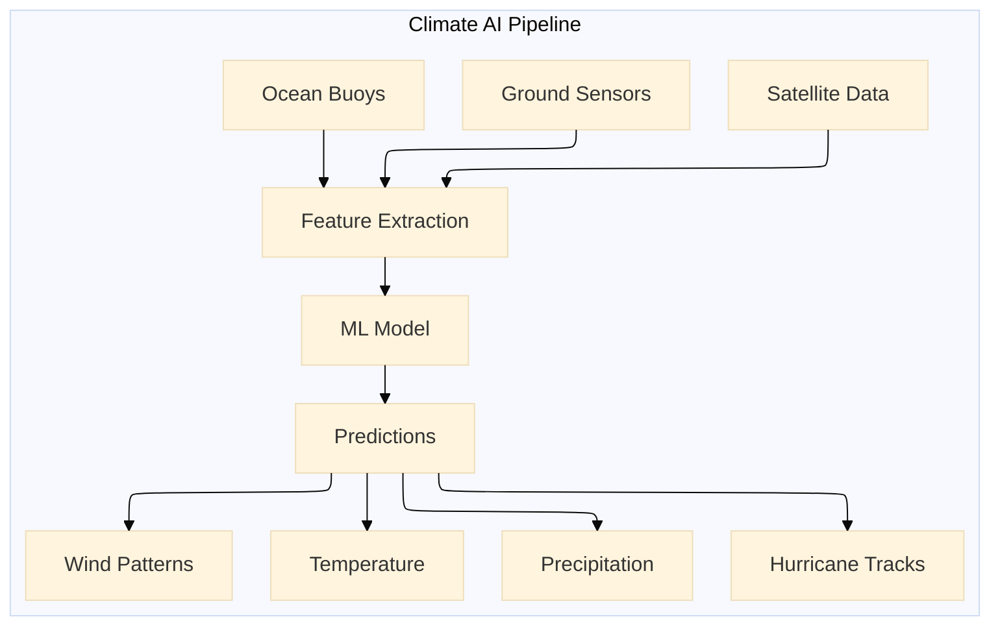

# AI enhances climate models and improves weather fo

```mermaid
---
config:
  theme: base
  layout: elk
---
graph TD
    subgraph "Climate AI Pipeline"
        S[Satellite Data] --> F[Feature Extraction]
        G[Ground Sensors] --> F
        O[Ocean Buoys] --> F
        
        F --> M[ML Model]
        M --> P[Predictions]
        
        P --> T[Temperature]
        P --> R[Precipitation]
        P --> W[Wind Patterns]
        P --> H[Hurricane Tracks]
    end
```
