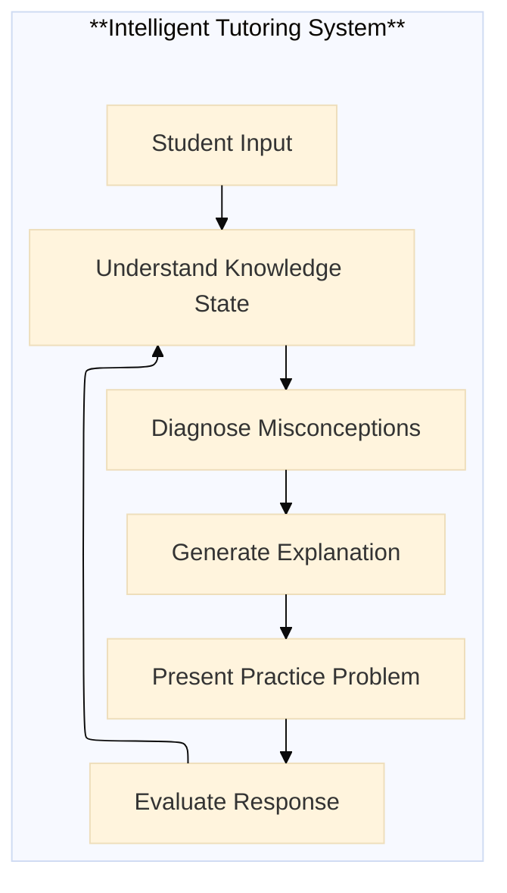

# Intelligent tutoring systems provide personalized 

```mermaid
---
config:
  theme: base
  layout: elk
---
graph TD
    subgraph "**Intelligent Tutoring System**"
        S[Student Input] --> U[Understand Knowledge State]
        U --> D[Diagnose Misconceptions]
        D --> G[Generate Explanation]
        G --> P[Present Practice Problem]
        P --> E[Evaluate Response]
        E --> U
    end
```
