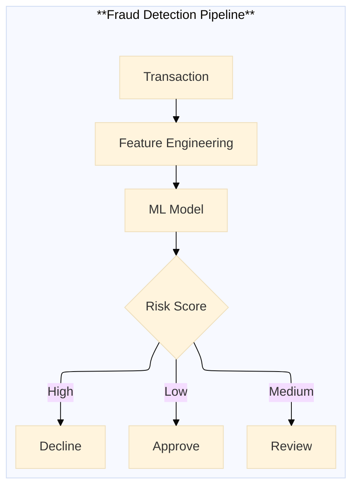

# Fraud detection systems must identify suspicious t

```mermaid
---
config:
  theme: base
  layout: elk
---
graph TD
    subgraph "**Fraud Detection Pipeline**"
        T[Transaction] --> F[Feature Engineering]
        F --> M[ML Model]
        M --> R{Risk Score}
        
        R -->|Low| A[Approve]
        R -->|Medium| R2[Review]
        R -->|High| D[Decline]
    end
```
