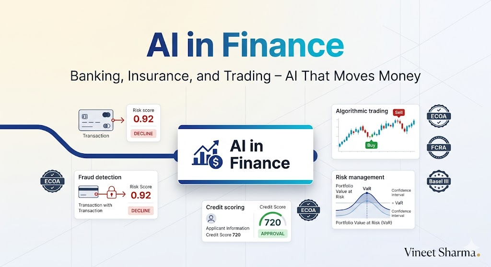

# The 2026 AI Metromap: AI in Finance – Banking, Insurance, and Trading

## Series E: Applied AI & Agents Line | Story 11 of 15+



## 📖 Introduction

**Welcome to the eleventh stop on the Applied AI & Agents Line.**

In our last story, we explored AI in healthcare—medical imaging, EHR analysis, drug discovery, and regulatory compliance. You saw how AI can save lives by detecting diseases earlier and accelerating treatment discovery.

Now let's turn to another domain where AI moves billions of dollars every second: **finance**.

Finance is one of the most data-rich industries in the world. Every transaction, every trade, every click generates data. And where there's data, there's AI opportunity. From detecting fraud in milliseconds, to predicting stock market movements, to automating credit decisions, to managing risk across portfolios—AI is transforming how money moves.

But finance AI comes with its own challenges. Models must be explainable for regulatory compliance. Decisions must be fair and non-discriminatory. Systems must operate with near-zero latency. And the cost of being wrong is measured in dollars—sometimes millions of them.

This story—**The 2026 AI Metromap: AI in Finance – Banking, Insurance, and Trading**—is your guide to building financial AI applications. We'll implement fraud detection—identifying suspicious transactions in real-time. We'll build algorithmic trading systems—making split-second buy/sell decisions. We'll develop credit scoring models—assessing borrower risk fairly. And we'll address the critical requirements of explainability, fairness, and regulatory compliance.

**Let's make money smart.**

---

## 📚 Where You Are in the Journey

### The Master Story Arc: The 2026 AI Metromap Series (Complete)

- 🗺️ **[The 2026 AI Metromap: Why the Old Learning Routes Are Obsolete](#)** – A paradigm shift from linear learning to transit-system mastery.
- 🧭 **[The 2026 AI Metromap: Reading the Map](#)** – Strategic navigation across the three core lines.
- 🎒 **[The 2026 AI Metromap: Avoiding Derailments](#)** – Diagnosing and preventing the most common learning pitfalls.
- 🏁 **[The 2026 AI Metromap: From Passenger to Driver](#)** – Building your portfolio using the Metromap structure.

### Series A: Foundations Station (Complete)
### Series B: Supervised Learning Line (Complete)
### Series C: Modern Architecture Line (Complete)
### Series D: Engineering & Optimization Yard (Complete)

### Series E: Applied AI & Agents Line (15+ Stories)

- 💬 **[The 2026 AI Metromap: Prompt Engineering 101 – The Art of Talking to AI](#)**
- 📚 **[The 2026 AI Metromap: RAG – Retrieval-Augmented Generation for Knowledge-Intensive Tasks](#)**
- 🤖 **[The 2026 AI Metromap: AI Agents & Autonomous Workflows – The Self-Driving Trains](#)**
- 🗣️ **[The 2026 AI Metromap: Voice Assistants & Speech Models – Making AI Talk](#)**
- 👁️ **[The 2026 AI Metromap: Computer Vision Projects – From OCR to Face Recognition](#)**
- 🎨 **[The 2026 AI Metromap: Image Generation & Editing – Diffusion Models in Practice](#)**
- 🔤 **[The 2026 AI Metromap: NLP Tasks – NER, Translation, Summarization, and Beyond](#)**
- 📈 **[The 2026 AI Metromap: Time Series Forecasting – ARIMA, LSTM, and Transformers](#)**
- 👍 **[The 2026 AI Metromap: Recommendation Systems – From Collaborative Filtering to Two-Tower Networks](#)**
- 🏥 **[The 2026 AI Metromap: AI in Healthcare – Medical Research, Diagnostics, and Wellness](#)**
- 💰 **The 2026 AI Metromap: AI in Finance – Banking, Insurance, and Trading** – Fraud detection; algorithmic trading; credit scoring; risk management; explainable AI for compliance. **⬅️ YOU ARE HERE**

- 🎮 **[The 2026 AI Metromap: AI in Gaming, VR/AR, and Entertainment](#)** – Procedural content generation; NPC behavior with LLMs; AI-driven storytelling; game testing automation. 🔜 *Up Next*

- 🏭 **[The 2026 AI Metromap: AI in Robotics, Manufacturing, and Supply Chain](#)** – Computer vision for quality control; predictive maintenance; autonomous navigation; warehouse optimization.

- 🌱 **[The 2026 AI Metromap: AI for Social Good – Climate Action, Agriculture, and Sustainability](#)** – Crop yield prediction; climate modeling; energy optimization; wildlife conservation; disaster response.

- 🎓 **[The 2026 AI Metromap: AI in Education – Personalized Learning and Training](#)** – Intelligent tutoring systems; automated grading; personalized content recommendation; adaptive learning paths.

### The Complete Story Catalog

For a complete view of all upcoming stories across every series, visit the **[Complete 2026 AI Metromap Story Catalog](#)**.

---

## 🚨 Fraud Detection: Stopping Crime in Real-Time

Fraud detection systems must identify suspicious transactions instantly, with high accuracy and low false positives.

```mermaid
```

](images/diagram_01_fraud-detection-systems-must-identify-suspicious-t-23ac.png)

[View Source](https://github.com/Vineet-Sharma-Medium-Stories/Medium-Assets/blob/main/the-2026-ai-metromap-ai-in-finance--banking-insurance-and-trading/diagram_01_fraud-detection-systems-must-identify-suspicious-t-23ac.md)


```python
def fraud_detection():
    """Implement real-time fraud detection systems"""
    
    print("="*60)
    print("FRAUD DETECTION")
    print("="*60)
    
    print("""
    import pandas as pd
    import numpy as np
    from sklearn.ensemble import IsolationForest, RandomForestClassifier
    from sklearn.preprocessing import StandardScaler
    from imblearn.over_sampling import SMOTE
    import xgboost as xgb
    
    # 1. Anomaly detection with Isolation Forest
    class FraudDetector:
        def __init__(self):
            self.isolation_forest = IsolationForest(contamination=0.01, random_state=42)
            self.xgboost = xgb.XGBClassifier(
                scale_pos_weight=10,  # Handle class imbalance
                max_depth=6,
                learning_rate=0.1,
                n_estimators=100
            )
            self.scaler = StandardScaler()
        
        def feature_engineering(self, transaction):
            \"\"\"Create features for fraud detection\"\"\"
            
            features = {
                # Transaction features
                'amount': transaction['amount'],
                'amount_log': np.log1p(transaction['amount']),
                'hour': transaction['timestamp'].hour,
                'day_of_week': transaction['timestamp'].dayofweek,
                'is_weekend': transaction['timestamp'].dayofweek >= 5,
                
                # Velocity features
                'transactions_1h': transaction['count_1h'],
                'transactions_24h': transaction['count_24h'],
                'amount_1h': transaction['sum_1h'],
                'amount_24h': transaction['sum_24h'],
                
                # Location features
                'distance_from_home': transaction['distance_from_home'],
                'is_foreign': transaction['country'] != transaction['home_country'],
                
                # Device features
                'is_new_device': transaction['device_first_seen'] > time_threshold,
                'device_risk_score': transaction['device_risk_score'],
                
                # Behavioral features
                'avg_transaction_amount': transaction['user_avg_amount'],
                'std_transaction_amount': transaction['user_std_amount'],
                'days_since_last_transaction': transaction['days_since_last'],
            }
            
            return features
        
        def train(self, X, y):
            \"\"\"Train fraud detection model\"\"\"
            
            # Handle class imbalance with SMOTE
            smote = SMOTE(random_state=42)
            X_resampled, y_resampled = smote.fit_resample(X, y)
            
            # Scale features
            X_scaled = self.scaler.fit_transform(X_resampled)
            
            # Train models
            self.isolation_forest.fit(X_scaled)
            self.xgboost.fit(X_scaled, y_resampled)
            
        def predict(self, transaction):
            \"\"\"Real-time fraud prediction\"\"\"
            
            features = self.feature_engineering(transaction)
            X = pd.DataFrame([features])
            X_scaled = self.scaler.transform(X)
            
            # Ensemble predictions
            if_score = self.isolation_forest.decision_function(X_scaled)[0]
            xgb_proba = self.xgboost.predict_proba(X_scaled)[0, 1]
            
            # Combined risk score (0-1)
            risk_score = 0.3 * (1 - (if_score + 1) / 2) + 0.7 * xgb_proba
            
            return {
                'risk_score': risk_score,
                'fraud_probability': xgb_proba,
                'anomaly_score': if_score,
                'decision': 'DECLINE' if risk_score > 0.7 else 'REVIEW' if risk_score > 0.3 else 'APPROVE'
            }
    
    # 2. Graph Neural Networks for fraud rings
    class GraphFraudDetector:
        \"\"\"Detect connected fraud rings using graph neural networks\"\"\"
        
        def __init__(self, node_features=64, edge_features=32):
            self.node_encoder = nn.Linear(node_features, 128)
            self.gnn_layers = nn.ModuleList([
                GraphConvLayer(128, 128),
                GraphConvLayer(128, 128),
                GraphConvLayer(128, 64)
            ])
            self.classifier = nn.Linear(64, 1)
        
        def forward(self, nodes, edges, edge_attr):
            # Node embeddings
            h = self.node_encoder(nodes)
            
            # Message passing
            for layer in self.gnn_layers:
                h = layer(h, edges, edge_attr)
                h = torch.relu(h)
            
            # Predict fraud probability for each node
            return torch.sigmoid(self.classifier(h))
    
    # 3. Real-time scoring engine
    class RealTimeFraudScoring:
        def __init__(self, model):
            self.model = model
            self.cache = {}  # Cache user profiles
            self.redis_client = redis.Redis()  # For production
        
        def score_transaction(self, transaction):
            \"\"\"Score transaction with milliseconds latency\"\"\"
            
            # Get cached user profile
            user_profile = self.get_user_profile(transaction['user_id'])
            
            # Compute velocity features
            velocity = self.compute_velocity(transaction['user_id'])
            
            # Combine features
            features = self.prepare_features(transaction, user_profile, velocity)
            
            # Predict
            result = self.model.predict(features)
            
            # Update cache
            self.update_velocity(transaction['user_id'], transaction)
            
            return result
        
        def compute_velocity(self, user_id):
            \"\"\"Compute transaction velocity from Redis\"\"\"
            now = time.time()
            transactions_1h = self.redis_client.zcount(
                f'user:{user_id}:transactions', 
                now - 3600, now
            )
            return {'count_1h': transactions_1h}
    """)
    
    print("\n" + "="*60)
    print("FRAUD DETECTION METRICS")
    print("="*60)
    
    metrics = [
        ("Precision", "Of flagged transactions, % actually fraud", "High = fewer false alarms"),
        ("Recall", "Of actual fraud, % detected", "High = catch more fraud"),
        ("F1 Score", "Harmonic mean of precision and recall", "Balance"),
        ("False Positive Rate", "Legitimate transactions flagged", "Low = better user experience"),
        ("Detection Latency", "Time to flag fraud", "<100ms for real-time")
    ]
    
    print(f"\n{'Metric':<20} {'Description':<35} {'Goal':<20}")
    print("-"*80)
    for metric, desc, goal in metrics:
        print(f"{metric:<20} {desc:<35} {goal:<20}")

fraud_detection()
```

---

## 📈 Algorithmic Trading: AI on Wall Street

Algorithmic trading systems make split-second decisions based on market data, news, and sentiment.

```python
def algorithmic_trading():
    """Implement AI-powered trading systems"""
    
    print("="*60)
    print("ALGORITHMIC TRADING")
    print("="*60)
    
    print("""
    import numpy as np
    import pandas as pd
    import torch
    import torch.nn as nn
    from transformers import AutoTokenizer, AutoModel
    
    # 1. LSTM for price prediction
    class PricePredictor(nn.Module):
        \"\"\"LSTM for stock price prediction\"\"\"
        
        def __init__(self, input_dim=5, hidden_dim=128, num_layers=2):
            super().__init__()
            self.lstm = nn.LSTM(input_dim, hidden_dim, num_layers, batch_first=True)
            self.fc = nn.Linear(hidden_dim, 1)
        
        def forward(self, x):
            lstm_out, _ = self.lstm(x)
            return self.fc(lstm_out[:, -1, :])
    
    # 2. Transformer for multi-asset prediction
    class TransformerTrading(nn.Module):
        \"\"\"Transformer for multivariate time series\"\"\"
        
        def __init__(self, input_dim, d_model=128, nhead=8, num_layers=3):
            super().__init__()
            self.embedding = nn.Linear(input_dim, d_model)
            self.pos_encoder = PositionalEncoding(d_model)
            encoder_layer = nn.TransformerEncoderLayer(d_model, nhead, batch_first=True)
            self.transformer = nn.TransformerEncoder(encoder_layer, num_layers)
            self.fc = nn.Linear(d_model, 1)
        
        def forward(self, x):
            x = self.embedding(x)
            x = self.pos_encoder(x)
            x = self.transformer(x)
            return self.fc(x[:, -1, :])
    
    # 3. Sentiment analysis for trading
    class SentimentTrader:
        def __init__(self):
            self.tokenizer = AutoTokenizer.from_pretrained("ProsusAI/finbert")
            self.model = AutoModel.from_pretrained("ProsusAI/finbert")
        
        def analyze_sentiment(self, news_articles):
            \"\"\"Analyze financial news sentiment\"\"\"
            
            sentiments = []
            for article in news_articles:
                inputs = self.tokenizer(article, return_tensors="pt", truncation=True, max_length=512)
                outputs = self.model(**inputs)
                pooled = outputs.pooler_output
                sentiment = self.classify_sentiment(pooled)
                sentiments.append(sentiment)
            
            # Aggregate sentiment score
            return np.mean(sentiments)
    
    # 4. Reinforcement learning trader
    class RLTrader:
        \"\"\"Deep Q-Network for trading decisions\"\"\"
        
        def __init__(self, state_dim, action_dim=3):  # Buy, Sell, Hold
            self.q_network = self._build_network(state_dim, action_dim)
            self.target_network = self._build_network(state_dim, action_dim)
            self.optimizer = torch.optim.Adam(self.q_network.parameters())
            self.memory = ReplayBuffer()
        
        def _build_network(self, state_dim, action_dim):
            return nn.Sequential(
                nn.Linear(state_dim, 256),
                nn.ReLU(),
                nn.Linear(256, 128),
                nn.ReLU(),
                nn.Linear(128, action_dim)
            )
        
        def act(self, state, epsilon=0.1):
            \"\"\"Choose action with epsilon-greedy\"\"\"
            if np.random.random() < epsilon:
                return np.random.randint(3)  # Random action
            else:
                with torch.no_grad():
                    q_values = self.q_network(torch.tensor(state).float())
                    return q_values.argmax().item()
        
        def train(self, batch_size=64):
            \"\"\"Train on experience replay\"\"\"
            states, actions, rewards, next_states, dones = self.memory.sample(batch_size)
            
            # Compute Q targets
            with torch.no_grad():
                next_q = self.target_network(next_states).max(1)[0]
                targets = rewards + 0.99 * next_q * (1 - dones)
            
            # Compute current Q
            current_q = self.q_network(states).gather(1, actions.unsqueeze(1))
            
            # Update network
            loss = nn.MSELoss()(current_q.squeeze(), targets)
            self.optimizer.zero_grad()
            loss.backward()
            self.optimizer.step()
    
    # 5. Market microstructure features
    def compute_microstructure_features(order_book):
        \"\"\"Extract features from limit order book\"\"\"
        
        features = {
            'bid_ask_spread': order_book['ask_price'] - order_book['bid_price'],
            'mid_price': (order_book['ask_price'] + order_book['bid_price']) / 2,
            'order_imbalance': order_book['bid_volume'] - order_book['ask_volume'],
            'price_pressure': order_book['bid_volume'] / (order_book['bid_volume'] + order_book['ask_volume']),
            'volatility': order_book['price_std'],
            'trade_volume': order_book['volume_5min']
        }
        
        return features
    
    # 6. Backtesting framework
    class Backtester:
        def __init__(self, model, initial_capital=100000):
            self.model = model
            self.capital = initial_capital
            self.positions = []
            self.trades = []
        
        def run(self, market_data):
            \"\"\"Run backtest on historical data\"\"\"
            
            for i, data in enumerate(market_data):
                # Get prediction
                signal = self.model.predict(data)
                
                # Execute trades
                if signal == 1 and self.capital > 0:  # Buy signal
                    shares = self.capital // data['price']
                    self.positions.append({'price': data['price'], 'shares': shares})
                    self.capital -= shares * data['price']
                    self.trades.append({'type': 'BUY', 'price': data['price'], 'time': data['time']})
                
                elif signal == -1 and len(self.positions) > 0:  # Sell signal
                    position = self.positions.pop()
                    self.capital += position['shares'] * data['price']
                    self.trades.append({'type': 'SELL', 'price': data['price'], 'time': data['time']})
            
            # Calculate metrics
            returns = (self.capital - initial_capital) / initial_capital
            sharpe = self.calculate_sharpe_ratio()
            max_drawdown = self.calculate_max_drawdown()
            
            return {
                'returns': returns,
                'sharpe_ratio': sharpe,
                'max_drawdown': max_drawdown,
                'num_trades': len(self.trades)
            }
    """)
    
    print("\n" + "="*60)
    print("TRADING STRATEGY TYPES")
    print("="*60)
    
    strategies = [
        ("Trend Following", "Follow momentum", "Moving averages, breakout"),
        ("Mean Reversion", "Bet on reversal", "Statistical arbitrage"),
        ("Market Making", "Capture bid-ask spread", "Order book imbalance"),
        ("Event-Driven", "React to news", "Sentiment analysis, earnings"),
        ("Statistical Arb", "Relative value", "Pairs trading, cointegration")
    ]
    
    print(f"\n{'Strategy':<18} {'Logic':<18} {'Techniques':<25}")
    print("-"*65)
    for strategy, logic, techniques in strategies:
        print(f"{strategy:<18} {logic:<18} {techniques:<25}")

algorithmic_trading()
```

---

## 💳 Credit Scoring: Fair and Accurate Risk Assessment

Credit scoring models determine loan eligibility and interest rates.

```python
def credit_scoring():
    """Implement fair and explainable credit scoring"""
    
    print("="*60)
    print("CREDIT SCORING")
    print("="*60)
    
    print("""
    import pandas as pd
    import numpy as np
    from sklearn.ensemble import GradientBoostingClassifier
    from sklearn.metrics import roc_auc_score, accuracy_score
    import shap
    
    # 1. Credit score model
    class CreditScorer:
        def __init__(self):
            self.model = GradientBoostingClassifier(
                n_estimators=100,
                max_depth=5,
                learning_rate=0.1,
                random_state=42
            )
            self.explainer = None
        
        def feature_engineering(self, application):
            \"\"\"Create features for credit scoring\"\"\"
            
            features = {
                # Demographics
                'age': application['age'],
                'age_squared': application['age'] ** 2,
                
                # Financial
                'income': application['income'],
                'income_to_debt': application['income'] / (application['debt'] + 1),
                'employment_years': application['employment_years'],
                
                # Credit history
                'num_credit_lines': application['num_credit_lines'],
                'credit_utilization': application['credit_used'] / (application['credit_limit'] + 1),
                'late_payments_30d': application['late_payments_30d'],
                'late_payments_60d': application['late_payments_60d'],
                'late_payments_90d': application['late_payments_90d'],
                
                # Application
                'loan_amount': application['loan_amount'],
                'loan_to_income': application['loan_amount'] / (application['income'] + 1),
                'loan_term': application['loan_term'],
                
                # Behavioral
                'bankruptcy_history': application['bankruptcy'],
                'foreclosure_history': application['foreclosure']
            }
            
            return features
        
        def train(self, X, y):
            \"\"\"Train credit scoring model\"\"\"
            self.model.fit(X, y)
            self.explainer = shap.TreeExplainer(self.model)
        
        def predict(self, application):
            \"\"\"Predict default probability\"\"\"
            features = self.feature_engineering(application)
            X = pd.DataFrame([features])
            
            default_prob = self.model.predict_proba(X)[0, 1]
            
            # Convert to credit score (300-850 scale)
            credit_score = 850 - (default_prob * 550)
            
            return {
                'default_probability': default_prob,
                'credit_score': int(credit_score),
                'risk_tier': self.get_risk_tier(default_prob)
            }
        
        def explain(self, application):
            \"\"\"Explain why score was assigned (for regulatory compliance)\"\"\"
            features = self.feature_engineering(application)
            X = pd.DataFrame([features])
            
            # SHAP values
            shap_values = self.explainer.shap_values(X)
            
            # Get top contributing features
            feature_impacts = []
            for i, feature in enumerate(features.keys()):
                feature_impacts.append({
                    'feature': feature,
                    'impact': shap_values[0, i],
                    'direction': 'positive' if shap_values[0, i] > 0 else 'negative'
                })
            
            feature_impacts.sort(key=lambda x: abs(x['impact']), reverse=True)
            
            # Generate explanation
            explanation = {
                'primary_factors': feature_impacts[:5],
                'adverse_actions': [f for f in feature_impacts if f['direction'] == 'positive'],
                'favorable_factors': [f for f in feature_impacts if f['direction'] == 'negative']
            }
            
            return explanation
        
        def get_risk_tier(self, default_prob):
            if default_prob < 0.02:
                return "Super Prime"
            elif default_prob < 0.05:
                return "Prime"
            elif default_prob < 0.10:
                return "Near Prime"
            elif default_prob < 0.20:
                return "Subprime"
            else:
                return "Deep Subprime"
    
    # 2. Fairness constraints
    class FairCreditScorer:
        \"\"\"Credit scoring with fairness constraints\"\"\"
        
        def __init__(self, protected_attributes):
            self.model = None
            self.protected_attributes = protected_attributes
            self.fairness_metrics = {}
        
        def check_fairness(self, X, y_pred):
            \"\"\"Check for disparate impact\"\"\"
            
            fairness_results = {}
            for attr in self.protected_attributes:
                # Disparate impact ratio
                privileged = X[attr] == 1
                unprivileged = X[attr] == 0
                
                approval_rate_privileged = y_pred[privileged].mean()
                approval_rate_unprivileged = y_pred[unprivileged].mean()
                
                disparate_impact = approval_rate_unprivileged / approval_rate_privileged
                
                fairness_results[attr] = {
                    'disparate_impact': disparate_impact,
                    'fair': 0.8 <= disparate_impact <= 1.25
                }
            
            return fairness_results
        
        def apply_fairness_constraint(self, X, y, model):
            \"\"\"Apply fairness constraint during training\"\"\"
            # Using exponentiated gradient reduction
            from fairlearn.reductions import ExponentiatedGradient, DemographicParity
            
            constraint = DemographicParity()
            mitigation = ExponentiatedGradient(model, constraint)
            mitigation.fit(X, y, sensitive_features=X['protected_group'])
            
            return mitigation
    
    # 3. Regulatory reporting
    class AdverseActionNotice:
        \"\"\"Generate adverse action notices (required by ECOA)\"\"\"
        
        def generate_notice(self, application, explanation):
            \"\"\"Create consumer-facing explanation\"\"\"
            
            notice = f"""
            ADVERSE ACTION NOTICE
            
            Thank you for your loan application. Unfortunately, we are unable to approve your application at this time.
            
            PRIMARY REASONS:
            """
            
            for factor in explanation['primary_factors'][:4]:
                notice += f"\n• {self.format_reason(factor)}"
            
            notice += f"""
            
            YOUR CREDIT SCORE: {explanation['credit_score']}
            
            WHAT YOU CAN DO:
            • Review your credit report for accuracy
            • Reduce outstanding debt
            • Build positive payment history
            
            You have the right to a free copy of your credit report within 60 days.
            For more information, visit www.consumerfinance.gov
            """
            
            return notice
        
        def format_reason(self, factor):
            \"\"\"Convert technical factor to consumer-friendly language\"\"\"
            reasons = {
                'credit_utilization': 'High credit utilization compared to available credit',
                'late_payments_30d': 'Recent late payments on existing accounts',
                'debt_to_income': 'High debt-to-income ratio',
                'credit_history': 'Insufficient credit history'
            }
            return reasons.get(factor['feature'], f"Factor: {factor['feature']}")
    """)
    
    print("\n" + "="*60)
    print("FAIRNESS METRICS")
    print("="*60)
    
    metrics = [
        ("Demographic Parity", "Equal approval rates across groups", "0.8-1.25 ratio"),
        ("Equal Opportunity", "Equal true positive rates", "Within 0.1 difference"),
        ("Equalized Odds", "Equal FPR and TPR across groups", "Within 0.1 difference"),
        ("Individual Fairness", "Similar individuals get similar scores", "Distance-based")
    ]
    
    print(f"\n{'Metric':<20} {'Definition':<35} {'Threshold':<20}")
    print("-"*80)
    for metric, definition, threshold in metrics:
        print(f"{metric:<20} {definition:<35} {threshold:<20}")

credit_scoring()
```

---

## 📊 Risk Management: Portfolio and Market Risk

Risk management models assess and mitigate financial risk.

```python
def risk_management():
    """Implement risk management systems"""
    
    print("="*60)
    print("RISK MANAGEMENT")
    print("="*60)
    
    print("""
    import numpy as np
    from scipy.stats import norm
    import pandas as pd
    
    # 1. Value at Risk (VaR)
    class ValueAtRisk:
        \"\"\"Calculate Value at Risk for portfolios\"\"\"
        
        def __init__(self, returns, confidence_level=0.95):
            self.returns = returns
            self.confidence_level = confidence_level
        
        def historical_var(self):
            \"\"\"Historical simulation VaR\"\"\"
            return np.percentile(self.returns, (1 - self.confidence_level) * 100)
        
        def parametric_var(self):
            \"\"\"Parametric VaR (normal distribution)\"\"\"
            mu = np.mean(self.returns)
            sigma = np.std(self.returns)
            z = norm.ppf(1 - self.confidence_level)
            return mu + z * sigma
        
        def monte_carlo_var(self, n_simulations=10000):
            \"\"\"Monte Carlo VaR\"\"\"
            mu = np.mean(self.returns)
            sigma = np.std(self.returns)
            simulated = np.random.normal(mu, sigma, n_simulations)
            return np.percentile(simulated, (1 - self.confidence_level) * 100)
    
    # 2. Credit Risk (PD, LGD, EAD)
    class CreditRiskModel:
        \"\"\"Calculate expected credit losses\"\"\"
        
        def __init__(self):
            self.pd_model = None  # Probability of Default
            self.lgd_model = None  # Loss Given Default
            self.ead_model = None  # Exposure at Default
        
        def expected_loss(self, exposure, pd, lgd):
            \"\"\"EL = EAD × PD × LGD\"\"\"
            return exposure * pd * lgd
        
        def unexpected_loss(self, exposure, pd, lgd, correlation):
            \"\"\"UL for portfolio\"\"\"
            return exposure * np.sqrt(pd * (1-pd)) * lgd * np.sqrt(correlation)
    
    # 3. Stress Testing
    class StressTester:
        \"\"\"Run stress scenarios\"\"\"
        
        def __init__(self, portfolio):
            self.portfolio = portfolio
        
        def run_scenarios(self):
            \"\"\"Run predefined stress scenarios\"\"\"
            
            scenarios = {
                'market_crash': {'equity': -0.30, 'credit': 0.05, 'rates': -0.01},
                'recession': {'equity': -0.20, 'credit': 0.08, 'rates': -0.02},
                'inflation_shock': {'equity': -0.10, 'rates': 0.02, 'commodities': 0.15},
                'geopolitical': {'equity': -0.15, 'credit': 0.03, 'fx': -0.05}
            }
            
            results = {}
            for scenario, shocks in scenarios.items():
                impact = self.portfolio.calculate_impact(shocks)
                results[scenario] = {
                    'loss': impact,
                    'capital_impact': impact / self.portfolio.capital,
                    'breached': impact > self.portfolio.risk_tolerance
                }
            
            return results
    
    # 4. AML Compliance
    class AntiMoneyLaundering:
        \"\"\"Detect suspicious transaction patterns\"\"\"
        
        def __init__(self):
            self.rule_engine = RuleEngine()
            self.ml_model = IsolationForest()
        
        def screen_transaction(self, transaction):
            \"\"\"Screen transaction for AML flags\"\"\"
            
            flags = []
            
            # Rule-based checks
            if transaction['amount'] > 10000:
                flags.append('LARGE_TRANSACTION')
            
            if transaction['frequency'] > 10:
                flags.append('HIGH_FREQUENCY')
            
            if transaction['country'] in high_risk_countries:
                flags.append('HIGH_RISK_COUNTRY')
            
            # ML anomaly detection
            features = self.extract_features(transaction)
            anomaly_score = self.ml_model.decision_function([features])[0]
            
            if anomaly_score < -0.5:
                flags.append('ANOMALY_DETECTED')
            
            return {
                'flags': flags,
                'risk_score': self.calculate_risk_score(flags, anomaly_score),
                'requires_review': len(flags) >= 2 or anomaly_score < -0.8
            }
    
    # 5. Model Risk Management
    class ModelValidator:
        \"\"\"Validate models for regulatory compliance\"\"\"
        
        def validate(self, model, validation_data):
            \"\"\"Comprehensive model validation\"\"\"
            
            validation_results = {
                'conceptual_soundness': self.assume_conceptual_soundness(model),
                'data_quality': self.check_data_quality(validation_data),
                'performance': self.evaluate_performance(model, validation_data),
                'stability': self.check_stability(model, validation_data),
                'backtesting': self.backtest(model, validation_data),
                'benchmarking': self.benchmark_against_alternatives(model, validation_data)
            }
            
            return validation_results
        
        def check_stability(self, model, data, n_chunks=10):
            \"\"\"Check model stability across time periods\"\"\"
            chunk_size = len(data) // n_chunks
            scores = []
            
            for i in range(n_chunks):
                chunk = data[i*chunk_size:(i+1)*chunk_size]
                score = model.evaluate(chunk)
                scores.append(score)
            
            # Check for drift
            stability_score = np.std(scores) / np.mean(scores)
            return {
                'passed': stability_score < 0.1,
                'stability_ratio': stability_score,
                'score_range': (min(scores), max(scores))
            }
    """)
    
    print("\n" + "="*60)
    print("RISK TYPES")
    print("="*60)
    
    risks = [
        ("Market Risk", "Loss from market movements", "VaR, stress testing"),
        ("Credit Risk", "Borrower default", "PD, LGD, EAD"),
        ("Operational Risk", "Internal failures", "Fraud, system failures"),
        ("Liquidity Risk", "Inability to meet obligations", "Cash flow analysis"),
        ("Model Risk", "Model errors", "Validation, backtesting"),
        ("AML Risk", "Regulatory violations", "Transaction monitoring")
    ]
    
    print(f"\n{'Risk Type':<18} {'Description':<30} {'Measurement':<25}")
    print("-"*80)
    for risk, desc, measure in risks:
        print(f"{risk:<18} {desc:<30} {measure:<25}")

risk_management()
```

---

## 🤖 AI Compliance and Explainability

Financial AI must be explainable and compliant with regulations.

```python
def ai_compliance():
    """Implement AI compliance and explainability"""
    
    print("="*60)
    print("AI COMPLIANCE AND EXPLAINABILITY")
    print("="*60)
    
    print("""
    import shap
    import lime
    import lime.lime_tabular
    from sklearn.inspection import permutation_importance
    
    # 1. SHAP explanations
    class SHAPExplainer:
        \"\"\"SHAP-based model explanations\"\"\"
        
        def __init__(self, model, X_train):
            self.model = model
            self.explainer = shap.TreeExplainer(model)
            self.X_train = X_train
        
        def explain_prediction(self, X_instance):
            \"\"\"Explain single prediction\"\"\"
            shap_values = self.explainer.shap_values(X_instance)
            
            explanation = []
            for i, value in enumerate(shap_values[0]):
                if abs(value) > 0.01:
                    explanation.append({
                        'feature': self.X_train.columns[i],
                        'value': X_instance.iloc[0, i],
                        'shap_value': value,
                        'impact': 'positive' if value > 0 else 'negative'
                    })
            
            explanation.sort(key=lambda x: abs(x['shap_value']), reverse=True)
            return explanation
    
    # 2. LIME explanations
    class LIMExplainer:
        \"\"\"LIME-based local explanations\"\"\"
        
        def __init__(self, model, X_train):
            self.model = model
            self.explainer = lime.lime_tabular.LimeTabularExplainer(
                X_train.values,
                feature_names=X_train.columns,
                class_names=['No Default', 'Default'],
                mode='classification'
            )
        
        def explain_prediction(self, X_instance):
            \"\"\"Explain single prediction\"\"\"
            exp = self.explainer.explain_instance(
                X_instance.values[0],
                self.model.predict_proba,
                num_features=5
            )
            return exp.as_list()
    
    # 3. Regulatory documentation
    class ModelDocumentation:
        \"\"\"Generate regulatory model documentation\"\"\"
        
        def generate_report(self, model, validation_results):
            \"\"\"Create model documentation for regulators\"\"\"
            
            report = {
                'model_overview': {
                    'name': model.name,
                    'type': model.type,
                    'version': model.version,
                    'development_date': datetime.now(),
                    'developer': model.developer
                },
                'model_development': {
                    'data_sources': model.data_sources,
                    'feature_definitions': model.feature_definitions,
                    'feature_engineering': model.feature_engineering_doc,
                    'model_architecture': model.architecture_doc
                },
                'validation_results': validation_results,
                'performance_metrics': model.performance_metrics,
                'fairness_assessment': model.fairness_metrics,
                'limitations': model.limitations,
                'monitoring_plan': {
                    'metrics_to_track': ['accuracy', 'fairness', 'drift'],
                    'monitoring_frequency': 'daily',
                    'alert_thresholds': model.alert_thresholds
                }
            }
            
            return report
    
    # 4. Audit trail
    class AuditLogger:
        \"\"\"Log all model decisions for audit\"\"\"
        
        def __init__(self, db_connection):
            self.db = db_connection
        
        def log_decision(self, model_name, input_data, prediction, explanation, user_id):
            \"\"\"Log decision with full context\"\"\"
            
            log_entry = {
                'timestamp': datetime.utcnow(),
                'model_name': model_name,
                'model_version': model_version,
                'input_hash': hash(input_data),
                'input_summary': self.summarize_input(input_data),
                'prediction': prediction,
                'confidence': prediction['confidence'],
                'explanation': explanation,
                'user_id': user_id,
                'decision_type': 'AUTOMATED' if prediction['confidence'] > 0.8 else 'REVIEW'
            }
            
            self.db.insert('model_decisions', log_entry)
            return log_entry['id']
        
        def retrieve_decision(self, decision_id):
            \"\"\"Retrieve decision for audit\"\"\"
            return self.db.query(f"SELECT * FROM model_decisions WHERE id = {decision_id}")
    
    # 5. Model governance
    class ModelGovernance:
        \"\"\"Manage model lifecycle\"\"\"
        
        def __init__(self):
            self.models = {}
            self.approvals = {}
        
        def request_approval(self, model_name, model):
            \"\"\"Request model approval for production\"\"\"
            
            # Validate model
            validation = self.validate_model(model)
            
            if validation['passed']:
                approval = {
                    'model_name': model_name,
                    'status': 'PENDING',
                    'request_date': datetime.now(),
                    'validation_results': validation,
                    'reviewers': self.assign_reviewers(model.risk_tier)
                }
                
                self.approvals[model_name] = approval
                self.notify_reviewers(approval)
                
                return approval
            else:
                return {'status': 'REJECTED', 'reasons': validation['failures']}
        
        def approve_model(self, model_name, approver):
            \"\"\"Approve model for production\"\"\"
            self.approvals[model_name]['status'] = 'APPROVED'
            self.approvals[model_name]['approved_by'] = approver
            self.approvals[model_name]['approval_date'] = datetime.now()
            
            # Deploy model
            self.deploy_model(model_name)
    """)
    
    print("\n" + "="*60)
    print("REGULATORY REQUIREMENTS")
    print("="*60)
    
    regulations = [
        ("ECOA", "Equal Credit Opportunity Act", "Explain denials, fairness"),
        ("FCRA", "Fair Credit Reporting Act", "Adverse action notices"),
        ("Basel III", "Capital adequacy", "Model risk management"),
        ("GDPR", "Data protection", "Right to explanation"),
        ("CCPA", "California privacy", "Data deletion rights"),
        ("SEC Rule 17a-4", "Record keeping", "Audit trails")
    ]
    
    print(f"\n{'Regulation':<12} {'Scope':<30} {'AI Impact':<30}")
    print("-"*75)
    for reg, scope, impact in regulations:
        print(f"{reg:<12} {scope:<30} {impact:<30}")

ai_compliance()
```

---

## 📊 Complete Financial AI Pipeline

```python
def financial_ai_pipeline():
    """Complete financial AI system"""
    
    print("="*60)
    print("COMPLETE FINANCIAL AI PIPELINE")
    print("="*60)
    
    print("""
    class FinancialAISystem:
        \"\"\"End-to-end financial AI platform\"\"\"
        
        def __init__(self):
            self.fraud_detector = FraudDetector()
            self.credit_scorer = CreditScorer()
            self.trading_system = TradingSystem()
            self.risk_manager = RiskManager()
            self.compliance = ComplianceEngine()
            self.audit_logger = AuditLogger()
        
        def process_transaction(self, transaction):
            \"\"\"Complete transaction processing pipeline\"\"\"
            
            # Step 1: Fraud detection
            fraud_result = self.fraud_detector.predict(transaction)
            
            if fraud_result['risk_score'] > 0.8:
                self.compliance.report_suspicious(transaction)
                return {'status': 'DECLINED', 'reason': 'Suspicious activity'}
            
            # Step 2: Credit check (if applicable)
            if transaction['requires_credit']:
                credit_result = self.credit_scorer.predict(transaction['applicant'])
                
                if credit_result['credit_score'] < 620:
                    # Generate adverse action notice
                    notice = self.compliance.generate_adverse_action(credit_result)
                    return {'status': 'DECLINED', 'reason': 'Credit score', 'notice': notice}
            
            # Step 3: Risk assessment
            risk_result = self.risk_manager.assess(transaction)
            
            if risk_result['risk_level'] == 'HIGH':
                self.risk_manager.escalate(transaction)
                return {'status': 'REVIEW', 'reason': 'High risk'}
            
            # Step 4: Execute
            result = self.execute_transaction(transaction)
            
            # Step 5: Audit logging
            self.audit_logger.log_transaction(transaction, result)
            
            return result
        
        def monitor_model_health(self):
            \"\"\"Continuous model monitoring\"\"\"
            
            metrics = {}
            
            for model_name, model in self.models.items():
                metrics[model_name] = {
                    'performance': model.performance_metrics(),
                    'drift': model.detect_drift(),
                    'fairness': model.fairness_metrics(),
                    'latency': model.inference_latency(),
                    'volume': model.transaction_volume()
                }
            
            # Alert on issues
            if any(m['drift']['detected'] for m in metrics.values()):
                self.alert('Model drift detected')
            
            return metrics
        
        def generate_regulatory_report(self):
            \"\"\"Generate reports for regulators\"\"\"
            
            report = {
                'model_inventory': self.get_model_inventory(),
                'validation_summary': self.get_validation_summary(),
                'performance_metrics': self.get_performance_metrics(),
                'fairness_metrics': self.get_fairness_metrics(),
                'complaints': self.get_complaint_summary(),
                'audit_trail': self.get_audit_summary()
            }
            
            return report
    """)
    
    print("\n" + "="*60)
    print("KEY PERFORMANCE INDICATORS")
    print("="*60)
    
    kpis = [
        ("Fraud Detection Rate", "% of fraud caught", ">95%"),
        ("False Positive Rate", "Legitimate transactions flagged", "<1%"),
        ("Model Accuracy", "Correct predictions", ">90%"),
        ("Inference Latency", "Decision time", "<100ms"),
        ("Fairness Ratio", "Disparate impact", "0.8-1.25"),
        ("Model Uptime", "Availability", "99.99%")
    ]
    
    print(f"\n{'KPI':<22} {'Description':<35} {'Target':<15}")
    print("-"*75)
    for kpi, desc, target in kpis:
        print(f"{kpi:<22} {desc:<35} {target:<15}")

financial_ai_pipeline()
```

---

## 📊 Takeaway from This Story

**What You Learned:**

- **Fraud Detection** – Real-time scoring with Isolation Forest + XGBoost. Velocity features, device fingerprinting. Graph neural networks for fraud rings.

- **Algorithmic Trading** – LSTM and Transformers for price prediction. Reinforcement learning for trading decisions. Sentiment analysis from news.

- **Credit Scoring** – Gradient boosting models. Feature engineering for financial data. Fairness constraints (disparate impact, equal opportunity). Adverse action notices.

- **Risk Management** – Value at Risk (VaR) calculations. Credit risk (PD, LGD, EAD). Stress testing. AML transaction monitoring.

- **AI Compliance** – SHAP and LIME for explainability. Model documentation for regulators. Audit trails for all decisions. Model governance lifecycle.

- **Regulations** – ECOA, FCRA, Basel III, GDPR. Fairness metrics, adverse action notices, right to explanation.

---

## 🔗 Navigation

- **⬅️ Previous Story:** [The 2026 AI Metromap: AI in Healthcare – Medical Research, Diagnostics, and Wellness](#)

- **📚 Series E Catalog:** [Series E: Applied AI & Agents Line](#) – View all 15+ stories in this series.

- **📚 Complete Story Catalog:** [Complete 2026 AI Metromap Story Catalog](#) – Your navigation guide to all 39+ stories.

- **➡️ Next Story:** **[The 2026 AI Metromap: AI in Gaming, VR/AR, and Entertainment](#)** – Procedural content generation; NPC behavior with LLMs; AI-driven storytelling; game testing automation.

---

## 📝 Your Invitation

Before the next story arrives, build a financial AI application:

1. **Fraud detection** – Use a credit card dataset. Build an ensemble model. Compute precision/recall.

2. **Credit scoring** – Train a model on lending data. Add fairness constraints. Generate adverse action notices.

3. **Trading system** – Build an LSTM for price prediction. Backtest on historical data.

4. **Explainability** – Add SHAP explanations to your credit model. Identify the most important features.

5. **Compliance** – Create a model documentation report. Add audit logging for predictions.

**You've mastered AI in finance. Next stop: AI in Gaming!**

---

*Found this helpful? Clap, comment, and share your financial AI projects. Next stop: AI in Gaming!* 🚇