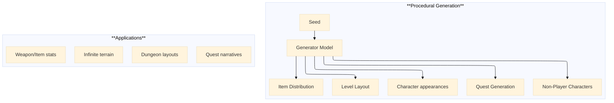

# Procedural content generation (PCG) uses AI to cre

```mermaid
---
config:
  theme: base
  layout: elk
---
graph TD
    subgraph "**Procedural Generation**"
        S[Seed] --> G[Generator Model]
        G --> L[Level Layout]
        G --> E[Enemy Placement]
        G --> I[Item Distribution]
        G --> Q[Quest Generation]
        G --> N[Non-Player Characters]
    end
    
    subgraph "**Applications**"
        A[Infinite terrain]
        B[Dungeon layouts]
        C[Weapon/Item stats]
        D[Quest narratives]
        E[Character appearances]
    end
```
