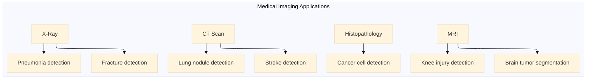

# Medical imaging AI can detect diseases earlier and

```mermaid
---
config:
  theme: base
  layout: elk
---
graph TD
    subgraph "Medical Imaging Applications"
        X[X-Ray] --> P1[Pneumonia detection]
        X --> P2[Fracture detection]
        
        CT[CT Scan] --> L[Lung nodule detection]
        CT --> S[Stroke detection]
        
        MRI[MRI] --> B[Brain tumor segmentation]
        MRI --> K[Knee injury detection]
        
        M[Histopathology] --> C[Cancer cell detection]
    end
```
