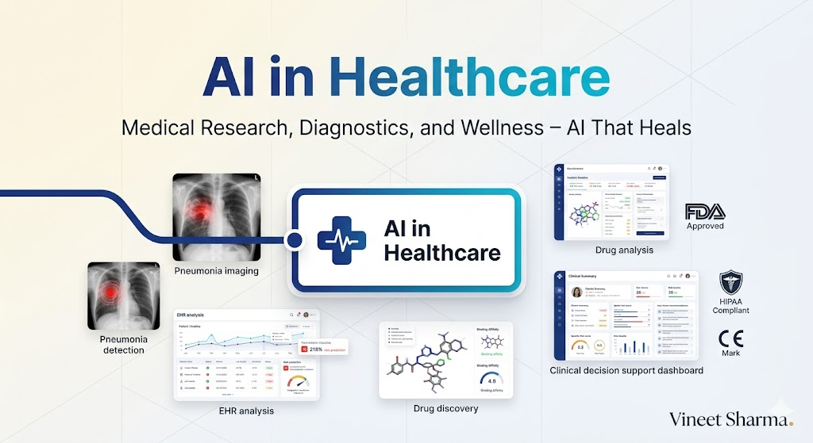

# The 2026 AI Metromap: AI in Healthcare – Medical Research, Diagnostics, and Wellness

## Series E: Applied AI & Agents Line | Story 10 of 15+



## 📖 Introduction

**Welcome to the tenth stop on the Applied AI & Agents Line.**

In our last nine stories, we mastered the core building blocks of AI applications: prompt engineering, RAG, agents, voice, vision, image generation, NLP, time series, and recommendation systems. Your toolkit is now comprehensive. You can build almost any AI application.

Now it's time to apply these skills to one of the most important domains: **healthcare**.

AI in healthcare isn't just another industry application. It's where AI can have the most profound impact on human lives. From diagnosing diseases earlier than human doctors, to discovering new drugs in months instead of years, to personalizing treatment plans, to monitoring patient health continuously—AI is transforming medicine.

But healthcare AI comes with unique challenges. Regulatory requirements (FDA, HIPAA), the need for explainability, the stakes of getting it wrong, and the complexity of medical data all make healthcare AI different from consumer applications.

This story—**The 2026 AI Metromap: AI in Healthcare – Medical Research, Diagnostics, and Wellness**—is your guide to building healthcare AI applications. We'll explore medical imaging—detecting diseases from X-rays, MRIs, and CT scans. We'll dive into electronic health records (EHR) analysis—predicting patient outcomes, identifying risks. We'll understand drug discovery—how AI accelerates finding new treatments. And we'll address the critical considerations of regulation, ethics, and deployment.

**Let's heal with AI.**

---

## 📚 Where You Are in the Journey

### The Master Story Arc: The 2026 AI Metromap Series (Complete)

- 🗺️ **[The 2026 AI Metromap: Why the Old Learning Routes Are Obsolete](#)** – A paradigm shift from linear learning to transit-system mastery.
- 🧭 **[The 2026 AI Metromap: Reading the Map](#)** – Strategic navigation across the three core lines.
- 🎒 **[The 2026 AI Metromap: Avoiding Derailments](#)** – Diagnosing and preventing the most common learning pitfalls.
- 🏁 **[The 2026 AI Metromap: From Passenger to Driver](#)** – Building your portfolio using the Metromap structure.

### Series A: Foundations Station (Complete)
### Series B: Supervised Learning Line (Complete)
### Series C: Modern Architecture Line (Complete)
### Series D: Engineering & Optimization Yard (Complete)

### Series E: Applied AI & Agents Line (15+ Stories)

- 💬 **[The 2026 AI Metromap: Prompt Engineering 101 – The Art of Talking to AI](#)**
- 📚 **[The 2026 AI Metromap: RAG – Retrieval-Augmented Generation for Knowledge-Intensive Tasks](#)**
- 🤖 **[The 2026 AI Metromap: AI Agents & Autonomous Workflows – The Self-Driving Trains](#)**
- 🗣️ **[The 2026 AI Metromap: Voice Assistants & Speech Models – Making AI Talk](#)**
- 👁️ **[The 2026 AI Metromap: Computer Vision Projects – From OCR to Face Recognition](#)**
- 🎨 **[The 2026 AI Metromap: Image Generation & Editing – Diffusion Models in Practice](#)**
- 🔤 **[The 2026 AI Metromap: NLP Tasks – NER, Translation, Summarization, and Beyond](#)**
- 📈 **[The 2026 AI Metromap: Time Series Forecasting – ARIMA, LSTM, and Transformers](#)**
- 👍 **[The 2026 AI Metromap: Recommendation Systems – From Collaborative Filtering to Two-Tower Networks](#)**
- 🏥 **The 2026 AI Metromap: AI in Healthcare – Medical Research, Diagnostics, and Wellness** – Medical imaging; EHR analysis; drug discovery; clinical decision support; regulatory considerations. **⬅️ YOU ARE HERE**

- 💰 **[The 2026 AI Metromap: AI in Finance – Banking, Insurance, and Trading](#)** – Fraud detection; algorithmic trading; credit scoring; risk management; explainable AI for compliance. 🔜 *Up Next*

- 🎮 **[The 2026 AI Metromap: AI in Gaming, VR/AR, and Entertainment](#)** – Procedural content generation; NPC behavior with LLMs; AI-driven storytelling; game testing automation.

- 🏭 **[The 2026 AI Metromap: AI in Robotics, Manufacturing, and Supply Chain](#)** – Computer vision for quality control; predictive maintenance; autonomous navigation; warehouse optimization.

- 🌱 **[The 2026 AI Metromap: AI for Social Good – Climate Action, Agriculture, and Sustainability](#)** – Crop yield prediction; climate modeling; energy optimization; wildlife conservation; disaster response.

- 🎓 **[The 2026 AI Metromap: AI in Education – Personalized Learning and Training](#)** – Intelligent tutoring systems; automated grading; personalized content recommendation; adaptive learning paths.

### The Complete Story Catalog

For a complete view of all upcoming stories across every series, visit the **[Complete 2026 AI Metromap Story Catalog](#)**.

---

## 🏥 Medical Imaging: Seeing What Humans Can't

Medical imaging AI can detect diseases earlier and more accurately than human radiologists.

```mermaid
```

](images/diagram_01_medical-imaging-ai-can-detect-diseases-earlier-and-7659.png)

[View Source](https://github.com/Vineet-Sharma-Medium-Stories/Medium-Assets/blob/main/the-2026-ai-metromap-ai-in-healthcare--medical-research-diagnostics-and-wellness/diagram_01_medical-imaging-ai-can-detect-diseases-earlier-and-7659.md)


```python
def medical_imaging():
    """Implement medical imaging AI for disease detection"""
    
    print("="*60)
    print("MEDICAL IMAGING AI")
    print("="*60)
    
    print("""
    import torch
    import torch.nn as nn
    import torchvision.transforms as transforms
    from torchvision import models
    from PIL import Image
    import numpy as np
    
    # 1. Pneumonia detection from chest X-rays
    class PneumoniaDetector(nn.Module):
        \"\"\"ResNet-based pneumonia detector\"\"\"
        
        def __init__(self, pretrained=True):
            super().__init__()
            self.backbone = models.resnet50(pretrained=pretrained)
            # Replace final layer for binary classification
            in_features = self.backbone.fc.in_features
            self.backbone.fc = nn.Sequential(
                nn.Dropout(0.5),
                nn.Linear(in_features, 256),
                nn.ReLU(),
                nn.Dropout(0.3),
                nn.Linear(256, 1),
                nn.Sigmoid()
            )
        
        def forward(self, x):
            return self.backbone(x)
    
    # Preprocessing for chest X-rays
    transform = transforms.Compose([
        transforms.Resize((224, 224)),
        transforms.ToTensor(),
        transforms.Normalize(mean=[0.485, 0.456, 0.406], std=[0.229, 0.224, 0.225])
    ])
    
    # Load pretrained model (would be trained on ChestX-ray14 or similar)
    model = PneumoniaDetector(pretrained=True)
    model.eval()
    
    # Inference function
    def detect_pneumonia(image_path):
        image = Image.open(image_path).convert('RGB')
        image_tensor = transform(image).unsqueeze(0)
        
        with torch.no_grad():
            prediction = model(image_tensor)
            probability = prediction.item()
        
        return {
            'probability': probability,
            'prediction': 'Pneumonia detected' if probability > 0.5 else 'Normal',
            'confidence': probability if probability > 0.5 else 1 - probability
        }
    
    # 2. Brain tumor segmentation with U-Net
    class UNet(nn.Module):
        \"\"\"U-Net for medical image segmentation\"\"\"
        
        def __init__(self, in_channels=3, out_channels=1):
            super().__init__()
            
            # Encoder
            self.enc1 = self._conv_block(in_channels, 64)
            self.enc2 = self._conv_block(64, 128)
            self.enc3 = self._conv_block(128, 256)
            self.enc4 = self._conv_block(256, 512)
            
            # Bottleneck
            self.bottleneck = self._conv_block(512, 1024)
            
            # Decoder
            self.up4 = nn.ConvTranspose2d(1024, 512, kernel_size=2, stride=2)
            self.dec4 = self._conv_block(1024, 512)
            self.up3 = nn.ConvTranspose2d(512, 256, kernel_size=2, stride=2)
            self.dec3 = self._conv_block(512, 256)
            self.up2 = nn.ConvTranspose2d(256, 128, kernel_size=2, stride=2)
            self.dec2 = self._conv_block(256, 128)
            self.up1 = nn.ConvTranspose2d(128, 64, kernel_size=2, stride=2)
            self.dec1 = self._conv_block(128, 64)
            
            # Output
            self.out = nn.Conv2d(64, out_channels, kernel_size=1)
            self.sigmoid = nn.Sigmoid()
        
        def _conv_block(self, in_channels, out_channels):
            return nn.Sequential(
                nn.Conv2d(in_channels, out_channels, kernel_size=3, padding=1),
                nn.BatchNorm2d(out_channels),
                nn.ReLU(inplace=True),
                nn.Conv2d(out_channels, out_channels, kernel_size=3, padding=1),
                nn.BatchNorm2d(out_channels),
                nn.ReLU(inplace=True)
            )
        
        def forward(self, x):
            # Encoder
            e1 = self.enc1(x)
            e2 = self.enc2(nn.MaxPool2d(2)(e1))
            e3 = self.enc3(nn.MaxPool2d(2)(e2))
            e4 = self.enc4(nn.MaxPool2d(2)(e3))
            
            # Bottleneck
            b = self.bottleneck(nn.MaxPool2d(2)(e4))
            
            # Decoder with skip connections
            d4 = self.up4(b)
            d4 = torch.cat([d4, e4], dim=1)
            d4 = self.dec4(d4)
            
            d3 = self.up3(d4)
            d3 = torch.cat([d3, e3], dim=1)
            d3 = self.dec3(d3)
            
            d2 = self.up2(d3)
            d2 = torch.cat([d2, e2], dim=1)
            d2 = self.dec2(d2)
            
            d1 = self.up1(d2)
            d1 = torch.cat([d1, e1], dim=1)
            d1 = self.dec1(d1)
            
            out = self.out(d1)
            return self.sigmoid(out)
    
    # 3. Diabetic retinopathy detection from fundus images
    class RetinopathyDetector(nn.Module):
        \"\"\"EfficientNet-based diabetic retinopathy detector\"\"\"
        
        def __init__(self, num_classes=5):  # 0-4 severity levels
            super().__init__()
            self.backbone = models.efficientnet_b3(pretrained=True)
            in_features = self.backbone.classifier[1].in_features
            self.backbone.classifier = nn.Sequential(
                nn.Dropout(0.3),
                nn.Linear(in_features, 512),
                nn.ReLU(),
                nn.Dropout(0.2),
                nn.Linear(512, num_classes)
            )
        
        def forward(self, x):
            return self.backbone(x)
    
    # 4. Model interpretation with Grad-CAM
    import torch.nn.functional as F
    
    class GradCAM:
        \"\"\"Gradient-weighted Class Activation Mapping for interpretability\"\"\"
        
        def __init__(self, model, target_layer):
            self.model = model
            self.target_layer = target_layer
            self.gradients = None
            self.activations = None
            
            # Register hooks
            target_layer.register_forward_hook(self._save_activation)
            target_layer.register_backward_hook(self._save_gradient)
        
        def _save_activation(self, module, input, output):
            self.activations = output
        
        def _save_gradient(self, module, grad_input, grad_output):
            self.gradients = grad_output[0]
        
        def generate_heatmap(self, input_tensor, class_idx=None):
            self.model.zero_grad()
            
            # Forward pass
            output = self.model(input_tensor)
            
            if class_idx is None:
                class_idx = output.argmax().item()
            
            # Backward pass
            one_hot = torch.zeros_like(output)
            one_hot[0, class_idx] = 1
            output.backward(gradient=one_hot)
            
            # Calculate weights
            weights = self.gradients.mean(dim=[2, 3], keepdim=True)
            cam = (weights * self.activations).sum(dim=1, keepdim=True)
            cam = F.relu(cam)
            cam = cam - cam.min()
            cam = cam / (cam.max() + 1e-8)
            
            return cam.squeeze().detach().numpy()
    
    # Usage example
    # heatmap = GradCAM(model, model.backbone.layer4[-1])
    # cam = heatmap.generate_heatmap(input_tensor)
    """)
    
    print("\n" + "="*60)
    print("MEDICAL IMAGING DATASETS")
    print("="*60)
    
    datasets = [
        ("ChestX-ray14", "112,120 frontal X-rays", "Pneumonia, masses, nodules"),
        ("MURA", "40,561 musculoskeletal X-rays", "Fracture detection"),
        ("BRATS", "Brain tumor segmentation", "MRI segmentation"),
        ("EyePACS", "88,702 fundus images", "Diabetic retinopathy"),
        ("COVIDx", "X-ray + CT", "COVID-19 detection")
    ]
    
    print(f"\n{'Dataset':<15} {'Size':<20} {'Tasks':<30}")
    print("-"*70)
    for name, size, tasks in datasets:
        print(f"{name:<15} {size:<20} {tasks:<30}")

medical_imaging()
```

---

## 📊 Electronic Health Records (EHR) Analysis

EHR analysis predicts patient outcomes, identifies risks, and personalizes treatment.

```python
def ehr_analysis():
    """Implement EHR analysis for patient outcome prediction"""
    
    print("="*60)
    print("ELECTRONIC HEALTH RECORDS ANALYSIS")
    print("="*60)
    
    print("""
    import pandas as pd
    import numpy as np
    import torch
    import torch.nn as nn
    from sklearn.preprocessing import StandardScaler, LabelEncoder
    from sklearn.model_selection import train_test_split
    
    # 1. Patient readmission prediction
    class ReadmissionPredictor(nn.Module):
        \"\"\"Predict 30-day hospital readmission risk\"\"\"
        
        def __init__(self, num_features):
            super().__init__()
            self.network = nn.Sequential(
                nn.Linear(num_features, 128),
                nn.ReLU(),
                nn.Dropout(0.3),
                nn.Linear(128, 64),
                nn.ReLU(),
                nn.Dropout(0.2),
                nn.Linear(64, 32),
                nn.ReLU(),
                nn.Linear(32, 1),
                nn.Sigmoid()
            )
        
        def forward(self, x):
            return self.network(x)
    
    # 2. Clinical risk scoring
    def calculate_risk_score(patient_data):
        \"\"\"Calculate composite risk score from multiple factors\"\"\"
        
        # Risk factors
        age_risk = 1.5 if patient_data['age'] > 65 else 1.0
        comorbidity_risk = 1 + 0.2 * patient_data['num_conditions']
        lab_risk = 1.2 if patient_data['lab_abnormal'] else 1.0
        
        # Combine
        risk_score = age_risk * comorbidity_risk * lab_risk
        
        return min(risk_score, 10.0)  # Cap at 10
    
    # 3. LSTM for longitudinal patient data
    class PatientLSTM(nn.Module):
        \"\"\"LSTM for modeling patient trajectories over time\"\"\"
        
        def __init__(self, input_dim, hidden_dim=128, num_layers=2):
            super().__init__()
            self.lstm = nn.LSTM(input_dim, hidden_dim, num_layers, batch_first=True)
            self.fc = nn.Linear(hidden_dim, 1)
        
        def forward(self, x):
            # x shape: (batch, time_steps, features)
            lstm_out, (hidden, cell) = self.lstm(x)
            last_output = lstm_out[:, -1, :]
            return torch.sigmoid(self.fc(last_output))
    
    # 4. Feature engineering for EHR
    def engineer_ehr_features(ehr_data):
        \"\"\"Create features from raw EHR data\"\"\"
        
        features = {}
        
        # Demographics
        features['age'] = ehr_data['age']
        features['gender'] = 1 if ehr_data['gender'] == 'M' else 0
        
        # Vital signs
        features['bmi'] = ehr_data['weight'] / (ehr_data['height'] ** 2)
        features['bp_risk'] = 1 if ehr_data['systolic'] > 140 else 0
        
        # Lab values
        features['glucose_abnormal'] = 1 if ehr_data['glucose'] > 140 else 0
        features['cholesterol_abnormal'] = 1 if ehr_data['ldl'] > 130 else 0
        
        # Medications
        features['medication_count'] = len(ehr_data['medications'])
        
        # Diagnosis codes
        features['chronic_conditions'] = len(ehr_data['diagnoses'])
        
        # Time since last visit
        features['days_since_visit'] = ehr_data['days_since_last_visit']
        
        return features
    
    # 5. Clinical decision support system
    class ClinicalDecisionSupport:
        \"\"\"AI-powered clinical decision support\"\"\"
        
        def __init__(self):
            self.readmission_model = ReadmissionPredictor(20)
            self.sepsis_model = ReadmissionPredictor(15)
        
        def assess_patient(self, patient_data):
            \"\"\"Comprehensive patient assessment\"\"\"
            
            # Extract features
            features = engineer_ehr_features(patient_data)
            
            # Predict readmission risk
            readmission_risk = self.readmission_model(torch.tensor(features).float())
            
            # Predict sepsis risk (simplified)
            sepsis_risk = self.sepsis_model(torch.tensor(features).float())
            
            # Generate recommendations
            recommendations = []
            if readmission_risk > 0.3:
                recommendations.append("Schedule follow-up within 7 days")
                recommendations.append("Medication reconciliation recommended")
            
            if sepsis_risk > 0.2:
                recommendations.append("Monitor vital signs every 4 hours")
                recommendations.append("Consider lactate measurement")
            
            return {
                'readmission_risk': float(readmission_risk),
                'sepsis_risk': float(sepsis_risk),
                'recommendations': recommendations,
                'alert_level': 'HIGH' if readmission_risk > 0.5 else 'MODERATE' if readmission_risk > 0.3 else 'LOW'
            }
    
    # 6. Clinical note summarization with LLM
    import openai
    
    def summarize_clinical_notes(notes):
        \"\"\"Summarize long clinical notes for review\"\"\"
        
        prompt = f\"\"\"
        Summarize the following clinical notes into a concise format:
        
        Key sections to extract:
        - Chief complaint
        - History of present illness
        - Physical exam findings
        - Lab results
        - Assessment and plan
        
        Notes:
        {notes}
        
        Summary:
        \"\"\"
        
        response = openai.ChatCompletion.create(
            model="gpt-4",
            messages=[{"role": "user", "content": prompt}],
            max_tokens=500
        )
        
        return response.choices[0].message.content
    """)
    
    print("\n" + "="*60)
    print("EHR PREDICTION TASKS")
    print("="*60)
    
    tasks = [
        ("Readmission", "30-day readmission risk", "Preventive follow-up"),
        ("Mortality", "In-hospital mortality", "ICU prioritization"),
        ("LOS", "Length of stay prediction", "Resource allocation"),
        ("Sepsis", "Sepsis onset prediction", "Early intervention"),
        ("Deterioration", "Clinical deterioration", "Rapid response teams")
    ]
    
    print(f"\n{'Task':<15} {'Prediction':<25} {'Intervention':<25}")
    print("-"*70)
    for task, pred, inter in tasks:
        print(f"{task:<15} {pred:<25} {inter:<25}")

ehr_analysis()
```

---

## 💊 Drug Discovery: AI-Powered Therapeutics

AI accelerates drug discovery from years to months.

```python
def drug_discovery():
    """Implement AI for drug discovery and development"""
    
    print("="*60)
    print("AI IN DRUG DISCOVERY")
    print("="*60)
    
    print("""
    import torch
    import torch.nn as nn
    import numpy as np
    from rdkit import Chem
    from rdkit.Chem import AllChem
    
    # 1. Molecular property prediction
    class MolecularGraphNN(nn.Module):
        \"\"\"Graph Neural Network for molecules\"\"\"
        
        def __init__(self, node_features=128, edge_features=64):
            super().__init__()
            self.node_encoder = nn.Linear(34, node_features)  # 34 atom features
            self.edge_encoder = nn.Linear(10, edge_features)
            self.message_passing = nn.GRUCell(node_features, node_features)
            self.fc = nn.Linear(node_features, 1)
        
        def forward(self, atoms, bonds, bond_indices):
            # Simplified message passing
            node_h = self.node_encoder(atoms)
            edge_h = self.edge_encoder(bonds)
            
            # Message passing steps
            for _ in range(3):
                # Send messages along bonds
                messages = torch.zeros_like(node_h)
                # Simplified: aggregate neighbor messages
                # In practice, use proper message passing
            
            return self.fc(node_h).squeeze()
    
    # 2. Binding affinity prediction
    class BindingAffinityPredictor(nn.Module):
        \"\"\"Predict protein-ligand binding affinity\"\"\"
        
        def __init__(self, protein_dim=1024, ligand_dim=512):
            super().__init__()
            self.protein_encoder = nn.Sequential(
                nn.Linear(protein_dim, 512),
                nn.ReLU(),
                nn.Dropout(0.2),
                nn.Linear(512, 256)
            )
            
            self.ligand_encoder = nn.Sequential(
                nn.Linear(ligand_dim, 256),
                nn.ReLU(),
                nn.Dropout(0.2),
                nn.Linear(256, 256)
            )
            
            self.combined = nn.Sequential(
                nn.Linear(512, 256),
                nn.ReLU(),
                nn.Linear(256, 128),
                nn.ReLU(),
                nn.Linear(128, 1)
            )
        
        def forward(self, protein_features, ligand_features):
            p_emb = self.protein_encoder(protein_features)
            l_emb = self.ligand_encoder(ligand_features)
            combined = torch.cat([p_emb, l_emb], dim=1)
            return self.combined(combined)
    
    # 3. De novo molecule generation with SMILES
    class MoleculeGenerator(nn.Module):
        \"\"\"RNN-based SMILES string generator\"\"\"
        
        def __init__(self, vocab_size, embedding_dim=128, hidden_dim=256):
            super().__init__()
            self.embedding = nn.Embedding(vocab_size, embedding_dim)
            self.lstm = nn.LSTM(embedding_dim, hidden_dim, num_layers=2, batch_first=True)
            self.fc = nn.Linear(hidden_dim, vocab_size)
        
        def forward(self, x):
            emb = self.embedding(x)
            lstm_out, _ = self.lstm(emb)
            return self.fc(lstm_out)
        
        def generate(self, start_token, max_length=100):
            \"\"\"Generate new molecule SMILES\"\"\"
            self.eval()
            generated = [start_token]
            hidden = None
            
            for _ in range(max_length):
                input_tensor = torch.tensor([generated[-1]]).unsqueeze(0)
                emb = self.embedding(input_tensor)
                lstm_out, hidden = self.lstm(emb, hidden)
                logits = self.fc(lstm_out)
                
                # Sample next token
                probs = torch.softmax(logits[0, -1], dim=0)
                next_token = torch.multinomial(probs, 1).item()
                
                if next_token == 2:  # End token
                    break
                
                generated.append(next_token)
            
            return self.decode_smiles(generated)
    
    # 4. Virtual screening
    def virtual_screening(molecules, target_protein, model):
        \"\"\"Screen large libraries of molecules\"\"\"
        
        scores = []
        for mol in molecules:
            # Generate features
            fingerprint = AllChem.GetMorganFingerprintAsBitVect(mol, radius=2, nBits=1024)
            fp_array = np.array(fingerprint).astype(np.float32)
            
            # Predict binding affinity
            score = model(torch.tensor(fp_array).unsqueeze(0))
            scores.append((mol, score.item()))
        
        # Sort by predicted affinity
        scores.sort(key=lambda x: x[1], reverse=True)
        return scores[:100]  # Top 100 candidates
    
    # 5. ADMET property prediction
    class ADMETPredictor(nn.Module):
        \"\"\"Predict Absorption, Distribution, Metabolism, Excretion, Toxicity\"\"\"
        
        def __init__(self, input_dim):
            super().__init__()
            self.shared = nn.Sequential(
                nn.Linear(input_dim, 256),
                nn.ReLU(),
                nn.Dropout(0.3),
                nn.Linear(256, 128),
                nn.ReLU()
            )
            
            # Multiple outputs
            self.absorption = nn.Linear(128, 1)  # Caco-2 permeability
            self.distribution = nn.Linear(128, 1)  # Plasma protein binding
            self.metabolism = nn.Linear(128, 1)  # CYP inhibition
            self.excretion = nn.Linear(128, 1)  # Half-life
            self.toxicity = nn.Linear(128, 1)  # hERG toxicity
        
        def forward(self, x):
            shared = self.shared(x)
            return {
                'absorption': torch.sigmoid(self.absorption(shared)),
                'distribution': torch.sigmoid(self.distribution(shared)),
                'metabolism': torch.sigmoid(self.metabolism(shared)),
                'excretion': self.excretion(shared),
                'toxicity': torch.sigmoid(self.toxicity(shared))
            }
    
    # 6. Drug repurposing
    def repurpose_drugs(disease_targets, drug_database, model):
        \"\"\"Find existing drugs for new indications\"\"\"
        
        candidates = []
        for drug in drug_database:
            # Get drug features
            drug_features = get_drug_features(drug)
            
            # Predict effect on disease targets
            score = model.predict(drug_features, disease_targets)
            
            if score > threshold:
                candidates.append((drug, score))
        
        return sorted(candidates, key=lambda x: x[1], reverse=True)
    """)
    
    print("\n" + "="*60)
    print("DRUG DISCOVERY PIPELINE")
    print("="*60)
    
    stages = [
        ("Target Identification", "Find disease-associated protein", "2-3 years → months"),
        ("Hit Discovery", "Screen millions of molecules", "1-2 years → weeks"),
        ("Lead Optimization", "Improve potency, ADMET", "2-3 years → months"),
        ("Preclinical", "In vitro, in vivo testing", "1-2 years → 6-12 months"),
        ("Clinical Trials", "Human testing", "6-8 years → 4-6 years")
    ]
    
    print(f"\n{'Stage':<20} {'Traditional Time':<25} {'AI-Enabled Time':<20}")
    print("-"*70)
    for stage, traditional, ai in stages:
        print(f"{stage:<20} {traditional:<25} {ai:<20}")

drug_discovery()
```

---

## 🏛️ Regulatory and Ethical Considerations

Healthcare AI must meet strict regulatory requirements.

```python
def healthcare_regulations():
    """Understand regulatory requirements for healthcare AI"""
    
    print("="*60)
    print("REGULATORY AND ETHICAL CONSIDERATIONS")
    print("="*60)
    
    print("""
    # 1. FDA Regulatory Pathways
    
    Class I (Low Risk): General controls
    - Examples: Clinical decision support, wellness apps
    - Requirements: Registration, labeling
    
    Class II (Moderate Risk): Special controls
    - Examples: Diagnostic algorithms, imaging software
    - Requirements: 510(k) clearance or De Novo classification
    
    Class III (High Risk): Premarket approval (PMA)
    - Examples: Life-supporting devices, novel AI diagnostics
    - Requirements: Extensive clinical trials, premarket approval
    
    # 2. HIPAA Compliance
    
    Protected Health Information (PHI):
    - Names, dates, addresses
    - Medical record numbers
    - Health plan beneficiary numbers
    - Biometric identifiers
    
    Compliance Requirements:
    - Data encryption at rest and in transit
    - Access controls and audit logs
    - Business Associate Agreements (BAA)
    - De-identification before research use
    
    # 3. Model Validation Requirements
    
    def validate_healthcare_model(model, validation_data):
        \"\"\"Comprehensive validation for healthcare AI\"\"\"
        
        validation_results = {
            'accuracy': calculate_accuracy(model, validation_data),
            'sensitivity': calculate_sensitivity(model, validation_data),
            'specificity': calculate_specificity(model, validation_data),
            'auc_roc': calculate_auc(model, validation_data),
            'calibration': calculate_calibration(model, validation_data),
            'fairness': assess_fairness(model, validation_data),
            'robustness': test_adversarial_robustness(model, validation_data),
            'explainability': generate_explanations(model, validation_data)
        }
        
        return validation_results
    
    # 4. Explainability Requirements
    
    class ExplainableMedicalAI:
        \"\"\"Healthcare AI with built-in explainability\"\"\"
        
        def predict_with_explanation(self, input_data):
            # Get prediction
            prediction = self.model(input_data)
            
            # Generate local explanation (SHAP, LIME)
            shap_values = self.explainer.shap_values(input_data)
            
            # Identify key features
            top_features = self.get_top_features(shap_values)
            
            # Generate natural language explanation
            explanation = self.generate_explanation(
                prediction=prediction,
                features=top_features,
                clinical_context=input_data
            )
            
            # Add confidence intervals
            confidence = self.estimate_uncertainty(input_data)
            
            return {
                'prediction': prediction,
                'explanation': explanation,
                'confidence': confidence,
                'features': top_features,
                'similar_cases': self.find_similar_cases(input_data)
            }
    
    # 5. Clinical Trial Integration
    
    class ClinicalTrialMatcher:
        \"\"\"Match patients to clinical trials\"\"\"
        
        def match_patients(self, patient_data, trials):
            \"\"\"Find trials that match patient eligibility\"\"\"
            
            matches = []
            for trial in trials:
                # Check inclusion/exclusion criteria
                eligible = self.check_eligibility(patient_data, trial.criteria)
                
                if eligible:
                    matches.append({
                        'trial': trial,
                        'match_score': self.calculate_match_score(patient_data, trial),
                        'location': trial.site_distance(patient_data.location),
                        'enrollment_status': trial.enrollment_status
                    })
            
            return sorted(matches, key=lambda x: x['match_score'], reverse=True)
    
    # 6. Post-Market Surveillance
    
    class ModelMonitor:
        \"\"\"Continuous monitoring for deployed healthcare AI\"\"\"
        
        def monitor_model(self):
            \"\"\"Track model performance in production\"\"\"
            
            metrics = {
                'drift_detection': self.detect_data_drift(),
                'performance_drift': self.detect_performance_degradation(),
                'adverse_events': self.track_adverse_events(),
                'user_feedback': self.analyze_feedback(),
                'edge_cases': self.identify_edge_cases()
            }
            
            if metrics['drift_detection'] > threshold:
                self.alert('Model drift detected - retraining needed')
                self.schedule_retraining()
            
            return metrics
    """)
    
    print("\n" + "="*60)
    print("KEY REGULATORY FRAMEWORKS")
    print("="*60)
    
    frameworks = [
        ("FDA", "US", "Medical devices, diagnostics", "510(k), PMA"),
        ("HIPAA", "US", "Data privacy", "PHI protection"),
        ("GDPR", "EU", "Data protection", "Right to explanation"),
        ("CE Mark", "EU", "Medical devices", "MDR compliance"),
        ("GxP", "Global", "Good practices", "Validation, documentation")
    ]
    
    print(f"\n{'Framework':<12} {'Region':<8} {'Scope':<25} {'Key Requirement':<25}")
    print("-"*75)
    for framework, region, scope, req in frameworks:
        print(f"{framework:<12} {region:<8} {scope:<25} {req:<25}")

healthcare_regulations()
```

---

## 📊 Complete Healthcare AI Pipeline

```python
def healthcare_pipeline():
    """Complete healthcare AI pipeline from data to deployment"""
    
    print("="*60)
    print("COMPLETE HEALTHCARE AI PIPELINE")
    print("="*60)
    
    print("""
    class HealthcareAISystem:
        \"\"\"End-to-end healthcare AI system\"\"\"
        
        def __init__(self, config):
            self.config = config
            self.models = {}
            self.data_pipeline = DataPipeline()
            self.validation = ValidationEngine()
            self.monitor = MonitoringSystem()
        
        def process_patient(self, patient_data):
            \"\"\"Complete patient analysis\"\"\"
            
            results = {
                'imaging': self.analyze_imaging(patient_data.images),
                'ehr': self.analyze_ehr(patient_data.records),
                'risk': self.calculate_risk(patient_data),
                'recommendations': self.generate_recommendations(patient_data)
            }
            
            # Add clinical decision support
            results['cds'] = self.clinical_decision_support(results)
            
            # Generate report
            results['report'] = self.generate_report(results)
            
            # Log for monitoring
            self.monitor.log_prediction(results)
            
            return results
        
        def analyze_imaging(self, images):
            \"\"\"Multi-modal imaging analysis\"\"\"
            
            findings = {}
            
            for modality, image in images.items():
                if modality == 'xray':
                    findings['pneumonia'] = self.models['xray'](image)
                elif modality == 'mri':
                    findings['tumor'] = self.models['mri'](image)
                elif modality == 'ct':
                    findings['nodules'] = self.models['ct'](image)
            
            return findings
        
        def analyze_ehr(self, records):
            \"\"\"EHR data analysis\"\"\"
            
            # Extract features
            features = self.data_pipeline.extract_features(records)
            
            # Run predictions
            predictions = {}
            for model_name, model in self.models.items():
                if model_name.startswith('ehr_'):
                    predictions[model_name] = model.predict(features)
            
            return predictions
        
        def calculate_risk(self, patient_data):
            \"\"\"Composite risk scoring\"\"\"
            
            risk_factors = {
                'age': self.age_risk(patient_data.age),
                'comorbidities': self.comorbidity_risk(patient_data.conditions),
                'vitals': self.vitals_risk(patient_data.vitals),
                'lab': self.lab_risk(patient_data.lab_results)
            }
            
            return {
                'overall': np.mean(list(risk_factors.values())),
                'factors': risk_factors,
                'trend': self.risk_trend(patient_data.history)
            }
        
        def generate_recommendations(self, patient_data):
            \"\"\"Evidence-based recommendations\"\"\"
            
            recommendations = []
            
            # Medication review
            if self.medication_interactions(patient_data.medications):
                recommendations.append("Review medication interactions")
            
            # Follow-up scheduling
            if patient_data.risk_score > 0.3:
                recommendations.append(f"Schedule follow-up within {self.followup_days(patient_data)} days")
            
            # Specialist referral
            if self.needs_specialist(patient_data):
                recommendations.append(f"Refer to {self.specialty_needed(patient_data)}")
            
            return recommendations
        
        def clinical_decision_support(self, results):
            \"\"\"CDS alerts and recommendations\"\"\"
            
            alerts = []
            
            # Critical findings
            if results['imaging'].get('pneumonia', 0) > 0.8:
                alerts.append('URGENT: Possible pneumonia detected')
            
            if results['ehr'].get('sepsis_risk', 0) > 0.7:
                alerts.append('HIGH RISK: Sepsis alert - initiate protocol')
            
            # Medication safety
            if self.drug_interaction_warning(results['medications']):
                alerts.append('WARNING: Potential drug interaction')
            
            return alerts
        
        def generate_report(self, results):
            \"\"\"Generate clinical report\"\"\"
            
            report = {
                'patient_id': results['patient_id'],
                'analysis_date': datetime.now(),
                'summary': self.generate_summary(results),
                'findings': results['imaging'],
                'risk_assessment': results['risk'],
                'recommendations': results['recommendations'],
                'alerts': results['cds'],
                'clinical_notes': self.generate_notes(results)
            }
            
            return report
        
        def validate_deployment(self):
            \"\"\"Validate system before deployment\"\"\"
            
            validation_results = self.validation.run_all_tests()
            
            if validation_results['passed']:
                self.deploy()
                self.monitor.start()
            else:
                self.alert_validation_failure(validation_results)
            
            return validation_results
    """)
    
    print("\n" + "="*60)
    print("DEPLOYMENT CHECKLIST")
    print("="*60)
    
    checklist = [
        "✓ FDA clearance (if Class II/III)",
        "✓ HIPAA compliance and BAA in place",
        "✓ Model validation on diverse populations",
        "✓ Explainability integrated for clinical review",
        "✓ Human-in-the-loop for critical decisions",
        "✓ Continuous monitoring for performance drift",
        "✓ Adverse event reporting system",
        "✓ Regular model retraining schedule",
        "✓ Clinical workflow integration tested",
        "✓ Staff training completed"
    ]
    
    for item in checklist:
        print(f"  {item}")

healthcare_pipeline()
```

---

## 📊 Takeaway from This Story

**What You Learned:**

- **Medical Imaging** – Deep learning for X-ray, MRI, CT analysis. U-Net for segmentation, ResNet/EfficientNet for classification. Grad-CAM for interpretability.

- **EHR Analysis** – Predict readmission, mortality, sepsis. LSTM for longitudinal data. Clinical decision support systems. Feature engineering from structured and unstructured data.

- **Drug Discovery** – Molecular property prediction with graph neural networks. Binding affinity prediction. De novo molecule generation. Virtual screening of millions of compounds.

- **Regulatory Requirements** – FDA classifications (Class I/II/III), 510(k), PMA. HIPAA compliance for PHI. GDPR right to explanation. GxP validation.

- **Explainability** – SHAP, LIME, Grad-CAM for model interpretability. Natural language explanations. Confidence intervals.

- **Deployment Pipeline** – Validation, monitoring, drift detection, adverse event tracking, human-in-the-loop.

---

## 🔗 Navigation

- **⬅️ Previous Story:** [The 2026 AI Metromap: Recommendation Systems – From Collaborative Filtering to Two-Tower Networks](#)

- **📚 Series E Catalog:** [Series E: Applied AI & Agents Line](#) – View all 15+ stories in this series.

- **📚 Complete Story Catalog:** [Complete 2026 AI Metromap Story Catalog](#) – Your navigation guide to all 39+ stories.

- **➡️ Next Story:** **[The 2026 AI Metromap: AI in Finance – Banking, Insurance, and Trading](#)** – Fraud detection; algorithmic trading; credit scoring; risk management; explainable AI for compliance.

---

## 📝 Your Invitation

Before the next story arrives, explore healthcare AI:

1. **Medical imaging** – Use a pretrained model to classify chest X-rays. Add Grad-CAM to visualize what the model sees.

2. **EHR analysis** – Build a readmission predictor using synthetic data. Calculate risk scores.

3. **Drug discovery** – Use RDKit to generate molecular fingerprints. Train a binding affinity predictor.

4. **Explainability** – Implement SHAP for a healthcare model. Generate natural language explanations.

5. **Regulatory review** – Research FDA guidelines for your application. Create a validation plan.

**You've mastered healthcare AI. Next stop: AI in Finance!**

---

*Found this helpful? Clap, comment, and share your healthcare AI projects. Next stop: AI in Finance!* 🚇