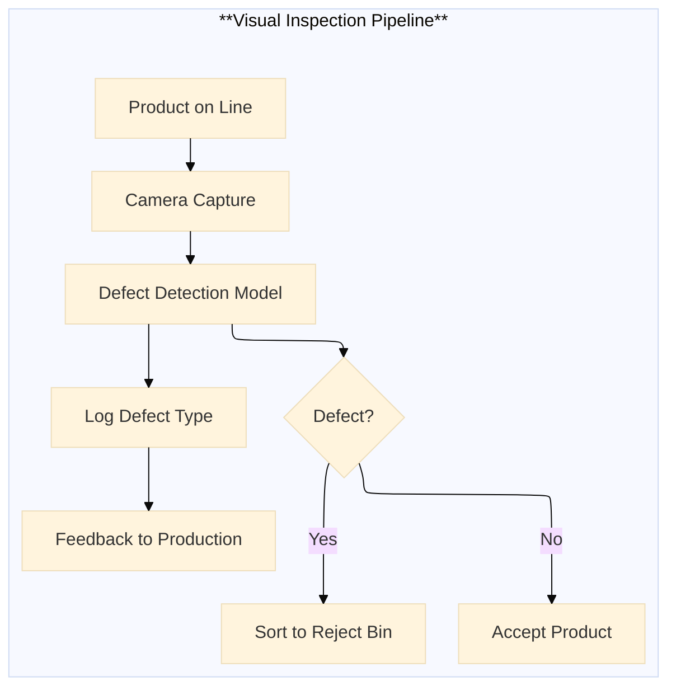

# Quality control is one of the most impactful appli

```mermaid
---
config:
  theme: base
  layout: elk
---
graph TD
    subgraph "**Visual Inspection Pipeline**"
        P[Product on Line] --> C[Camera Capture]
        C --> D[Defect Detection Model]
        D --> R{Defect?}
        
        R -->|Yes| S[Sort to Reject Bin]
        R -->|No| A[Accept Product]
        
        D --> L[Log Defect Type]
        L --> F[Feedback to Production]
    end
```
