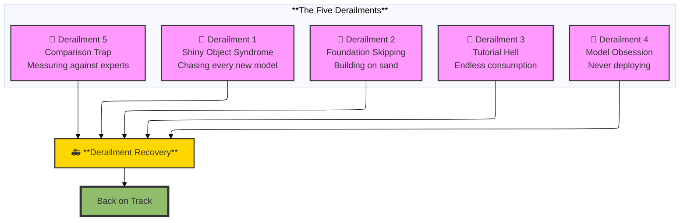

# After watching hundreds of learners navigate the A

```mermaid
---
config:
  theme: base
  layout: elk
---
graph TD
    subgraph "**The Five Derailments**"
        D1[🚨 Derailment 1<br/>Shiny Object Syndrome<br/>Chasing every new model]
        D2[🚨 Derailment 2<br/>Foundation Skipping<br/>Building on sand]
        D3[🚨 Derailment 3<br/>Tutorial Hell<br/>Endless consumption]
        D4[🚨 Derailment 4<br/>Model Obsession<br/>Never deploying]
        D5[🚨 Derailment 5<br/>Comparison Trap<br/>Measuring against experts]
    end
    
    D1 --> R[🚑 **Derailment Recovery**]
    D2 --> R
    D3 --> R
    D4 --> R
    D5 --> R
    
    R --> T[Back on Track]
    
    style D1 fill:#f9f,stroke:#333,stroke-width:2px
    style D2 fill:#f9f,stroke:#333,stroke-width:2px
    style D3 fill:#f9f,stroke:#333,stroke-width:2px
    style D4 fill:#f9f,stroke:#333,stroke-width:2px
    style D5 fill:#f9f,stroke:#333,stroke-width:2px
    style R fill:#ffd700,stroke:#333,stroke-width:2px
    style T fill:#90be6d,stroke:#333,stroke-width:4px
```
