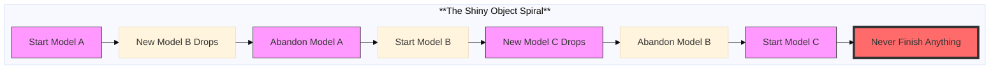

# Your brain is wired to seek novelty. Every new mod

```mermaid
---
config:
  theme: base
  layout: elk
---
graph LR
    subgraph "**The Shiny Object Spiral**"
        A[Start Model A] --> B[New Model B Drops]
        B --> C[Abandon Model A]
        C --> D[Start Model B]
        D --> E[New Model C Drops]
        E --> F[Abandon Model B]
        F --> G[Start Model C]
        G --> H[Never Finish Anything]
    end
    
    style A fill:#f9f,stroke:#333,stroke-width:1px
    style C fill:#f9f,stroke:#333,stroke-width:1px
    style E fill:#f9f,stroke:#333,stroke-width:1px
    style G fill:#f9f,stroke:#333,stroke-width:1px
    style H fill:#ff6b6b,stroke:#333,stroke-width:4px
```
