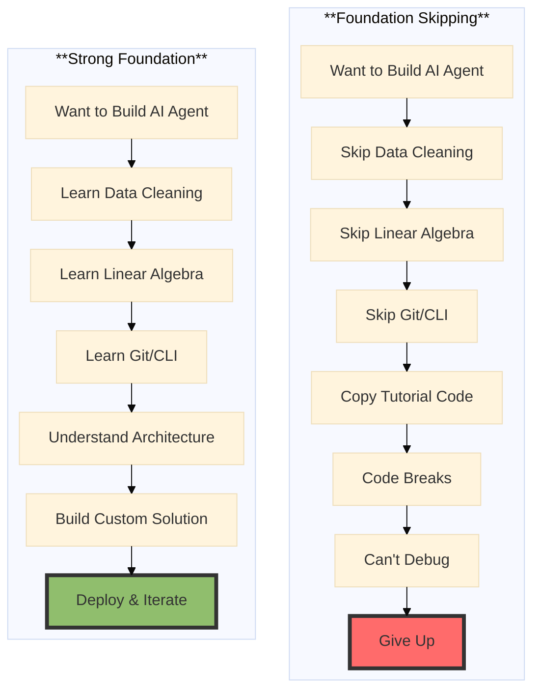

# Foundation skipping feels efficient. Why spend wee

```mermaid
---
config:
  theme: base
  layout: elk
---
graph TD
    subgraph "**Foundation Skipping**"
        A[Want to Build AI Agent] --> B[Skip Data Cleaning]
        B --> C[Skip Linear Algebra]
        C --> D[Skip Git/CLI]
        D --> E[Copy Tutorial Code]
        E --> F[Code Breaks]
        F --> G[Can't Debug]
        G --> H[Give Up]
    end
    
    subgraph "**Strong Foundation**"
        A2[Want to Build AI Agent] --> B2[Learn Data Cleaning]
        B2 --> C2[Learn Linear Algebra]
        C2 --> D2[Learn Git/CLI]
        D2 --> E2[Understand Architecture]
        E2 --> F2[Build Custom Solution]
        F2 --> G2[Deploy & Iterate]
    end
    
    style H fill:#ff6b6b,stroke:#333,stroke-width:4px
    style G2 fill:#90be6d,stroke:#333,stroke-width:4px
```
