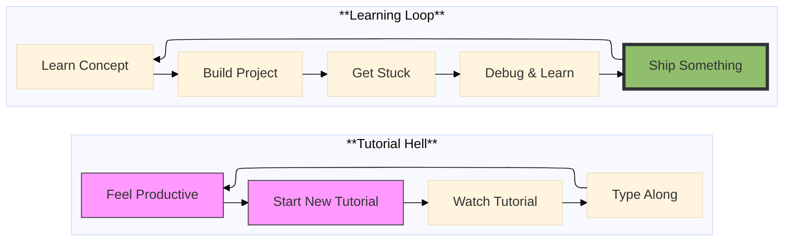

# Tutorials feel productive. You're watching, listen

```mermaid
---
config:
  theme: base
  layout: elk
---
graph LR
    subgraph "**Tutorial Hell**"
        A[Watch Tutorial] --> B[Type Along]
        B --> C[Feel Productive]
        C --> D[Start New Tutorial]
        D --> A
    end
    
    subgraph "**Learning Loop**"
        E[Learn Concept] --> F[Build Project]
        F --> G[Get Stuck]
        G --> H[Debug & Learn]
        H --> I[Ship Something]
        I --> E
    end
    
    style C fill:#f9f,stroke:#333,stroke-width:1px
    style D fill:#f9f,stroke:#333,stroke-width:1px
    style I fill:#90be6d,stroke:#333,stroke-width:4px
```
