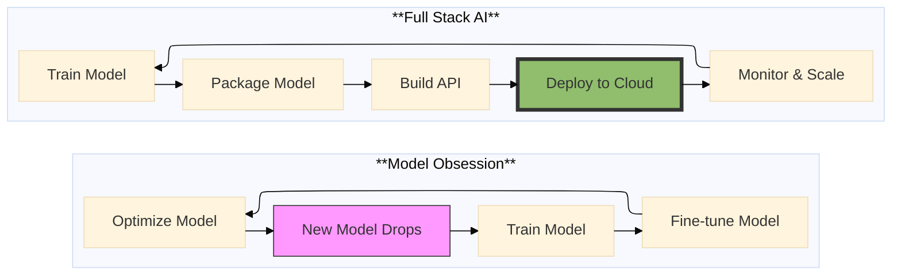

# Deployment feels scary. It's "not my job." The mod

```mermaid
---
config:
  theme: base
  layout: elk
---
graph LR
    subgraph "**Model Obsession**"
        A[Train Model] --> B[Fine-tune Model]
        B --> C[Optimize Model]
        C --> D[New Model Drops]
        D --> A
    end
    
    subgraph "**Full Stack AI**"
        E[Train Model] --> F[Package Model]
        F --> G[Build API]
        G --> H[Deploy to Cloud]
        H --> I[Monitor & Scale]
        I --> E
    end
    
    style D fill:#f9f,stroke:#333,stroke-width:1px
    style H fill:#90be6d,stroke:#333,stroke-width:4px
```
