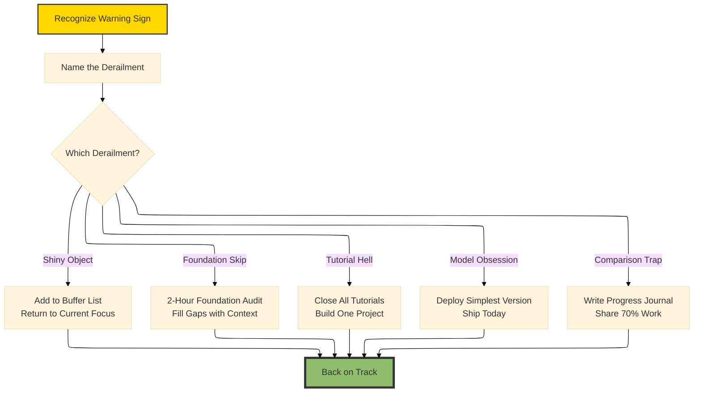

# When you feel yourself derailing, follow this prot

```mermaid
---
config:
  theme: base
  layout: elk
---
graph TD
    A[Recognize Warning Sign] --> B[Name the Derailment]
    B --> C{Which Derailment?}
    
    C -->|Shiny Object| D[Add to Buffer List<br/>Return to Current Focus]
    C -->|Foundation Skip| E[2-Hour Foundation Audit<br/>Fill Gaps with Context]
    C -->|Tutorial Hell| F[Close All Tutorials<br/>Build One Project]
    C -->|Model Obsession| G[Deploy Simplest Version<br/>Ship Today]
    C -->|Comparison Trap| H[Write Progress Journal<br/>Share 70% Work]
    
    D --> I[Back on Track]
    E --> I
    F --> I
    G --> I
    H --> I
    
    style A fill:#ffd700,stroke:#333,stroke-width:2px
    style I fill:#90be6d,stroke:#333,stroke-width:4px
```
