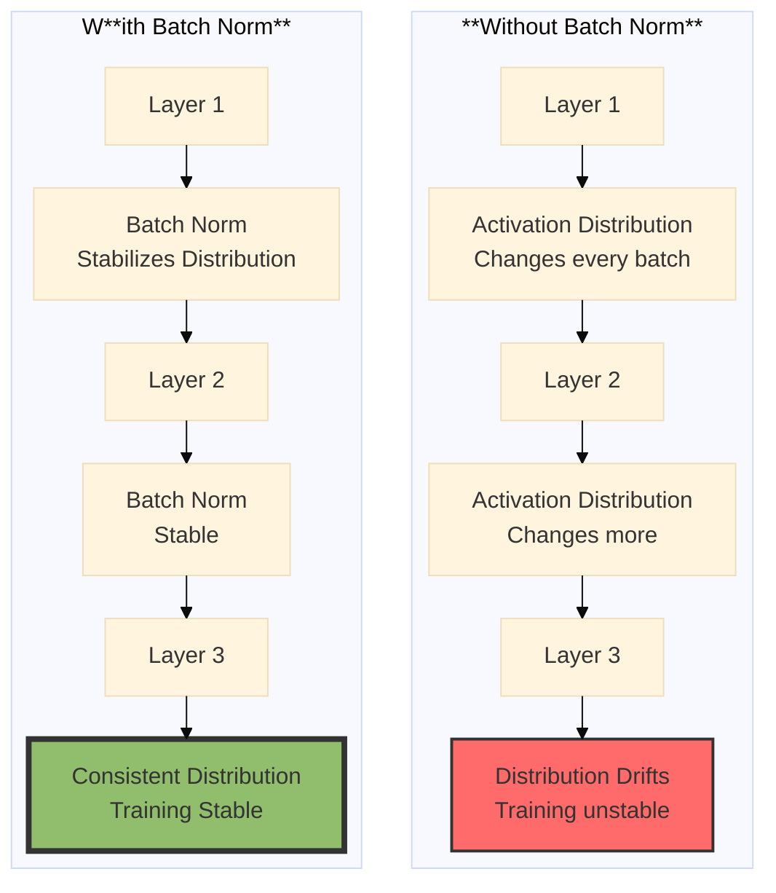

# Why do deep networks need stabilization?

```mermaid
---
config:
  theme: base
  layout: elk
---
graph TD
    subgraph "**Without Batch Norm**"
        L1[Layer 1] --> A1[Activation Distribution<br/>Changes every batch]
        A1 --> L2[Layer 2]
        L2 --> A2[Activation Distribution<br/>Changes more]
        A2 --> L3[Layer 3]
        L3 --> A3[Distribution Drifts<br/>Training unstable]
    end
    
    subgraph "W**ith Batch Norm**"
        L1b[Layer 1] --> BN1[Batch Norm<br/>Stabilizes Distribution]
        BN1 --> L2b[Layer 2]
        L2b --> BN2[Batch Norm<br/>Stable]
        BN2 --> L3b[Layer 3]
        L3b --> BN3[Consistent Distribution<br/>Training Stable]
    end
    
    style A3 fill:#ff6b6b,stroke:#333,stroke-width:2px
    style BN3 fill:#90be6d,stroke:#333,stroke-width:4px
```
