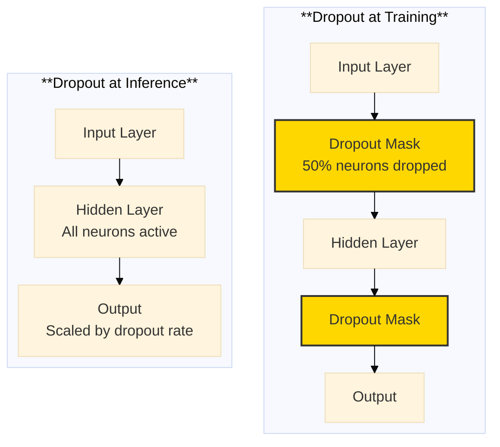

# Dropout randomly "drops" neurons during training, 

```mermaid
---
config:
  theme: base
  layout: elk
---
graph TD
    subgraph "**Dropout at Training**"
        I[Input Layer] --> D1[Dropout Mask<br/>50% neurons dropped]
        D1 --> H1[Hidden Layer]
        H1 --> D2[Dropout Mask]
        D2 --> O[Output]
    end
    
    subgraph "**Dropout at Inference**"
        I2[Input Layer] --> H2[Hidden Layer<br/>All neurons active]
        H2 --> O2[Output<br/>Scaled by dropout rate]
    end
    
    style D1 fill:#ffd700,stroke:#333,stroke-width:2px
    style D2 fill:#ffd700,stroke:#333,stroke-width:2px
```
