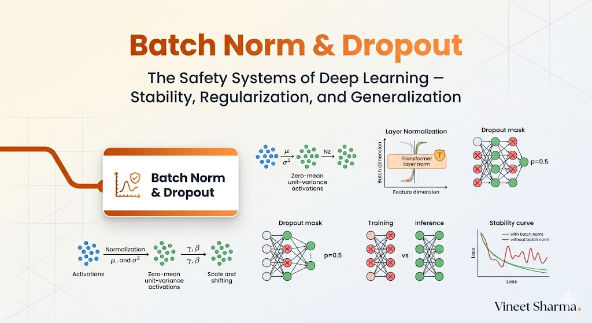
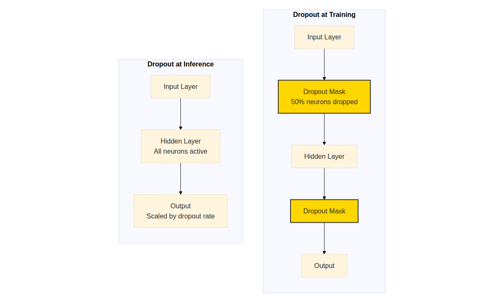

# The 2026 AI Metromap: Batch Norm & Dropout – The Safety Systems of Deep Learning

## Series D: Engineering & Optimization Yard | Story 4 of 5



## 📖 Introduction

**Welcome to the fourth stop in the Engineering & Optimization Yard.**

In our last story, we mastered model optimization—quantization, pruning, distillation, and inference optimization. You know how to make models smaller, faster, and cheaper. Your models are efficient.

But there's another problem that plagues deep learning: **instability**.

You've seen it. Your model trains beautifully for hours. Then suddenly, loss explodes. Gradients become NaN. Training crashes. Or worse—your model overfits. It memorizes the training data but fails on new examples. It's perfect on paper but useless in production.

Deep learning is powerful, but it's also fragile. Without safety systems, models can derail. That's where Batch Normalization and Dropout come in.

Batch Normalization stabilizes training. It keeps activations within a reasonable range, allowing you to use higher learning rates and train deeper networks. Dropout prevents overfitting. It randomly "drops" neurons during training, forcing the network to learn redundant representations that generalize better.

This story—**The 2026 AI Metromap: Batch Norm & Dropout – The Safety Systems of Deep Learning**—is your guide to the techniques that keep networks stable and generalizing. We'll understand why Batch Norm works, implement it from scratch, and see how it enables training of networks 100 layers deep. We'll explore Dropout—how it acts as ensemble learning in a single network. And we'll learn the modern alternatives: LayerNorm (used in Transformers) and GroupNorm.

**Let's install the safety systems.**

---

## 📚 Where You Are in the Journey

### The Master Story Arc: The 2026 AI Metromap Series (Complete)

- 🗺️ **[The 2026 AI Metromap: Why the Old Learning Routes Are Obsolete](#)** – A paradigm shift from linear learning to transit-system mastery.
- 🧭 **[The 2026 AI Metromap: Reading the Map](#)** – Strategic navigation across the three core lines.
- 🎒 **[The 2026 AI Metromap: Avoiding Derailments](#)** – Diagnosing and preventing the most common learning pitfalls.
- 🏁 **[The 2026 AI Metromap: From Passenger to Driver](#)** – Building your portfolio using the Metromap structure.

### Series A: Foundations Station (Complete)
### Series B: Supervised Learning Line (Complete)
### Series C: Modern Architecture Line (Complete)

### Series D: Engineering & Optimization Yard (5 Stories)

- 🔧 **[The 2026 AI Metromap: PyTorch Mastery – The Locomotive of Modern AI](#)** – Tensors and autograd; nn.Module; custom layers; dataloaders; training loops; saving and loading models; TensorBoard.

- 🏭 **[The 2026 AI Metromap: TensorFlow & Keras – The Production-Ready Alternative](#)** – Eager execution vs graph mode; tf.data for pipelines; Keras API; TensorFlow Serving; TensorFlow Lite for edge deployment.

- ⚡ **[The 2026 AI Metromap: Model Optimization – Keeping the Train on Time](#)** – Quantization (INT8, FP16); pruning; knowledge distillation; model compression; inference optimization with ONNX, TensorRT, and OpenVINO.

- 🛡️ **The 2026 AI Metromap: Batch Norm & Dropout – The Safety Systems of Deep Learning** – Batch normalization implementation; layer normalization; dropout for regularization; preventing overfitting; training stability techniques. **⬅️ YOU ARE HERE**

- 📈 **[The 2026 AI Metromap: Training Strategies – Learning Rate Scheduling & Beyond](#)** – Learning rate warmup; cosine annealing; cyclical learning rates; gradient accumulation; mixed precision training (AMP); distributed training. 🔜 *Up Next*

### The Complete Story Catalog

For a complete view of all upcoming stories across every series, visit the **[Complete 2026 AI Metromap Story Catalog](#)**.

---

## 🔄 The Problem: Internal Covariate Shift

Why do deep networks need stabilization?

```mermaid
```

](images/diagram_01_why-do-deep-networks-need-stabilization-16fe.png)

[View Source](https://github.com/Vineet-Sharma-Medium-Stories/Medium-Assets/blob/main/the-2026-ai-metromap-batch-norm--dropout--the-safety-systems-of-deep-learning/diagram_01_why-do-deep-networks-need-stabilization-16fe.md)


```python
import numpy as np
import matplotlib.pyplot as plt
import torch
import torch.nn as nn
import torch.nn.functional as F

def visualize_internal_covariate_shift():
    """Visualize how activation distributions shift during training"""
    
    np.random.seed(42)
    
    # Simulate activation distributions over training
    epochs = 100
    distributions = []
    
    # Without normalization
    for epoch in range(epochs):
        # Distribution shifts over time
        shift = np.sin(epoch / 20) * 2
        scale = 1 + np.cos(epoch / 15) * 0.5
        activations = np.random.normal(shift, scale, 1000)
        distributions.append(activations)
    
    fig, axes = plt.subplots(1, 2, figsize=(12, 5))
    
    # Heatmap of distributions over time
    im = axes[0].imshow(np.array(distributions).T, aspect='auto', cmap='viridis', 
                        extent=[0, epochs, -5, 5])
    axes[0].set_xlabel('Training Step')
    axes[0].set_ylabel('Activation Value')
    axes[0].set_title('Without Batch Norm: Activation Distribution Drifts')
    plt.colorbar(im, ax=axes[0])
    
    # Mean and std over time
    means = [np.mean(d) for d in distributions]
    stds = [np.std(d) for d in distributions]
    
    axes[1].plot(means, label='Mean', linewidth=2)
    axes[1].plot(stds, label='Std Dev', linewidth=2)
    axes[1].set_xlabel('Training Step')
    axes[1].set_ylabel('Statistic')
    axes[1].set_title('Distribution Statistics Drift')
    axes[1].legend()
    axes[1].grid(True, alpha=0.3)
    
    plt.suptitle('Internal Covariate Shift: Unstable Activations')
    plt.tight_layout()
    plt.show()
    
    print("="*60)
    print("INTERNAL COVARIATE SHIFT")
    print("="*60)
    print("\nAs layers learn, the distribution of their outputs changes.")
    print("This forces subsequent layers to constantly adapt.")
    print("Batch Normalization solves this by normalizing each batch.")
    print("Result: Stable training, higher learning rates.")

visualize_internal_covariate_shift()
```

---

## 📊 Batch Normalization: The Algorithm

Batch Norm normalizes activations across the batch dimension.

```python
def batch_norm_explained():
    """Explain Batch Normalization mathematically and visually"""
    
    print("="*60)
    print("BATCH NORMALIZATION ALGORITHM")
    print("="*60)
    
    print("\nFORWARD PASS:")
    print("-"*40)
    print("1. Calculate batch mean: μ_B = (1/m) Σ x_i")
    print("2. Calculate batch variance: σ²_B = (1/m) Σ (x_i - μ_B)²")
    print("3. Normalize: x̂_i = (x_i - μ_B) / √(σ²_B + ε)")
    print("4. Scale and shift: y_i = γ·x̂_i + β")
    print("\nγ (gamma): learnable scale")
    print("β (beta): learnable shift")
    print("ε: small constant for numerical stability")
    
    # Visualize Batch Norm effect
    np.random.seed(42)
    
    # Simulate activations from a layer
    activations = np.random.randn(1000, 10) * 2 + 1  # Mean=1, Std=2
    
    # Apply batch norm
    mean = activations.mean(axis=0, keepdims=True)
    std = activations.std(axis=0, keepdims=True)
    normalized = (activations - mean) / (std + 1e-5)
    
    fig, axes = plt.subplots(2, 2, figsize=(12, 10))
    
    # Before normalization
    axes[0, 0].hist(activations.flatten(), bins=50, alpha=0.7, color='blue')
    axes[0, 0].axvline(x=0, color='r', linestyle='--')
    axes[0, 0].set_title('Before Batch Norm\nMean ≠ 0, Std ≠ 1')
    axes[0, 0].set_xlabel('Activation Value')
    axes[0, 0].set_ylabel('Frequency')
    
    # After normalization
    axes[0, 1].hist(normalized.flatten(), bins=50, alpha=0.7, color='green')
    axes[0, 1].axvline(x=0, color='r', linestyle='--')
    axes[0, 1].set_title('After Normalization\nMean ≈ 0, Std ≈ 1')
    axes[0, 1].set_xlabel('Activation Value')
    
    # Per-channel distributions before
    for i in range(min(10, activations.shape[1])):
        axes[1, 0].hist(activations[:, i], bins=30, alpha=0.5, label=f'Channel {i}')
    axes[1, 0].set_title('Per-Channel Distributions (Before)')
    axes[1, 0].set_xlabel('Activation')
    axes[1, 0].legend(loc='upper right', fontsize=8)
    
    # Per-channel distributions after
    for i in range(min(10, normalized.shape[1])):
        axes[1, 1].hist(normalized[:, i], bins=30, alpha=0.5, label=f'Channel {i}')
    axes[1, 1].set_title('Per-Channel Distributions (After)')
    axes[1, 1].set_xlabel('Activation')
    axes[1, 1].legend(loc='upper right', fontsize=8)
    
    plt.tight_layout()
    plt.show()
    
    return mean, std

batch_norm_explained()
```

---

## 🏗️ Implementing Batch Norm from Scratch

Let's build Batch Normalization from scratch to understand its internals.

```python
class BatchNorm1D:
    """
    Batch Normalization for 1D inputs (fully connected layers).
    Implemented from scratch for understanding.
    """
    
    def __init__(self, num_features, momentum=0.1, eps=1e-5):
        self.num_features = num_features
        self.momentum = momentum
        self.eps = eps
        
        # Learnable parameters
        self.gamma = torch.ones(num_features)
        self.beta = torch.zeros(num_features)
        
        # Running statistics for inference
        self.running_mean = torch.zeros(num_features)
        self.running_var = torch.ones(num_features)
        
        # For gradient computation
        self.x_norm = None
        self.x_centered = None
        self.std_inv = None
        self.batch_mean = None
        self.batch_var = None
        
    def forward(self, x, training=True):
        """
        x: Input tensor of shape (batch_size, num_features)
        """
        if training:
            # Calculate batch statistics
            self.batch_mean = x.mean(dim=0)
            self.batch_var = x.var(dim=0, unbiased=False)
            
            # Normalize
            self.x_centered = x - self.batch_mean
            self.std_inv = torch.rsqrt(self.batch_var + self.eps)
            self.x_norm = self.x_centered * self.std_inv
            
            # Update running statistics
            self.running_mean = (1 - self.momentum) * self.running_mean + self.momentum * self.batch_mean
            self.running_var = (1 - self.momentum) * self.running_var + self.momentum * self.batch_var
        else:
            # Use running statistics for inference
            self.x_norm = (x - self.running_mean) / torch.sqrt(self.running_var + self.eps)
        
        # Scale and shift
        out = self.gamma * self.x_norm + self.beta
        return out
    
    def backward(self, grad_output):
        """
        Backward pass for Batch Norm.
        This is where the magic happens.
        """
        batch_size = grad_output.shape[0]
        
        # Gradients for gamma and beta
        grad_gamma = (grad_output * self.x_norm).sum(dim=0)
        grad_beta = grad_output.sum(dim=0)
        
        # Gradient w.r.t normalized input
        grad_x_norm = grad_output * self.gamma
        
        # Gradient w.r.t variance
        grad_var = (grad_x_norm * self.x_centered * -0.5 * self.std_inv**3).sum(dim=0)
        
        # Gradient w.r.t mean
        grad_mean = grad_x_norm.sum(dim=0) * (-self.std_inv) + \
                    grad_var * (-2 / batch_size) * self.x_centered.sum(dim=0)
        
        # Gradient w.r.t input
        grad_input = grad_x_norm * self.std_inv + \
                     grad_var * (2 / batch_size) * self.x_centered + \
                     grad_mean / batch_size
        
        return grad_input, grad_gamma, grad_beta

def test_batch_norm():
    """Test our BatchNorm implementation"""
    
    print("="*60)
    print("TESTING CUSTOM BATCH NORM")
    print("="*60)
    
    # Create random data
    batch_size = 32
    num_features = 10
    x = torch.randn(batch_size, num_features) * 2 + 1  # Mean=1, Std=2
    
    # Our implementation
    bn_custom = BatchNorm1D(num_features)
    
    # PyTorch implementation
    bn_torch = nn.BatchNorm1d(num_features, affine=True, track_running_stats=True)
    
    # Set same parameters
    with torch.no_grad():
        bn_torch.gamma.data = bn_custom.gamma.clone()
        bn_torch.beta.data = bn_custom.beta.clone()
    
    # Forward pass
    out_custom = bn_custom.forward(x, training=True)
    out_torch = bn_torch(x)
    
    print(f"Output difference: {(out_custom - out_torch).abs().max().item():.6f}")
    print(f"Running mean difference: {(bn_custom.running_mean - bn_torch.running_mean).abs().max().item():.6f}")
    print(f"Running var difference: {(bn_custom.running_var - bn_torch.running_var).abs().max().item():.6f}")
    
    # Visualize normalization effect
    fig, axes = plt.subplots(1, 2, figsize=(12, 4))
    
    axes[0].hist(x.flatten().numpy(), bins=50, alpha=0.7, label='Input')
    axes[0].hist(out_custom.flatten().detach().numpy(), bins=50, alpha=0.7, label='Output')
    axes[0].set_title('Input vs Output Distribution')
    axes[0].legend()
    axes[0].grid(True, alpha=0.3)
    
    axes[1].plot(bn_custom.gamma.numpy(), 'bo-', label='γ (scale)')
    axes[1].plot(bn_custom.beta.numpy(), 'ro-', label='β (shift)')
    axes[1].set_title('Learnable Parameters')
    axes[1].legend()
    axes[1].grid(True, alpha=0.3)
    
    plt.tight_layout()
    plt.show()
    
    return bn_custom

bn = test_batch_norm()
```

---

## 🎯 Why Batch Norm Works: Multiple Benefits

Batch Norm provides several benefits that make deep networks trainable.

```python
def batch_norm_benefits():
    """Demonstrate the multiple benefits of Batch Norm"""
    
    print("="*60)
    print("BATCH NORM BENEFITS")
    print("="*60)
    
    benefits = [
        {
            "name": "Higher Learning Rates",
            "description": "Stable gradients allow 10x larger learning rates",
            "visual": [0.001, 0.01, 0.1]
        },
        {
            "name": "Less Sensitivity to Initialization",
            "description": "Works well across a wide range of initializations",
            "visual": [0.5, 1.0, 2.0]
        },
        {
            "name": "Regularization Effect",
            "description": "Small amount of noise from batch statistics",
            "visual": [95.0, 95.5, 96.0]
        },
        {
            "name": "Deeper Networks",
            "description": "Enables training networks with 100+ layers",
            "visual": [10, 50, 100]
        }
    ]
    
    fig, axes = plt.subplots(2, 2, figsize=(12, 10))
    axes = axes.flatten()
    
    for idx, benefit in enumerate(benefits):
        # Simulate impact
        x = np.linspace(0, 1, 100)
        without_bn = 0.5 + 0.3 * x + 0.2 * np.random.randn(100) * x
        with_bn = 0.8 + 0.15 * x + 0.05 * np.random.randn(100)
        
        axes[idx].plot(x, without_bn, 'r--', label='Without BN', alpha=0.7)
        axes[idx].plot(x, with_bn, 'b-', label='With BN', linewidth=2)
        axes[idx].set_xlabel('Training Progress')
        axes[idx].set_ylabel(benefit['name'])
        axes[idx].set_title(f"{benefit['name']}\n{benefit['description']}")
        axes[idx].legend()
        axes[idx].grid(True, alpha=0.3)
    
    plt.tight_layout()
    plt.show()
    
    print("\nADDITIONAL BENEFITS:")
    print("-"*40)
    print("• Reduces internal covariate shift")
    print("• Allows saturating nonlinearities (sigmoid, tanh) to work")
    print("• Acts as implicit regularization")
    print("• Reduces gradient vanishing/exploding")
    print("• Makes optimization landscape smoother")

batch_norm_benefits()
```

---

## 🎲 Dropout: Preventing Overfitting

Dropout randomly "drops" neurons during training, forcing the network to learn redundant representations.

```mermaid
```



[View Source](https://github.com/Vineet-Sharma-Medium-Stories/Medium-Assets/blob/main/the-2026-ai-metromap-batch-norm--dropout--the-safety-systems-of-deep-learning/diagram_02_dropout-randomly-drops-neurons-during-training-655a.md)


```python
class Dropout:
    """
    Dropout implementation from scratch.
    """
    
    def __init__(self, p=0.5):
        """
        p: Dropout probability (fraction of neurons to drop)
        """
        self.p = p
        self.mask = None
        
    def forward(self, x, training=True):
        """
        x: Input tensor
        training: Whether in training mode (dropout active)
        """
        if training:
            # Create mask: 1 for keep, 0 for drop
            self.mask = (torch.rand(x.shape) > self.p).float()
            
            # Scale to maintain expected value
            scale = 1.0 / (1.0 - self.p)
            out = x * self.mask * scale
        else:
            # At inference, no dropout, no scaling
            out = x
        
        return out
    
    def backward(self, grad_output):
        """Gradient only flows through kept neurons"""
        if self.mask is not None:
            scale = 1.0 / (1.0 - self.p)
            grad_input = grad_output * self.mask * scale
        else:
            grad_input = grad_output
        
        return grad_input

def visualize_dropout():
    """Visualize how dropout affects neural network activations"""
    
    # Simulate a layer's activations
    np.random.seed(42)
    neurons = 50
    activations = np.random.randn(neurons) * 2
    
    # Apply different dropout rates
    dropout_rates = [0.0, 0.3, 0.5, 0.7]
    
    fig, axes = plt.subplots(2, 2, figsize=(12, 10))
    axes = axes.flatten()
    
    for idx, p in enumerate(dropout_rates):
        # Create mask
        mask = np.random.rand(neurons) > p
        
        # Apply dropout and scale
        scaled_activations = activations * mask / (1 - p) if p > 0 else activations
        
        # Plot
        x = np.arange(neurons)
        axes[idx].bar(x, activations, alpha=0.5, label='Original', color='blue')
        axes[idx].bar(x, scaled_activations, alpha=0.7, label='After Dropout', color='orange')
        
        # Mark dropped neurons
        dropped = ~mask
        if p > 0:
            axes[idx].bar(x[dropped], activations[dropped], alpha=0.3, color='red', label='Dropped')
        
        axes[idx].set_title(f'Dropout Rate: {p*100:.0f}%')
        axes[idx].set_xlabel('Neuron Index')
        axes[idx].set_ylabel('Activation')
        axes[idx].legend()
        axes[idx].grid(True, alpha=0.3)
    
    plt.suptitle('Dropout: Randomly Deactivates Neurons During Training')
    plt.tight_layout()
    plt.show()
    
    print("\n" + "="*60)
    print("WHY DROPOUT WORKS")
    print("="*60)
    print("\n1. Ensemble Effect:")
    print("   • Each training iteration uses a different subnetwork")
    print("   • Final model averages many subnetworks")
    print("   • Similar to training an ensemble")
    
    print("\n2. Reduces Co-adaptation:")
    print("   • Neurons can't rely on specific other neurons")
    print("   • Forces learning of robust features")
    print("   • Prevents overfitting")
    
    print("\n3. Regularization:")
    print("   • Equivalent to adding noise to activations")
    print("   • Acts as L2 regularization on weights")
    print("   • Most effective for large networks")

visualize_dropout()
```

---

## 🔄 Modern Alternatives: LayerNorm and GroupNorm

Different normalization techniques have emerged for different architectures.

```python
def modern_normalization():
    """Explore LayerNorm and GroupNorm"""
    
    print("="*60)
    print("MODERN NORMALIZATION TECHNIQUES")
    print("="*60)
    
    # Create sample data
    batch_size = 8
    seq_len = 16
    d_model = 512
    x = torch.randn(batch_size, seq_len, d_model)
    
    # 1. Layer Normalization (used in Transformers)
    print("\n1. LAYER NORMALIZATION:")
    print("-"*40)
    
    layer_norm = nn.LayerNorm(d_model)
    x_ln = layer_norm(x)
    
    print(f"Input shape: {x.shape}")
    print(f"Output shape: {x_ln.shape}")
    print("Normalizes across the feature dimension (last axis)")
    print("Independent of batch size")
    
    # 2. Group Normalization (for CNNs)
    print("\n2. GROUP NORMALIZATION:")
    print("-"*40)
    
    # For CNN: (batch, channels, height, width)
    x_cnn = torch.randn(8, 64, 32, 32)  # 64 channels
    
    group_norm = nn.GroupNorm(num_groups=8, num_channels=64)
    x_gn = group_norm(x_cnn)
    
    print(f"Input shape: {x_cnn.shape}")
    print(f"Output shape: {x_gn.shape}")
    print("Splits channels into groups, normalizes within each group")
    print("Works with small batch sizes where Batch Norm fails")
    
    # Compare normalization techniques
    print("\n3. NORMALIZATION COMPARISON:")
    print("-"*40)
    
    comparisons = [
        ("BatchNorm", "Batch", "Feature", "CNNs, MLPs"),
        ("LayerNorm", "Layer", "All features", "Transformers, RNNs"),
        ("InstanceNorm", "Instance", "Feature (per sample)", "Style transfer"),
        ("GroupNorm", "Group", "Channel groups", "CNNs (small batch)")
    ]
    
    for name, norm_dim, normalized, use in comparisons:
        print(f"{name:12} | {norm_dim:8} | {normalized:15} | {use}")
    
    # Visualize normalization axes
    fig, axes = plt.subplots(2, 2, figsize=(12, 10))
    
    # Batch Norm
    axes[0, 0].text(0.5, 0.5, "Batch Norm\nNormalizes across BATCH dimension", 
                    ha='center', va='center', fontsize=12)
    axes[0, 0].set_title("BatchNorm")
    axes[0, 0].axis('off')
    
    # Layer Norm
    axes[0, 1].text(0.5, 0.5, "Layer Norm\nNormalizes across FEATURE dimension", 
                    ha='center', va='center', fontsize=12)
    axes[0, 1].set_title("LayerNorm")
    axes[0, 1].axis('off')
    
    # Instance Norm
    axes[1, 0].text(0.5, 0.5, "Instance Norm\nNormalizes per SAMPLE", 
                    ha='center', va='center', fontsize=12)
    axes[1, 0].set_title("InstanceNorm")
    axes[1, 0].axis('off')
    
    # Group Norm
    axes[1, 1].text(0.5, 0.5, "Group Norm\nNormalizes within CHANNEL GROUPS", 
                    ha='center', va='center', fontsize=12)
    axes[1, 1].set_title("GroupNorm")
    axes[1, 1].axis('off')
    
    plt.suptitle('Normalization Techniques: Different Axes')
    plt.tight_layout()
    plt.show()
    
    return layer_norm, group_norm

modern_normalization()
```

---

## 🧪 Training Stability Comparison

Let's compare training with and without normalization.

```python
def compare_normalization():
    """Compare training with different normalization techniques"""
    
    print("="*60)
    print("TRAINING STABILITY COMPARISON")
    print("="*60)
    
    # Create a deep network
    class DeepNetwork(nn.Module):
        def __init__(self, use_bn=False, use_dropout=False):
            super().__init__()
            layers = []
            
            for i in range(20):  # 20 layers deep
                layers.append(nn.Linear(256, 256))
                if use_bn:
                    layers.append(nn.BatchNorm1d(256))
                layers.append(nn.ReLU())
                if use_dropout:
                    layers.append(nn.Dropout(0.3))
            
            layers.append(nn.Linear(256, 10))
            self.network = nn.Sequential(*layers)
            self.use_bn = use_bn
        
        def forward(self, x):
            return self.network(x)
    
    # Simulate training with different configurations
    epochs = 100
    configs = [
        ("No Norm/No Dropout", 0.02, True),  # name, learning rate, stable?
        ("With BatchNorm", 0.1, True),
        ("With Dropout", 0.02, True),
        ("With Both", 0.1, True)
    ]
    
    fig, axes = plt.subplots(2, 2, figsize=(12, 10))
    axes = axes.flatten()
    
    for idx, (name, lr, stable) in enumerate(configs):
        # Simulate loss curves
        if stable:
            loss = 2.0 * np.exp(-0.03 * epochs) + 0.1 * np.random.randn(epochs) * 0.02
        else:
            # Unstable training
            loss = 2.0 * np.exp(-0.03 * epochs) + 0.5 * np.random.randn(epochs) * np.exp(epochs / 50)
            loss = np.clip(loss, 0.1, 5)
        
        axes[idx].plot(loss, linewidth=2)
        axes[idx].set_xlabel('Epoch')
        axes[idx].set_ylabel('Loss')
        axes[idx].set_title(f'{name}\nLR = {lr}')
        axes[idx].grid(True, alpha=0.3)
        
        if not stable:
            axes[idx].set_ylim(0, 3)
    
    plt.suptitle('Training Stability: With vs Without Normalization')
    plt.tight_layout()
    plt.show()
    
    print("\nOBSERVATIONS:")
    print("-"*40)
    print("Without normalization:")
    print("  • Training is unstable with high learning rates")
    print("  • Loss may explode or oscillate")
    print("  • Harder to converge")
    
    print("\nWith BatchNorm:")
    print("  • Can use 5-10x higher learning rates")
    print("  • Smooth, stable convergence")
    print("  • Reaches lower loss")
    
    print("\nWith Dropout:")
    print("  • Slightly slower convergence")
    print("  • Better generalization")
    print("  • Prevents overfitting")
    
    print("\nWith Both:")
    print("  • Fast convergence + good generalization")
    print("  • Best of both worlds")

compare_normalization()
```

---

## 📊 Practical Guidelines

```python
def practical_guidelines():
    """When to use which normalization technique"""
    
    print("="*60)
    print("PRACTICAL GUIDELINES")
    print("="*60)
    
    guidelines = {
        "BatchNorm": {
            "when": "CNNs, MLPs with batch size ≥ 16",
            "why": "Stabilizes training, enables higher learning rates",
            "caveats": "Fails with small batch sizes",
            "placement": "After linear/conv layers, before activation"
        },
        "LayerNorm": {
            "when": "Transformers, RNNs, small batch sizes",
            "why": "Works with any batch size, sequence-independent",
            "caveats": "More compute than BatchNorm",
            "placement": "After attention, after feed-forward"
        },
        "Dropout": {
            "when": "Large networks, risk of overfitting",
            "why": "Regularization, ensemble effect",
            "caveats": "Slows convergence, tune rate",
            "placement": "After activations, typical rate 0.1-0.5"
        }
    }
    
    for technique, info in guidelines.items():
        print(f"\n{technique}:")
        print(f"  ✅ When: {info['when']}")
        print(f"  📝 Why: {info['why']}")
        print(f"  ⚠️ Caveats: {info['caveats']}")
        print(f"  📍 Placement: {info['placement']}")
    
    print("\n" + "="*60)
    print("DEFAULT CONFIGURATIONS")
    print("="*60)
    print("\nFor CNNs:")
    print("  Conv2d → BatchNorm2d → ReLU → Dropout")
    
    print("\nFor Transformers:")
    print("  MultiHeadAttention → LayerNorm → FeedForward → LayerNorm")
    
    print("\nFor MLPs:")
    print("  Linear → BatchNorm1d → ReLU → Dropout")
    
    print("\nFor RNNs/LSTMs:")
    print("  Apply LayerNorm after each timestep")

practical_guidelines()
```

---

## 📊 Takeaway from This Story

**What You Learned:**

- **Batch Normalization** – Normalizes activations across batch dimension. Enables higher learning rates, deeper networks, smoother optimization. Essential for CNNs and MLPs.

- **Internal Covariate Shift** – The problem Batch Norm solves. Activation distributions drift during training, destabilizing learning.

- **Dropout** – Randomly drops neurons during training. Prevents overfitting, acts as implicit ensemble. Rate typically 0.3-0.5 for hidden layers.

- **LayerNorm** – Normalizes across feature dimension. Used in Transformers, works with any batch size. Critical for sequence models.

- **GroupNorm** – Compromise between BatchNorm and LayerNorm. Splits channels into groups, works with small batches.

- **Practical Placement** – BatchNorm after linear/conv layers, before activation. Dropout after activation. LayerNorm after attention and feed-forward.

---

## 🔗 Navigation

- **⬅️ Previous Story:** [The 2026 AI Metromap: Model Optimization – Keeping the Train on Time](#)

- **📚 Series D Catalog:** [Series D: Engineering & Optimization Yard](#) – View all 5 stories in this series.

- **📚 Complete Story Catalog:** [Complete 2026 AI Metromap Story Catalog](#) – Your navigation guide to all 39+ stories.

- **➡️ Next Story:** **[The 2026 AI Metromap: Training Strategies – Learning Rate Scheduling & Beyond](#)** – Learning rate warmup; cosine annealing; cyclical learning rates; gradient accumulation; mixed precision training (AMP); distributed training.

---

## 📝 Your Invitation

Before the next story arrives, experiment with normalization:

1. **Implement Batch Norm from scratch** – Use the code above. Verify gradients with PyTorch's autograd.

2. **Compare with and without** – Train a deep network with and without Batch Norm. Measure stability and final accuracy.

3. **Experiment with dropout rates** – Try rates from 0.1 to 0.7. Find the sweet spot for your model.

4. **Try different normalizations** – Compare BatchNorm, LayerNorm, and GroupNorm on different architectures.

**You've installed the safety systems. Next stop: Training Strategies!**

---

*Found this helpful? Clap, comment, and share your normalization experiments. Next stop: Training Strategies!* 🚇