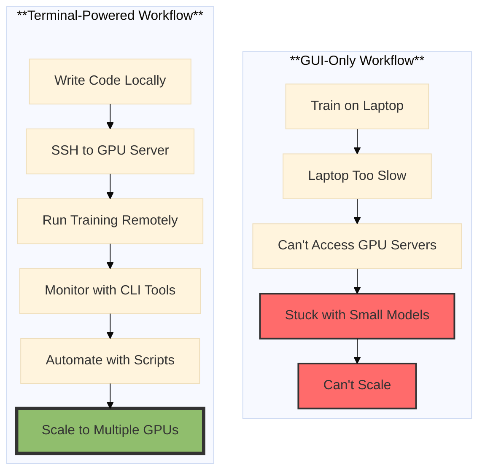

# Let's look at what happens when you can't use the 

```mermaid
---
config:
  theme: base
  layout: elk
---
graph TD
    subgraph "**GUI-Only Workflow**"
        A[Train on Laptop] --> B[Laptop Too Slow]
        B --> C[Can't Access GPU Servers]
        C --> D[Stuck with Small Models]
        D --> E[Can't Scale]
    end
    
    subgraph "**Terminal-Powered Workflow**"
        F[Write Code Locally] --> G[SSH to GPU Server]
        G --> H[Run Training Remotely]
        H --> I[Monitor with CLI Tools]
        I --> J[Automate with Scripts]
        J --> K[Scale to Multiple GPUs]
    end
    
    style D fill:#ff6b6b,stroke:#333,stroke-width:2px
    style E fill:#ff6b6b,stroke:#333,stroke-width:2px
    style K fill:#90be6d,stroke:#333,stroke-width:4px
```
