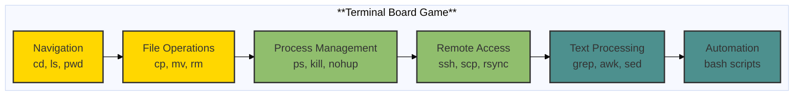

# Like any board game, the terminal has rules, piece

```mermaid
---
config:
  theme: base
  layout: elk
---
graph LR
    subgraph "**Terminal Board Game**"
        A[Navigation<br/>cd, ls, pwd] --> B[File Operations<br/>cp, mv, rm]
        B --> C[Process Management<br/>ps, kill, nohup]
        C --> D[Remote Access<br/>ssh, scp, rsync]
        D --> E[Text Processing<br/>grep, awk, sed]
        E --> F[Automation<br/>bash scripts]
    end
    
    style A fill:#ffd700,stroke:#333,stroke-width:2px
    style B fill:#ffd700,stroke:#333,stroke-width:2px
    style C fill:#90be6d,stroke:#333,stroke-width:2px
    style D fill:#90be6d,stroke:#333,stroke-width:2px
    style E fill:#4d908e,stroke:#333,stroke-width:2px
    style F fill:#4d908e,stroke:#333,stroke-width:2px
```
