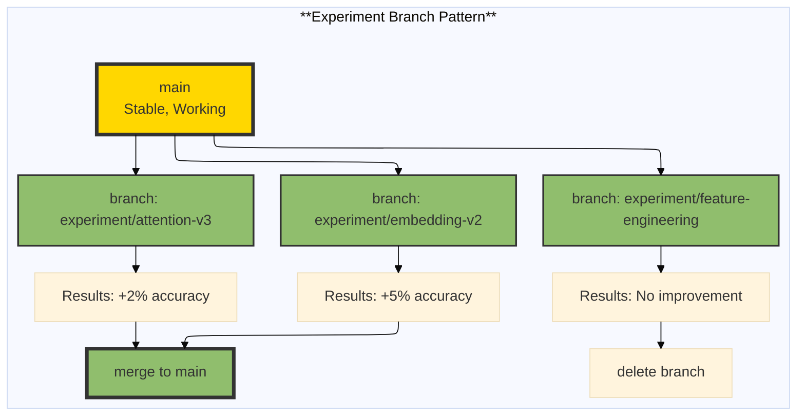

# AI development is fundamentally different from sof

```mermaid
---
config:
  theme: base
  layout: elk
---
graph TD
    subgraph "**Experiment Branch Pattern**"
        M[main<br/>Stable, Working] --> B1[branch: experiment/embedding-v2]
        M --> B2[branch: experiment/attention-v3]
        M --> B3[branch: experiment/feature-engineering]
        
        B1 --> R1[Results: +5% accuracy]
        B2 --> R2[Results: +2% accuracy]
        B3 --> R3[Results: No improvement]
        
        R1 --> M2[merge to main]
        R2 --> M2
        R3 --> D[delete branch]
    end
    
    style M fill:#ffd700,stroke:#333,stroke-width:4px
    style B1 fill:#90be6d,stroke:#333,stroke-width:2px
    style B2 fill:#90be6d,stroke:#333,stroke-width:2px
    style B3 fill:#90be6d,stroke:#333,stroke-width:2px
    style M2 fill:#90be6d,stroke:#333,stroke-width:4px
```
