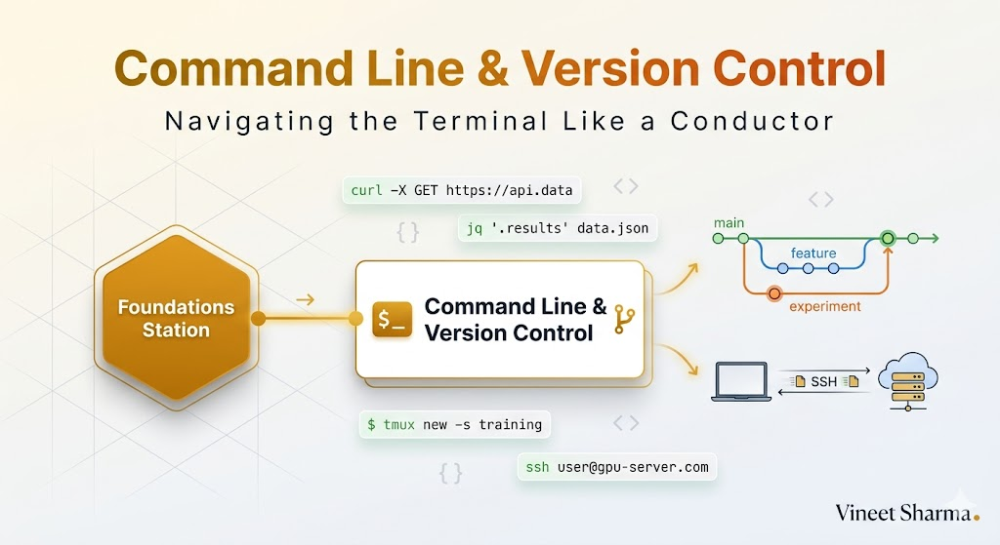
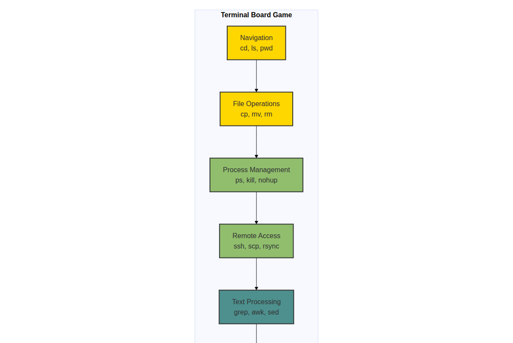
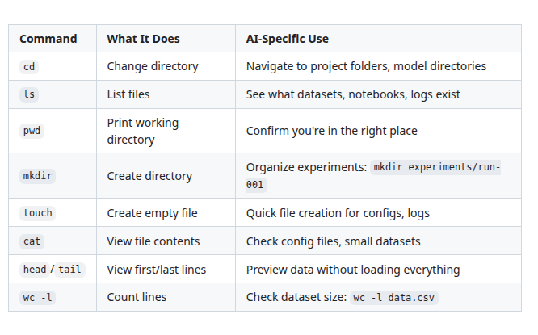
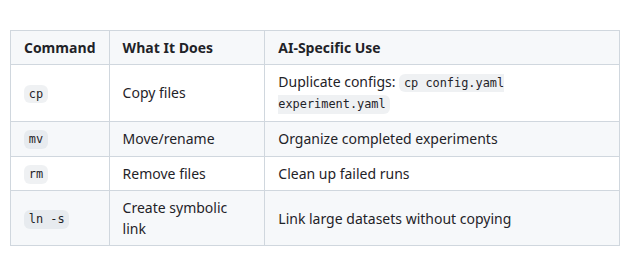
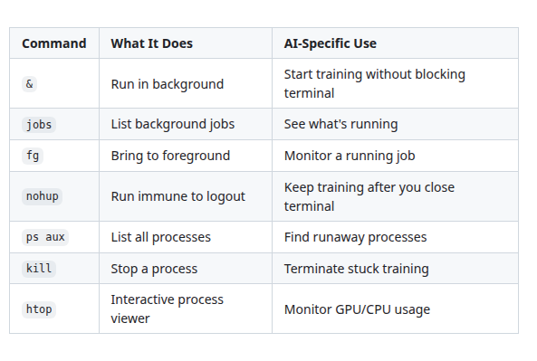
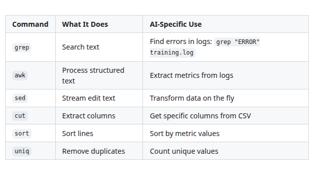
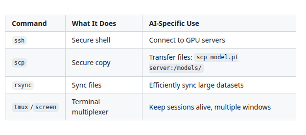
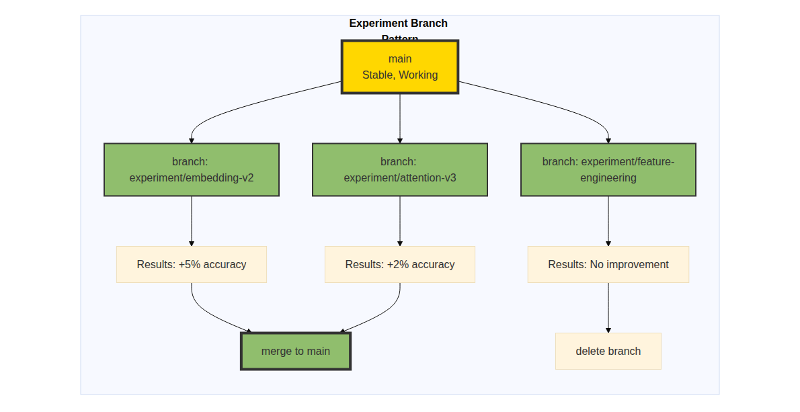

# The 2026 AI Metromap: Command Line & Version Control – Navigating the Terminal Like a Conductor

## Series A: Foundations Station | Story 2 of 5



## 📖 Introduction

**Welcome to the second stop at Foundations Station.**

In our first foundation story, we reframed data cleaning and Git as board games—strategic skills that separate those who ship from those who struggle. You learned the foundation workflow that makes every AI project reproducible and reliable.

Now we need to talk about how you actually run that workflow.

If you've been avoiding the command line, you're not alone. It looks intimidating. Black screen, blinking cursor, no safety net. It feels like a step backward from the beautiful IDEs and notebooks you're used to.

But here's the truth that every senior AI engineer knows: **The command line is where real AI work happens.**

- Training models on remote GPU servers? Command line.
- Managing multiple experiments across machines? Command line.
- Automating data pipelines? Command line.
- Deploying models to production? Command line.

The GUI is comfortable. The command line is powerful. And in 2026, if you can't navigate the terminal, you're not just slow—you're locked out of the most important parts of AI engineering.

This story—**The 2026 AI Metromap: Command Line & Version Control – Navigating the Terminal Like a Conductor**—is your guide to mastering the interface that controls everything. We'll cover essential CLI tools that every AI engineer needs, Git workflows that scale to complex projects, and the SSH skills that let you train on any machine on earth.

**Let's get you behind the conductor's console.**

---

## 📚 Where You Are in the Journey

### The Master Story Arc: The 2026 AI Metromap Series (Complete)

- 🗺️ **[The 2026 AI Metromap: Why the Old Learning Routes Are Obsolete](#)** – A paradigm shift from linear learning to transit-system mastery.
- 🧭 **[The 2026 AI Metromap: Reading the Map](#)** – Strategic navigation across the three core lines.
- 🎒 **[The 2026 AI Metromap: Avoiding Derailments](#)** – Diagnosing and preventing the most common learning pitfalls.
- 🏁 **[The 2026 AI Metromap: From Passenger to Driver](#)** – Building your portfolio using the Metromap structure.

### Series A: Foundations Station (5 Stories)

- 🏗️ **[The 2026 AI Metromap: Foundations Station – Why Data Cleaning and Git Are Your Board Games, Not Just Chores](#)** – Reframing foundational skills as strategic enablers; practical data cleaning; Git workflows for model versioning.

- 🖥️ **The 2026 AI Metromap: Command Line & Version Control – Navigating the Terminal Like a Conductor** – Essential CLI tools for AI development; Git branching strategies; SSH and remote GPU training setup. **⬅️ YOU ARE HERE**

- 🧮 **[The 2026 AI Metromap: Linear Algebra for ML – The Language of the Map](#)** – Vectors, matrices, and tensors explained through intuition; dot products as attention mechanisms; eigenvalues and PCA. 🔜 *Up Next*

- 📊 **[The 2026 AI Metromap: Data Cleaning & Visualization – Turning Raw Data into Tracks](#)** – Real-world data wrangling with pandas, polars, and DuckDB; handling missing values, outliers, and imbalanced datasets.

- 🔄 **[The 2026 AI Metromap: Ethics & Responsible AI – The Safety Systems of the Metro](#)** – Bias detection and mitigation; interpretability; privacy-preserving AI; regulatory compliance.

### The Complete Story Catalog

For a complete view of all upcoming stories across every series, visit the **[Complete 2026 AI Metromap Story Catalog](#)**.

---

## 🚂 Why the Command Line Matters for AI

You might be thinking: "I use VS Code. I use Jupyter. Why do I need the terminal?"

Let's look at what happens when you can't use the command line:

```mermaid
```

](images/diagram_01_lets-look-at-what-happens-when-you-cant-use-the-29e5.png)

[View Source](https://github.com/Vineet-Sharma-Medium-Stories/Medium-Assets/blob/main/the-2026-ai-metromap-command-line--version-control--navigating-the-terminal-like-a-conductor/diagram_01_lets-look-at-what-happens-when-you-cant-use-the-29e5.md)


**The Hard Truth:**

- **Your laptop is not a training machine.** Real models need GPUs. GPUs live in the cloud or on remote servers. You reach them through the terminal.

- **Experiments multiply.** You'll run dozens of training runs. Managing them through a GUI is impossible. The terminal lets you script, automate, and scale.

- **Deployment is not a notebook.** Production systems run on servers. Servers have no GUIs. If you can't deploy from the command line, you can't ship.

---

## 🎮 The Terminal as a Board Game

Like any board game, the terminal has rules, pieces, and strategies. Master them, and you control the board.

```mermaid
```



[View Source](https://github.com/Vineet-Sharma-Medium-Stories/Medium-Assets/blob/main/the-2026-ai-metromap-command-line--version-control--navigating-the-terminal-like-a-conductor/diagram_02_like-any-board-game-the-terminal-has-rules-piece-ea33.md)


---

## 🎯 Essential CLI Tools for AI Engineers

You don't need to be a terminal wizard. You need 20% of the commands to do 80% of the work. Here's your toolkit.

### Level 1: Navigation & Files (The Basics)

These are your movement pieces. You use them every single day.



[View Source](https://github.com/Vineet-Sharma-Medium-Stories/Medium-Assets/blob/main/the-2026-ai-metromap-command-line--version-control--navigating-the-terminal-like-a-conductor/table_01_these-are-your-movement-pieces-you-use-them-every-4463.md)


**Essential Patterns:**
```bash
# Navigate to your project
cd ~/projects/ai-metromap

# List everything with details
ls -la

# Create experiment structure
mkdir -p experiments/2026-04-01/{checkpoints,logs,metrics}

# Check how many samples in your dataset
wc -l data/train.csv

# Preview data without opening
head -n 5 data/train.csv
```

---

### Level 2: File Operations (Moving Pieces)



[View Source](https://github.com/Vineet-Sharma-Medium-Stories/Medium-Assets/blob/main/the-2026-ai-metromap-command-line--version-control--navigating-the-terminal-like-a-conductor/table_02_level-2-file-operations-moving-pieces-d4e8.md)


**Essential Patterns:**
```bash
# Copy a config for a new experiment
cp configs/base.yaml configs/experiment-01.yaml

# Rename a failed experiment
mv experiments/bad-run experiments/archive/bad-run

# Create a symlink to a large dataset (saves disk space)
ln -s /mnt/data/imagenet ./data/imagenet

# Remove old checkpoints (carefully!)
rm experiments/old-run/checkpoints/*.pt
```

---

### Level 3: Process Management (Running the Game)

AI training runs can take hours or days. You need to manage these processes.



[View Source](https://github.com/Vineet-Sharma-Medium-Stories/Medium-Assets/blob/main/the-2026-ai-metromap-command-line--version-control--navigating-the-terminal-like-a-conductor/table_03_ai-training-runs-can-take-hours-or-days-you-need-bb11.md)


**Essential Patterns:**
```bash
# Run training in background
python train.py --config config.yaml &

# Run with nohup (keeps running after logout)
nohup python train.py --config config.yaml > training.log 2>&1 &

# Monitor GPU usage
watch -n 1 nvidia-smi

# Or use htop for interactive monitoring
htop

# Find a process by name and kill it
ps aux | grep train.py
kill -9 [PID]
```

---

### Level 4: Text Processing (Data & Logs)

You'll spend a lot of time examining logs and processing text data. These commands are your best friends.



[View Source](https://github.com/Vineet-Sharma-Medium-Stories/Medium-Assets/blob/main/the-2026-ai-metromap-command-line--version-control--navigating-the-terminal-like-a-conductor/table_04_youll-spend-a-lot-of-time-examining-logs-and-proc-8d29.md)


**Essential Patterns:**
```bash
# Find all errors in training logs
grep -n "Error" experiments/*/logs/training.log

# Extract accuracy from log file
grep "val_accuracy" training.log | awk '{print $NF}'

# Sort model checkpoints by timestamp
ls -lt checkpoints/ | head -n 5

# Count unique values in a column
cut -d',' -f3 data.csv | sort | uniq -c

# Search for specific metrics across experiments
grep -r "final_accuracy" experiments/*/metrics.txt
```

---

### Level 5: Remote Access (The Real Power)

This is where AI training actually happens. Remote servers with GPUs.



[View Source](https://github.com/Vineet-Sharma-Medium-Stories/Medium-Assets/blob/main/the-2026-ai-metromap-command-line--version-control--navigating-the-terminal-like-a-conductor/table_05_this-is-where-ai-training-actually-happens-remote-b510.md)


**Essential Patterns:**
```bash
# Connect to a remote GPU server
ssh username@server.com

# Copy code to server
rsync -avz ./project/ username@server.com:~/projects/

# Copy model back to local
scp username@server.com:~/projects/checkpoints/best_model.pt ./

# Use tmux for persistent sessions
tmux new -s training
# ... start training ...
# Detach with Ctrl+B, D
# Reattach later
tmux attach -t training
```

---

## 🔧 Git Beyond Basics: Branching Strategies for AI

In the first foundation story, we covered Git basics. Now let's go deeper with strategies that scale to complex AI projects.

### The Experiment Branch Pattern

AI development is fundamentally different from software development. You don't know what will work. You need to explore freely without breaking what works.

```mermaid
```



[View Source](https://github.com/Vineet-Sharma-Medium-Stories/Medium-Assets/blob/main/the-2026-ai-metromap-command-line--version-control--navigating-the-terminal-like-a-conductor/diagram_03_ai-development-is-fundamentally-different-from-sof-7475.md)


**The Workflow:**

```bash
# Start a new experiment from main
git checkout main
git pull
git checkout -b experiment/lora-fine-tuning

# Run your experiment. Commit progress.
git add configs/lora_config.yaml
git commit -m "exp: add LoRA config with rank=8"

# Run training. If it works:
git checkout main
git merge experiment/lora-fine-tuning
git tag -a exp-lora-success -m "LoRA fine-tuning: +12% accuracy on validation"

# If it fails, just delete the branch
git branch -D experiment/lora-fine-tuning
```

### The Model Tagging Pattern

Tags are your memory. Use them to mark important milestones.

```bash
# Tag a successful training run
git tag -a model-v1-baseline -m "Baseline: 85% accuracy, trained on full dataset"

# Tag after hyperparameter tuning
git tag -a model-v2-hp-opt -m "After Bayesian optimization: 87% accuracy"

# Tag after architecture change
git tag -a model-v3-attention -m "Added multi-head attention: 89% accuracy"

# List all model tags
git tag -l "model-*"

# Show details of a specific tag
git show model-v2-hp-opt
```

### The Config-as-Code Pattern

Your model configuration should be versioned alongside your code.

```yaml
# configs/production.yaml
model:
  name: "churn_predictor_v3"
  architecture: "transformer"
  embedding_dim: 256
  num_heads: 8
  num_layers: 6

training:
  batch_size: 32
  learning_rate: 0.0001
  optimizer: "adamw"
  scheduler: "cosine"
  epochs: 50

data:
  train_path: "data/processed/train_v2.parquet"
  val_path: "data/processed/val_v2.parquet"
  features: ["age", "income", "tenure", "usage_freq"]

experiment:
  tags: ["production", "transformer-v3"]
  notes: "Increased embedding dim from 128 to 256"
```

```bash
# Commit config changes
git add configs/production.yaml
git commit -m "config: increase embedding dim to 256

Experiment results:
- Previous (dim=128): 87% accuracy
- New (dim=256): 89% accuracy
- Training time: +20% (acceptable trade-off)
"
git tag -a config-prod-v3 -m "Production config with improved accuracy"
```

---

## 🌐 SSH & Remote Training: The Real AI Workflow

This is where the terminal becomes indispensable. Here's the complete remote training workflow.

### Step 1: Connect to Your GPU Server

```bash
# Connect with SSH
ssh username@gpu-server.com

# Or with port forwarding for Jupyter
ssh -L 8888:localhost:8888 username@gpu-server.com
```

### Step 2: Sync Your Code

```bash
# From local machine
rsync -avz --exclude 'data' --exclude 'checkpoints' \
  ./project/ username@gpu-server.com:~/projects/

# Or use git
git push origin main
# On remote:
git clone https://github.com/username/project.git
```

### Step 3: Set Up the Environment

```bash
# On remote server
cd ~/projects/project

# Create virtual environment
python -m venv venv
source venv/bin/activate

# Install dependencies
pip install -r requirements.txt
```

### Step 4: Start Training with tmux

```bash
# Start a tmux session
tmux new -s training-experiment-01

# Inside tmux, activate environment and start training
source venv/bin/activate
python train.py --config configs/experiment.yaml

# Detach with Ctrl+B, then D
# Your training continues running
```

### Step 5: Monitor and Reattach

```bash
# List active tmux sessions
tmux ls

# Reattach to your training session
tmux attach -t training-experiment-01

# Check logs without attaching
tail -f logs/training.log
```

### Step 6: Retrieve Results

```bash
# From local machine
scp username@gpu-server.com:~/projects/project/checkpoints/best_model.pt ./

# Or sync entire experiment folder
rsync -avz username@gpu-server.com:~/projects/project/experiments/ ./experiments/
```

---

## 🚀 Advanced CLI Patterns for AI

### Pattern 1: One-Liner Experiment Launcher

Create a script that launches experiments with all the right settings:

```bash
#!/bin/bash
# run_experiment.sh

EXPERIMENT_NAME=$1
CONFIG_PATH=$2

# Create experiment directory
mkdir -p experiments/$EXPERIMENT_NAME/{logs,checkpoints,metrics}

# Copy config for reproducibility
cp $CONFIG_PATH experiments/$EXPERIMENT_NAME/config.yaml

# Launch training with nohup
nohup python train.py \
  --config $CONFIG_PATH \
  --experiment_name $EXPERIMENT_NAME \
  > experiments/$EXPERIMENT_NAME/logs/training.log 2>&1 &

echo "Experiment $EXPERIMENT_NAME started. PID: $!"
echo "Monitor with: tail -f experiments/$EXPERIMENT_NAME/logs/training.log"
```

Usage:
```bash
./run_experiment.sh embedding-experiment configs/embedding.yaml
```

### Pattern 2: Batch Log Analysis

```bash
# Find the best accuracy across all experiments
grep -r "val_accuracy" experiments/*/logs/*.log | \
  awk -F: '{print $1, $NF}' | \
  sort -k2 -rn | \
  head -n 5

# Output:
# experiments/exp-001/logs/training.log 0.92
# experiments/exp-003/logs/training.log 0.91
# experiments/exp-002/logs/training.log 0.89
```

### Pattern 3: Disk Space Management

```bash
# Find large files in your project
find . -type f -size +100M -exec ls -lh {} \;

# Clean up old checkpoints (keep only last 5)
ls -t checkpoints/*.pt | tail -n +6 | xargs rm -f
```

---

## 📊 Takeaway from This Story

**What You Learned:**

- **Why the Terminal Matters** – Real AI work happens on remote servers with GPUs. The command line is your only interface to that power.

- **The Essential CLI Toolkit** – Navigation, file operations, process management, text processing, and remote access. Master these 20 commands for 80% of your work.

- **Git Beyond Basics** – Experiment branches, model tagging, and config-as-code patterns that scale to complex AI projects.

- **The Remote Training Workflow** – SSH, rsync, tmux, and scp form the complete pipeline for training on GPU servers.

- **Advanced Patterns** – One-liner experiment launchers, batch log analysis, and disk space management for production projects.

---

## 🔗 Navigation

- **⬅️ Previous Story:** [The 2026 AI Metromap: Foundations Station – Why Data Cleaning and Git Are Your Board Games, Not Just Chores](#)

- **📚 Series A Catalog:** [Series A: Foundations Station](#) – View all 5 stories in this series.

- **📚 Complete Story Catalog:** [Complete 2026 AI Metromap Story Catalog](#) – Your navigation guide to all 39+ stories.

- **➡️ Next Story:** **[The 2026 AI Metromap: Linear Algebra for ML – The Language of the Map](#)** – Vectors, matrices, and tensors explained through intuition; dot products as attention mechanisms; eigenvalues and PCA.

---

## 📝 Your Invitation

Before the next story arrives, practice your terminal skills:

1. **Set up a remote GPU environment** – Even a free Colab instance with SSH access counts. Connect to it.

2. **Create an experiment branch** – Start a new feature branch for your next model experiment.

3. **Write a launch script** – Automate your training runs with a simple bash script.

4. **Practice tmux** – Start a session, run a long command, detach, reattach.

The terminal is your conductor's console. The more you practice, the more powerful you become.

---

*Found this helpful? Clap, comment, and share your favorite terminal trick. Next stop: Linear Algebra for ML!* 🚇