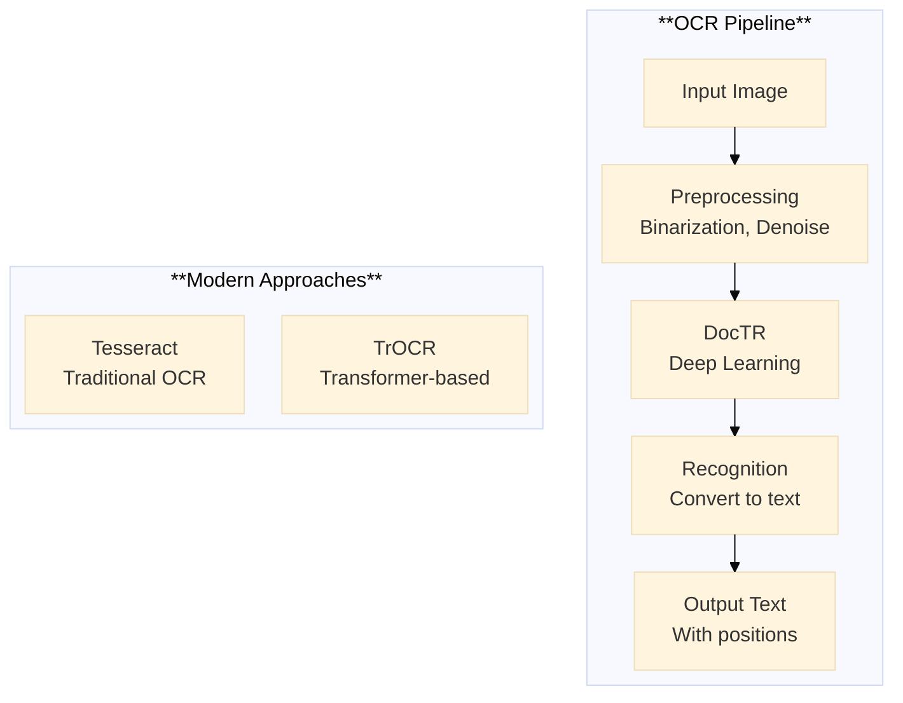

# OCR extracts text from images, documents, and phot

```mermaid
---
config:
  theme: base
  layout: elk
---
graph TD
    subgraph "**OCR Pipeline**"
        I[Input Image] --> P[Preprocessing<br/>Binarization, Denoise]
        P --> D[Detection<br/>Find text regions]
        D --> R[Recognition<br/>Convert to text]
        R --> O[Output Text<br/>With positions]
    end
    
    subgraph "**Modern Approaches**"
        T[Tesseract<br/>Traditional OCR]
        V[TrOCR<br/>Transformer-based]
        D[DocTR<br/>Deep Learning]
    end
```
