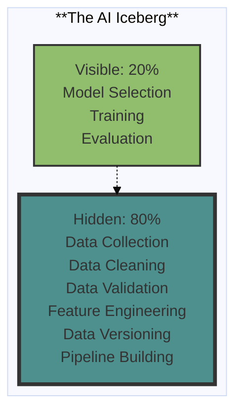

# It's not.

```mermaid
---
config:
  theme: base
  layout: elk
---
graph TD
    subgraph "**The AI Iceberg**"
        A[Visible: 20%<br/>Model Selection<br/>Training<br/>Evaluation] 
        
        B[Hidden: 80%<br/>Data Collection<br/>Data Cleaning<br/>Data Validation<br/>Feature Engineering<br/>Data Versioning<br/>Pipeline Building]
        
        A -.-> B
    end
    
    style A fill:#90be6d,stroke:#333,stroke-width:2px
    style B fill:#4d908e,stroke:#333,stroke-width:4px
```
