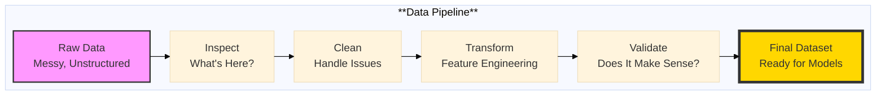

# Think of data work as a pipeline. Each stage trans

```mermaid
---
config:
  theme: base
  layout: elk
---
graph LR
    subgraph "**Data Pipeline**"
        R[Raw Data<br/>Messy, Unstructured] --> I[Inspect<br/>What's Here?]
        I --> C[Clean<br/>Handle Issues]
        C --> T[Transform<br/>Feature Engineering]
        T --> V[Validate<br/>Does It Make Sense?]
        V --> F[Final Dataset<br/>Ready for Models]
    end
    
    style R fill:#f9f,stroke:#333,stroke-width:2px
    style F fill:#ffd700,stroke:#333,stroke-width:4px
```
