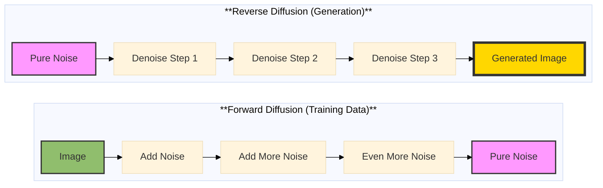

# Diffusion models are built on a counterintuitive i

```mermaid
---
config:
  theme: base
  layout: elk
---
graph LR
    subgraph "**Forward Diffusion (Training Data)**"
        I[Image] --> N1[Add Noise]
        N1 --> N2[Add More Noise]
        N2 --> N3[Even More Noise]
        N3 --> P[Pure Noise]
    end
    
    subgraph "**Reverse Diffusion (Generation)**"
        P2[Pure Noise] --> D1[Denoise Step 1]
        D1 --> D2[Denoise Step 2]
        D2 --> D3[Denoise Step 3]
        D3 --> I2[Generated Image]
    end
    
    style I fill:#90be6d,stroke:#333,stroke-width:2px
    style P fill:#f9f,stroke:#333,stroke-width:2px
    style P2 fill:#f9f,stroke:#333,stroke-width:2px
    style I2 fill:#ffd700,stroke:#333,stroke-width:4px
```
