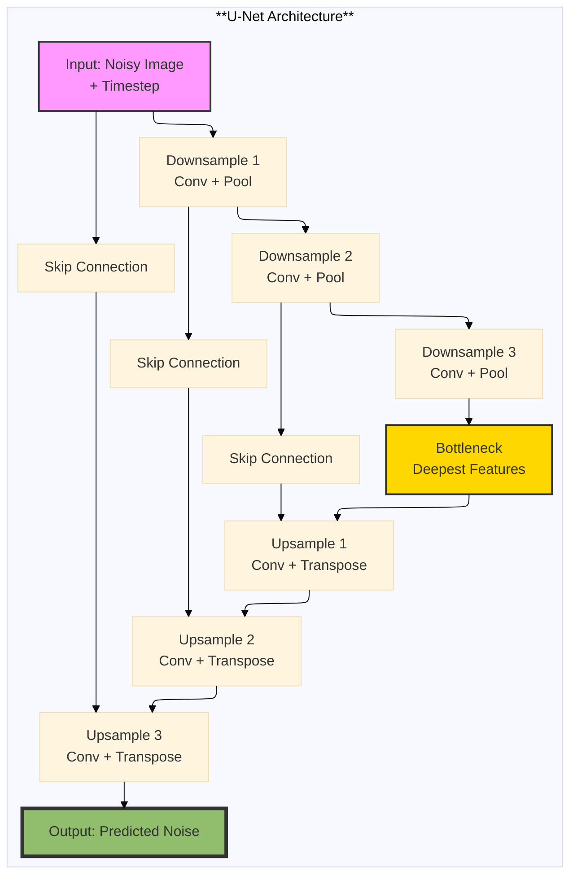

# The denoising network in diffusion models is typic

```mermaid
---
config:
  theme: base
  layout: elk
---
graph TD
    subgraph "**U-Net Architecture**"
        I[Input: Noisy Image<br/>+ Timestep] --> D1[Downsample 1<br/>Conv + Pool]
        D1 --> D2[Downsample 2<br/>Conv + Pool]
        D2 --> D3[Downsample 3<br/>Conv + Pool]
        D3 --> B[Bottleneck<br/>Deepest Features]
        
        B --> U1[Upsample 1<br/>Conv + Transpose]
        D2 --> S1[Skip Connection]
        S1 --> U1
        U1 --> U2[Upsample 2<br/>Conv + Transpose]
        D1 --> S2[Skip Connection]
        S2 --> U2
        U2 --> U3[Upsample 3<br/>Conv + Transpose]
        I --> S3[Skip Connection]
        S3 --> U3
        
        U3 --> O[Output: Predicted Noise]
    end
    
    style I fill:#f9f,stroke:#333,stroke-width:2px
    style B fill:#ffd700,stroke:#333,stroke-width:2px
    style O fill:#90be6d,stroke:#333,stroke-width:4px
```
