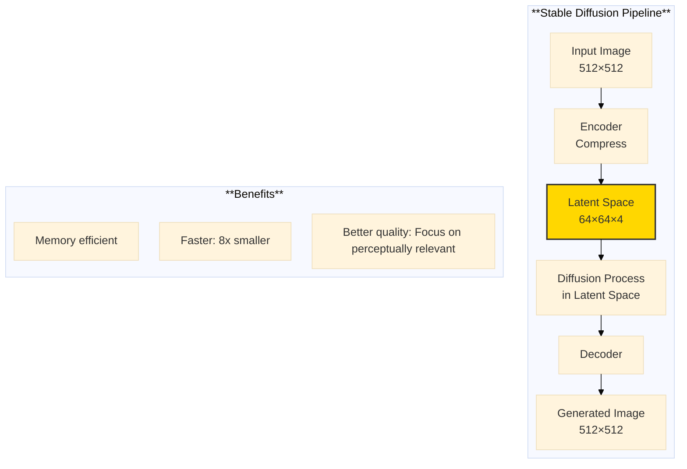

# Stable Diffusion made diffusion practical by opera

```mermaid
---
config:
  theme: base
  layout: elk
---
graph TD
    subgraph "**Stable Diffusion Pipeline**"
        I[Input Image<br/>512×512] --> E[Encoder<br/>Compress]
        E --> L[Latent Space<br/>64×64×4]
        L --> D2[Diffusion Process<br/>in Latent Space]
        D2 --> DEC[Decoder]
        DEC --> O[Generated Image<br/>512×512]
    end
    
    subgraph "**Benefits**"
        B1[Faster: 8x smaller]
        B2[Better quality: Focus on perceptually relevant]
        B3[Memory efficient]
    end
    
    style L fill:#ffd700,stroke:#333,stroke-width:2px
```
