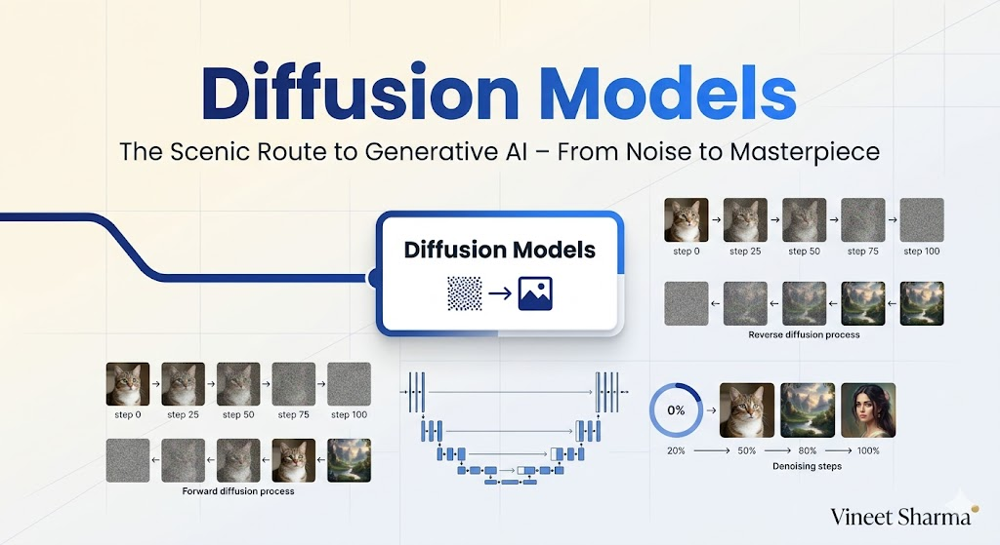
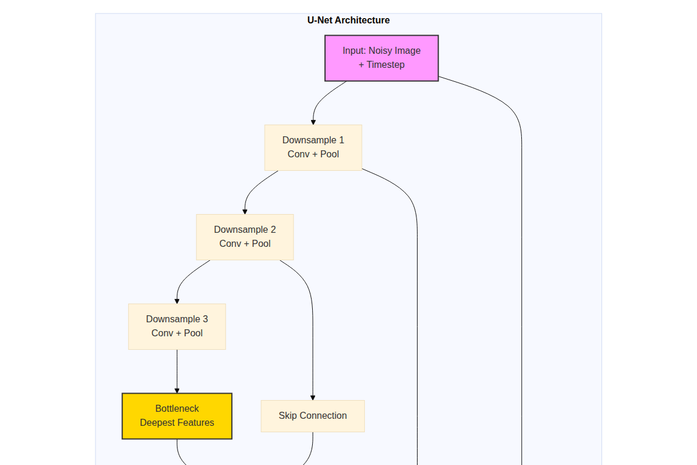
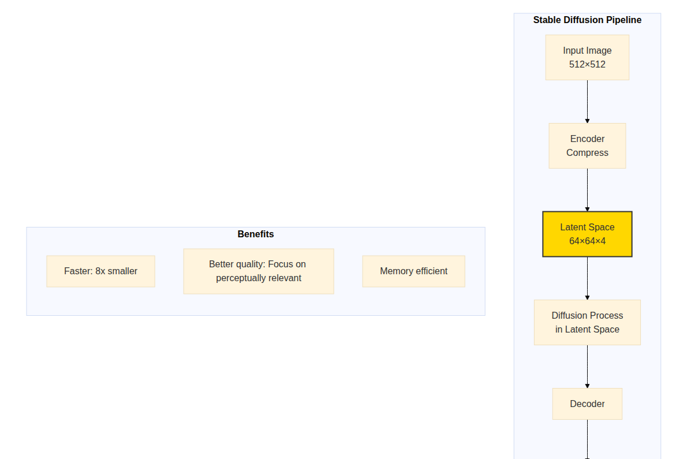
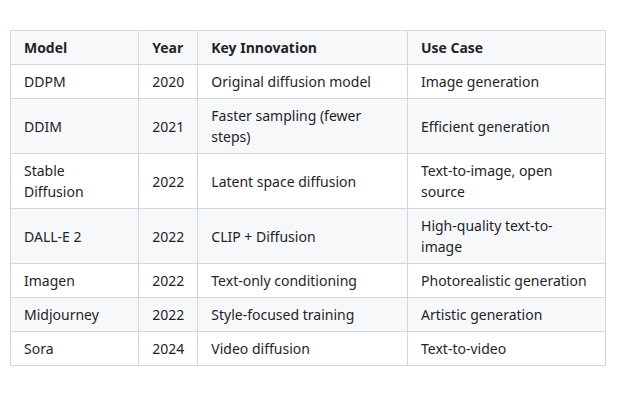

# The 2026 AI Metromap: Diffusion Models – The Scenic Route to Generative AI

## Series C: Modern Architecture Line | Story 3 of 6



## 📖 Introduction

**Welcome to the third stop on the Modern Architecture Line.**

In our last two stories, we mastered Transformers and GPT—the architectures that revolutionized language. But language is only one medium. What about images? Audio? Video?

For years, generating realistic images was dominated by GANs (Generative Adversarial Networks). They were powerful but notoriously unstable. Training a GAN was like training two models fighting each other—finicky, prone to collapse, and hard to control.

Then came diffusion models.

In 2020, researchers proposed a different approach: start with pure noise and gradually remove it to reveal an image. It seemed counterintuitive. Why would destroying data teach you to create it? But the results were stunning. Stable Diffusion, DALL-E, Midjourney—all built on diffusion. Today, diffusion models generate photorealistic images, stunning videos, and even music.

This story—**The 2026 AI Metromap: Diffusion Models – The Scenic Route to Generative AI**—is your journey into the architecture that powers modern generative media. We'll understand the forward diffusion process—how we slowly add noise to an image until it becomes pure static. We'll explore reverse diffusion—how a neural network learns to undo that process. We'll decode the U-Net architecture that powers diffusion models. And we'll see how conditioning turns these models into controllable generators.

**Let's take the scenic route.**

---

## 📚 Where You Are in the Journey

### The Master Story Arc: The 2026 AI Metromap Series (Complete)

- 🗺️ **[The 2026 AI Metromap: Why the Old Learning Routes Are Obsolete](#)** – A paradigm shift from linear learning to transit-system mastery.
- 🧭 **[The 2026 AI Metromap: Reading the Map](#)** – Strategic navigation across the three core lines.
- 🎒 **[The 2026 AI Metromap: Avoiding Derailments](#)** – Diagnosing and preventing the most common learning pitfalls.
- 🏁 **[The 2026 AI Metromap: From Passenger to Driver](#)** – Building your portfolio using the Metromap structure.

### Series A: Foundations Station (Complete)
### Series B: Supervised Learning Line (Complete)

### Series C: Modern Architecture Line (6 Stories)

- 📖 **[The 2026 AI Metromap: Transformers & Attention – The Station That Changed Everything](#)** – The "Attention Is All You Need" paper decoded; self-attention mechanisms; multi-head attention; positional encoding; encoder-decoder architecture.

- 🤖 **[The 2026 AI Metromap: GPT & LLM Architecture – Understanding the Engine of the Express Train](#)** – Decoder-only architecture; causal masking; next token prediction; scaling laws; context windows; emergent abilities.

- 🎨 **The 2026 AI Metromap: Diffusion Models – The Scenic Route to Generative AI** – How diffusion models work; forward diffusion process; reverse denoising; U-Net architecture; stable diffusion. **⬅️ YOU ARE HERE**

- 🌐 **[The 2026 AI Metromap: Multimodal Models – The Interchange Stations](#)** – CLIP: connecting images and text; Flamingo: few-shot multimodal learning; Gemini: native multimodality; contrastive learning. 🔜 *Up Next*

- 🧩 **[The 2026 AI Metromap: Fine-Tuning vs. In-Context Learning – When to Train vs. When to Prompt](#)** – Parameter-efficient fine-tuning (LoRA, QLoRA); instruction tuning; RLHF; in-context learning; few-shot prompting.

- 📚 **[The 2026 AI Metromap: Open Source LLMs – LLaMA, Mistral, DeepSeek, and Beyond](#)** – Running LLMs locally; quantization (GGUF, GPTQ); inference optimization; model comparison; open-source ecosystem.

### The Complete Story Catalog

For a complete view of all upcoming stories across every series, visit the **[Complete 2026 AI Metromap Story Catalog](#)**.

---

## 🌊 The Core Idea: Destroying to Create

Diffusion models are built on a counterintuitive idea: **learn to reverse destruction.**

```mermaid
```

](images/diagram_01_diffusion-models-are-built-on-a-counterintuitive-i-ea04.png)

[View Source](https://github.com/Vineet-Sharma-Medium-Stories/Medium-Assets/blob/main/the-2026-ai-metromap-diffusion-models--the-scenic-route-to-generative-ai/diagram_01_diffusion-models-are-built-on-a-counterintuitive-i-ea04.md)


**The Insight:** If you can learn to predict the noise added at each step, you can start from pure noise and gradually remove it to create new images.

---

## 🔄 Forward Diffusion: Creating Training Data

The forward process takes a clean image and gradually adds noise over T steps.

```python
import numpy as np
import matplotlib.pyplot as plt
from scipy.ndimage import gaussian_filter

def visualize_forward_diffusion():
    """Visualize the forward diffusion process"""
    
    # Create a simple image (a circle)
    size = 64
    x = np.linspace(-2, 2, size)
    y = np.linspace(-2, 2, size)
    X, Y = np.meshgrid(x, y)
    image = np.exp(-((X)**2 + (Y)**2) * 3)  # Gaussian blob
    
    # Diffusion parameters
    T = 20  # Number of steps
    beta_start = 0.0001
    beta_end = 0.02
    betas = np.linspace(beta_start, beta_end, T)
    
    # Store images at each step
    images = [image.copy()]
    current = image.copy()
    
    for t in range(T):
        # Add noise according to schedule
        beta = betas[t]
        noise = np.random.randn(*image.shape) * np.sqrt(beta)
        current = np.sqrt(1 - beta) * current + noise
        images.append(current.copy())
    
    # Visualize
    fig, axes = plt.subplots(2, 5, figsize=(15, 6))
    axes = axes.flatten()
    
    steps_to_show = [0, 1, 2, 3, 5, 7, 10, 13, 16, 19]
    
    for idx, step in enumerate(steps_to_show):
        axes[idx].imshow(images[step], cmap='gray', vmin=-2, vmax=2)
        axes[idx].set_title(f'Step {step}')
        axes[idx].axis('off')
    
    plt.suptitle('Forward Diffusion: Gradually Adding Noise', fontsize=14)
    plt.tight_layout()
    plt.show()
    
    # Show noise schedule
    fig, ax = plt.subplots(figsize=(8, 4))
    ax.plot(range(T), betas, 'b-', linewidth=2)
    ax.set_xlabel('Timestep')
    ax.set_ylabel('Noise Amount (β)')
    ax.set_title('Noise Schedule: Slowly Increasing')
    ax.grid(True, alpha=0.3)
    plt.show()
    
    print("\n" + "="*60)
    print("FORWARD DIFFUSION EXPLANATION")
    print("="*60)
    print("At each step, we add a small amount of Gaussian noise.")
    print("The amount of noise increases over time (β schedule).")
    print("After enough steps, the image becomes pure noise.")
    print("\nThe model learns to predict the noise at each step.")

visualize_forward_diffusion()
```

---

## 🔧 The Diffusion Process Mathematically

Let's formalize the diffusion process.

```python
def diffusion_mathematics():
    """Explain the mathematics of diffusion"""
    
    print("="*60)
    print("DIFFUSION MATHEMATICS")
    print("="*60)
    
    print("\n1. FORWARD PROCESS:")
    print("   q(xₜ | xₜ₋₁) = 𝒩(xₜ; √(1-βₜ)·xₜ₋₁, βₜ·I)")
    print("   Each step adds Gaussian noise with variance βₜ")
    
    print("\n2. REPARAMETERIZATION TRICK:")
    print("   xₜ = √(ᾱₜ)·x₀ + √(1-ᾱₜ)·ε")
    print("   Where αₜ = 1-βₜ, ᾱₜ = ∏ᵢ₌₁ᵗ αᵢ")
    print("   ε ∼ 𝒩(0, I)")
    print("\n   This allows us to jump directly from x₀ to xₜ in one step!")
    
    print("\n3. REVERSE PROCESS:")
    print("   p_θ(xₜ₋₁ | xₜ) = 𝒩(xₜ₋₁; μ_θ(xₜ, t), Σ_θ(xₜ, t))")
    print("   The model learns to predict the mean μ_θ")
    
    print("\n4. SIMPLIFIED TRAINING OBJECTIVE:")
    print("   L = 𝔼_{t, x₀, ε}[||ε - ε_θ(√(ᾱₜ)·x₀ + √(1-ᾱₜ)·ε, t)||²]")
    print("\n   The model learns to predict the noise ε added at each timestep!")
    
    print("\n" + "="*60)
    print("KEY INSIGHT")
    print("="*60)
    print("The model doesn't predict the image directly.")
    print("It predicts the NOISE that was added.")
    print("Then we subtract the predicted noise to recover the image.")
    print("This is more stable and easier to learn!")

diffusion_mathematics()
```

---

## 🏗️ The U-Net Architecture: The Heart of Diffusion

The denoising network in diffusion models is typically a U-Net—a symmetric architecture with downsampling and upsampling paths.

```mermaid
```



[View Source](https://github.com/Vineet-Sharma-Medium-Stories/Medium-Assets/blob/main/the-2026-ai-metromap-diffusion-models--the-scenic-route-to-generative-ai/diagram_02_the-denoising-network-in-diffusion-models-is-typic-5138.md)


```python
import numpy as np

class SimpleUNet:
    """
    A simplified U-Net for diffusion models.
    Learns to predict noise at each timestep.
    """
    
    def __init__(self, image_size=32, channels=3, time_embed_dim=128):
        self.image_size = image_size
        self.channels = channels
        self.time_embed_dim = time_embed_dim
        
        # Simplified: just create random weights for demonstration
        self.conv1 = np.random.randn(64, channels, 3, 3) * 0.01
        self.conv2 = np.random.randn(64, 64, 3, 3) * 0.01
        self.conv3 = np.random.randn(128, 64, 3, 3) * 0.01
        self.conv4 = np.random.randn(128, 128, 3, 3) * 0.01
        self.conv5 = np.random.randn(64, 128, 3, 3) * 0.01
        self.conv6 = np.random.randn(32, 64, 3, 3) * 0.01
        self.conv7 = np.random.randn(channels, 32, 3, 3) * 0.01
        
        # Time embedding
        self.time_mlp = np.random.randn(time_embed_dim, time_embed_dim) * 0.01
    
    def forward(self, x, t):
        """
        Args:
            x: Noisy image (batch, channels, height, width)
            t: Timestep (batch,)
        
        Returns:
            Predicted noise (same shape as x)
        """
        # In a real implementation, this would:
        # 1. Embed timestep
        # 2. Apply downsampling convolutions
        # 3. Apply bottleneck
        # 4. Apply upsampling with skip connections
        # 5. Output noise prediction
        
        # Simplified for demonstration
        batch_size = x.shape[0]
        return np.random.randn(*x.shape) * 0.1  # Placeholder

def visualize_unet():
    """Visualize the U-Net architecture flow"""
    
    import matplotlib.patches as patches
    from matplotlib.patches import FancyBboxPatch
    
    fig, ax = plt.subplots(1, 1, figsize=(12, 8))
    ax.set_xlim(0, 10)
    ax.set_ylim(0, 10)
    ax.axis('off')
    
    # Define positions
    positions = {
        'input': (1, 5),
        'down1': (2.5, 6),
        'down2': (4, 7),
        'down3': (5.5, 8),
        'bottleneck': (7, 5),
        'up1': (5.5, 4),
        'up2': (4, 3),
        'up3': (2.5, 2),
        'output': (1, 1)
    }
    
    # Draw boxes
    for name, pos in positions.items():
        rect = FancyBboxPatch((pos[0]-0.8, pos[1]-0.5), 1.6, 1, 
                              boxstyle="round,pad=0.1", 
                              facecolor='lightblue', edgecolor='blue', linewidth=2)
        ax.add_patch(rect)
        ax.text(pos[0], pos[1], name, ha='center', va='center', fontsize=10)
    
    # Draw arrows
    ax.annotate('', xy=(positions['down1'][0]+0.8, positions['down1'][1]), 
                xytext=(positions['down2'][0]-0.8, positions['down2'][1]),
                arrowprops=dict(arrowstyle='->', lw=2))
    
    ax.annotate('', xy=(positions['down2'][0]+0.8, positions['down2'][1]), 
                xytext=(positions['down3'][0]-0.8, positions['down3'][1]),
                arrowprops=dict(arrowstyle='->', lw=2))
    
    ax.annotate('', xy=(positions['down3'][0]+0.8, positions['down3'][1]), 
                xytext=(positions['bottleneck'][0]-0.8, positions['bottleneck'][1]),
                arrowprops=dict(arrowstyle='->', lw=2))
    
    ax.annotate('', xy=(positions['bottleneck'][0]+0.8, positions['bottleneck'][1]), 
                xytext=(positions['up1'][0]-0.8, positions['up1'][1]),
                arrowprops=dict(arrowstyle='->', lw=2))
    
    ax.annotate('', xy=(positions['up1'][0]+0.8, positions['up1'][1]), 
                xytext=(positions['up2'][0]-0.8, positions['up2'][1]),
                arrowprops=dict(arrowstyle='->', lw=2))
    
    ax.annotate('', xy=(positions['up2'][0]+0.8, positions['up2'][1]), 
                xytext=(positions['up3'][0]-0.8, positions['up3'][1]),
                arrowprops=dict(arrowstyle='->', lw=2))
    
    ax.annotate('', xy=(positions['up3'][0]+0.8, positions['up3'][1]), 
                xytext=(positions['output'][0]-0.8, positions['output'][1]),
                arrowprops=dict(arrowstyle='->', lw=2))
    
    # Draw skip connections
    ax.annotate('', xy=(positions['down1'][0]+0.8, positions['down1'][1]), 
                xytext=(positions['up2'][0]+0.8, positions['up2'][1]),
                arrowprops=dict(arrowstyle='-', lw=1.5, linestyle='--', color='green'))
    
    ax.annotate('', xy=(positions['down2'][0]+0.8, positions['down2'][1]), 
                xytext=(positions['up1'][0]+0.8, positions['up1'][1]),
                arrowprops=dict(arrowstyle='-', lw=1.5, linestyle='--', color='green'))
    
    ax.annotate('', xy=(positions['input'][0]+0.8, positions['input'][1]), 
                xytext=(positions['up3'][0]+0.8, positions['up3'][1]),
                arrowprops=dict(arrowstyle='-', lw=1.5, linestyle='--', color='green'))
    
    ax.text(8.5, 6, 'Skip Connections\n(preserve details)', 
            ha='center', va='center', fontsize=9, color='green')
    
    ax.set_title('U-Net Architecture: Downsampling → Bottleneck → Upsampling with Skips', fontsize=12)
    plt.tight_layout()
    plt.show()

visualize_unet()
```

---

## 🎨 Reverse Diffusion: Generating Images

The generation process starts from pure noise and iteratively removes noise.

```python
def visualize_reverse_diffusion():
    """Visualize the reverse diffusion (generation) process"""
    
    # Simulate reverse diffusion
    T = 20
    images = []
    
    # Start from pure noise
    current = np.random.randn(64, 64) * 2
    
    for step in range(T):
        # Simulate denoising (in reality, this uses the trained model)
        noise_pred = current * 0.1  # Simplified prediction
        current = current - noise_pred
        images.append(current.copy())
    
    # Visualize
    fig, axes = plt.subplots(2, 5, figsize=(15, 6))
    axes = axes.flatten()
    
    steps_to_show = [0, 1, 2, 3, 5, 7, 10, 13, 16, 19]
    
    for idx, step in enumerate(steps_to_show):
        img = images[step]
        # Normalize for display
        img = (img - img.min()) / (img.max() - img.min())
        axes[idx].imshow(img, cmap='gray')
        axes[idx].set_title(f'Step {step}')
        axes[idx].axis('off')
    
    plt.suptitle('Reverse Diffusion: From Noise to Image', fontsize=14)
    plt.tight_layout()
    plt.show()
    
    print("\n" + "="*60)
    print("REVERSE DIFFUSION PROCESS")
    print("="*60)
    print("Step 0: Pure random noise")
    print("Each step: Model predicts the noise to remove")
    print("Gradually, structure emerges from chaos")
    print("Final step: Clean generated image")

visualize_reverse_diffusion()
```

---

## 🎯 Conditioning: Controlling Generation

The real power of diffusion models comes from **conditioning**—controlling what gets generated.

```mermaid
```


[View Source](https://github.com/Vineet-Sharma-Medium-Stories/Medium-Assets/blob/main/the-2026-ai-metromap-diffusion-models--the-scenic-route-to-generative-ai/diagram_03_the-real-power-of-diffusion-models-comes-from-co-90a2.md)


```python
def visualize_conditioning():
    """Show how conditioning works in diffusion models"""
    
    fig, axes = plt.subplots(2, 3, figsize=(12, 8))
    
    conditions = [
        ("Text: 'A cat'", "Generated cat"),
        ("Text: 'A dog'", "Generated dog"),
        ("Image + Text", "Style transfer"),
        ("Sketch + Prompt", "Guided generation"),
        ("Mask + Inpainting", "Fill missing areas"),
        ("Depth map", "3D-aware generation")
    ]
    
    for idx, (cond, result) in enumerate(conditions):
        row = idx // 3
        col = idx % 3
        axes[row, col].axis('off')
        
        # Placeholder visualization
        rect = plt.Rectangle((0.1, 0.1), 0.8, 0.8, fill=True, facecolor='lightgray', edgecolor='blue')
        axes[row, col].add_patch(rect)
        axes[row, col].text(0.5, 0.3, cond, ha='center', va='center', fontsize=10)
        axes[row, col].text(0.5, 0.7, result, ha='center', va='center', fontsize=10, fontweight='bold')
        axes[row, col].set_xlim(0, 1)
        axes[row, col].set_ylim(0, 1)
    
    plt.suptitle('Diffusion Models Can Be Conditioned on Many Input Types', fontsize=14)
    plt.tight_layout()
    plt.show()
    
    print("\n" + "="*60)
    print("CONDITIONING MECHANISMS")
    print("="*60)
    print("1. Text Conditioning (Cross-Attention):")
    print("   Text embeddings guide denoising process")
    print("\n2. Image Conditioning:")
    print("   Reference image controls style or content")
    print("\n3. Spatial Conditioning:")
    print("   Sketches, masks, depth maps control layout")
    print("\n4. Class Conditioning:")
    print("   Simple category labels (e.g., 'cat', 'dog')")

visualize_conditioning()
```

---

## 🏭 Stable Diffusion: Efficiency Through Latent Space

Stable Diffusion made diffusion practical by operating in **latent space**—a compressed representation.

```mermaid
```



[View Source](https://github.com/Vineet-Sharma-Medium-Stories/Medium-Assets/blob/main/the-2026-ai-metromap-diffusion-models--the-scenic-route-to-generative-ai/diagram_04_stable-diffusion-made-diffusion-practical-by-opera-6f0d.md)


```python
def explain_latent_diffusion():
    """Explain why latent diffusion is more efficient"""
    
    print("="*60)
    print("LATENT DIFFUSION VS PIXEL DIFFUSION")
    print("="*60)
    
    pixel_size = 512 * 512 * 3  # 512x512 RGB image
    latent_size = 64 * 64 * 4   # 64x64 latent with 4 channels
    
    print(f"\nPixel space size: {pixel_size:,} elements")
    print(f"Latent space size: {latent_size:,} elements")
    print(f"Compression ratio: {pixel_size / latent_size:.1f}x smaller")
    
    print("\nWhy latent diffusion wins:")
    print("  1. 8x smaller → 8x faster training")
    print("  2. 8x smaller → 8x less memory")
    print("  3. Works in perceptual space, not pixel space")
    print("  4. VAE ensures the latent can reconstruct high-quality images")
    
    print("\nThe pipeline:")
    print("  1. Autoencoder learns to compress images → latent")
    print("  2. Diffusion model trains in latent space")
    print("  3. Decoder reconstructs high-res images from latents")
    print("\nThis is how Stable Diffusion achieves such fast, high-quality generation!")

explain_latent_diffusion()
```

---

## 📊 Diffusion Model Variants



[View Source](https://github.com/Vineet-Sharma-Medium-Stories/Medium-Assets/blob/main/the-2026-ai-metromap-diffusion-models--the-scenic-route-to-generative-ai/table_01_diffusion-model-variants.md)


---

## 🎬 Beyond Images: Video, Audio, and 3D

Diffusion models extend beyond images.

```python
def visualize_diffusion_modalities():
    """Show diffusion applications across modalities"""
    
    modalities = [
        ("Images", "Stable Diffusion, DALL-E", "Photorealistic generation"),
        ("Video", "Sora, Runway Gen-3", "Text-to-video, frame prediction"),
        ("Audio", "AudioLDM, DiffWave", "Music generation, speech synthesis"),
        ("3D", "Point-E, DreamFusion", "3D object generation"),
        ("Molecular", "DiffDock", "Drug discovery, protein design"),
        ("Time Series", "CSDI", "Missing value imputation, forecasting")
    ]
    
    fig, axes = plt.subplots(2, 3, figsize=(15, 8))
    axes = axes.flatten()
    
    for idx, (name, models, use) in enumerate(modalities):
        axes[idx].axis('off')
        axes[idx].set_title(name, fontsize=14, fontweight='bold')
        
        # Create a simple visual representation
        rect = plt.Rectangle((0.1, 0.1), 0.8, 0.8, fill=True, 
                              facecolor='lightblue', edgecolor='navy', alpha=0.3)
        axes[idx].add_patch(rect)
        
        axes[idx].text(0.5, 0.7, models, ha='center', va='center', 
                      fontsize=10, fontweight='bold')
        axes[idx].text(0.5, 0.4, use, ha='center', va='center', 
                      fontsize=9, style='italic')
        axes[idx].text(0.5, 0.15, "🎨" if name == "Images" else 
                             "🎬" if name == "Video" else 
                             "🎵" if name == "Audio" else 
                             "📦" if name == "3D" else
                             "🧬" if name == "Molecular" else
                             "📊", 
                      ha='center', va='center', fontsize=30)
        
        axes[idx].set_xlim(0, 1)
        axes[idx].set_ylim(0, 1)
    
    plt.suptitle('Diffusion Models Across Modalities', fontsize=14)
    plt.tight_layout()
    plt.show()

visualize_diffusion_modalities()
```

---

## 📊 Takeaway from This Story

**What You Learned:**

- **Forward Diffusion** – Gradually add noise to an image until it becomes pure noise. Creates training data.

- **Reverse Diffusion** – Learn to predict the noise at each step. Start from pure noise and gradually remove it to generate new images.

- **The U-Net Architecture** – Symmetric network with downsampling and upsampling paths. Skip connections preserve details.

- **Conditioning** – Text, images, sketches, and other inputs guide generation. Cross-attention enables text-to-image.

- **Latent Diffusion** – Operate in compressed latent space for efficiency. 8x faster, 8x less memory.

- **Beyond Images** – Video, audio, 3D, molecular structures, time series. Diffusion is a universal generative framework.

---

## 🔗 Navigation

- **⬅️ Previous Story:** [The 2026 AI Metromap: GPT & LLM Architecture – Understanding the Engine of the Express Train](#)

- **📚 Series C Catalog:** [Series C: Modern Architecture Line](#) – View all 6 stories in this series.

- **📚 Complete Story Catalog:** [Complete 2026 AI Metromap Story Catalog](#) – Your navigation guide to all 39+ stories.

- **➡️ Next Story:** **[The 2026 AI Metromap: Multimodal Models – The Interchange Stations](#)** – CLIP: connecting images and text; Flamingo: few-shot multimodal learning; Gemini: native multimodality; contrastive learning.

---

## 📝 Your Invitation

Before the next story arrives, experiment with diffusion:

1. **Visualize the process** – Generate your own forward diffusion visualization. Watch images fade to noise.

2. **Implement a simple denoiser** – Train a small neural network to predict noise at a fixed timestep.

3. **Explore conditioning** – How would you condition a diffusion model on class labels?

4. **Try Stable Diffusion** – Use an open-source implementation to generate images from text prompts.

**You've mastered the scenic route. Next stop: Multimodal Models!**

---

*Found this helpful? Clap, comment, and share your diffusion experiments. Next stop: Multimodal Models!* 🚇