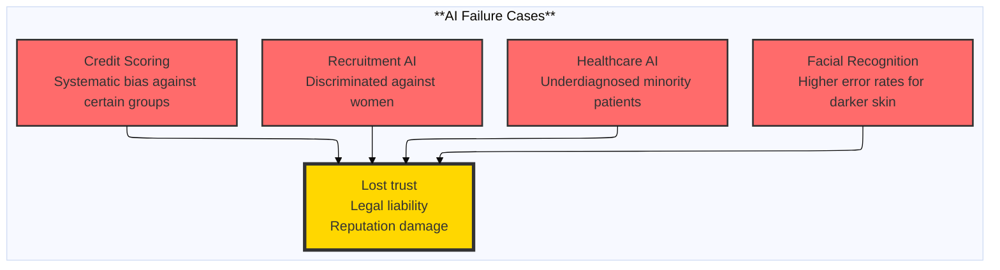

# They're not.

```mermaid
---
config:
  theme: base
  layout: elk
---
graph TD
    subgraph "**AI Failure Cases**"
        A[Recruitment AI<br/>Discriminated against women] --> C[Lost trust<br/>Legal liability<br/>Reputation damage]
        B[Healthcare AI<br/>Underdiagnosed minority patients] --> C
        D[Facial Recognition<br/>Higher error rates for darker skin] --> C
        E[Credit Scoring<br/>Systematic bias against certain groups] --> C
    end
    
    style A fill:#ff6b6b,stroke:#333,stroke-width:2px
    style B fill:#ff6b6b,stroke:#333,stroke-width:2px
    style D fill:#ff6b6b,stroke:#333,stroke-width:2px
    style E fill:#ff6b6b,stroke:#333,stroke-width:2px
    style C fill:#ffd700,stroke:#333,stroke-width:4px
```
