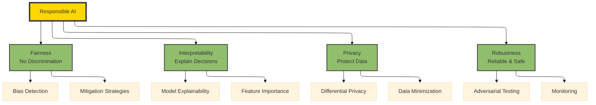

# ## 🎮 The Four Pillars of Responsible AI

```mermaid
---
config:
  theme: base
  layout: elk
---
graph TD
    A[Responsible AI] --> B[Fairness<br/>No Discrimination]
    A --> C[Interpretability<br/>Explain Decisions]
    A --> D[Privacy<br/>Protect Data]
    A --> E[Robustness<br/>Reliable & Safe]
    
    B --> B1[Bias Detection]
    B --> B2[Mitigation Strategies]
    
    C --> C1[Model Explainability]
    C --> C2[Feature Importance]
    
    D --> D1[Differential Privacy]
    D --> D2[Data Minimization]
    
    E --> E1[Adversarial Testing]
    E --> E2[Monitoring]
    
    style A fill:#ffd700,stroke:#333,stroke-width:4px
    style B fill:#90be6d,stroke:#333,stroke-width:2px
    style C fill:#90be6d,stroke:#333,stroke-width:2px
    style D fill:#90be6d,stroke:#333,stroke-width:2px
    style E fill:#90be6d,stroke:#333,stroke-width:2px
```
