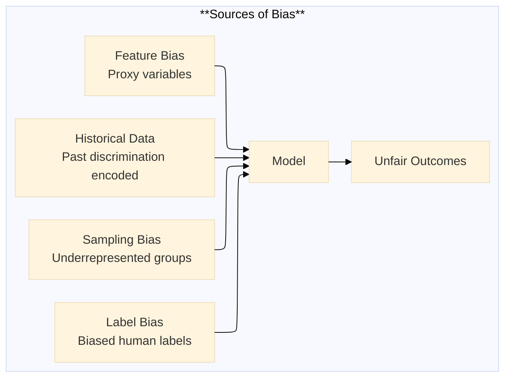

# ### Where Does Bias Come From?

```mermaid
---
config:
  theme: base
  layout: elk
---
graph LR
    subgraph "**Sources of Bias**"
        D[Historical Data<br/>Past discrimination encoded] --> M[Model]
        S[Sampling Bias<br/>Underrepresented groups] --> M
        L[Label Bias<br/>Biased human labels] --> M
        F[Feature Bias<br/>Proxy variables] --> M
        M --> U[Unfair Outcomes]
    end
```
