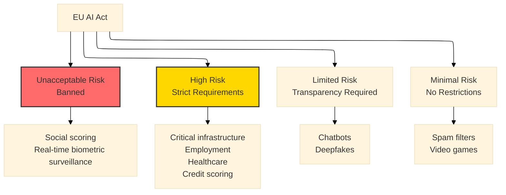

# ### EU AI Act – Risk Categories

```mermaid
---
config:
  theme: base
  layout: elk
---
graph TD
    A[EU AI Act] --> B[Unacceptable Risk<br/>Banned]
    A --> C[High Risk<br/>Strict Requirements]
    A --> D[Limited Risk<br/>Transparency Required]
    A --> E[Minimal Risk<br/>No Restrictions]
    
    B --> B1[Social scoring<br/>Real-time biometric surveillance]
    C --> C1[Critical infrastructure<br/>Employment<br/>Healthcare<br/>Credit scoring]
    D --> D1[Chatbots<br/>Deepfakes]
    E --> E1[Spam filters<br/>Video games]
    
    style B fill:#ff6b6b,stroke:#333,stroke-width:2px
    style C fill:#ffd700,stroke:#333,stroke-width:2px
```
