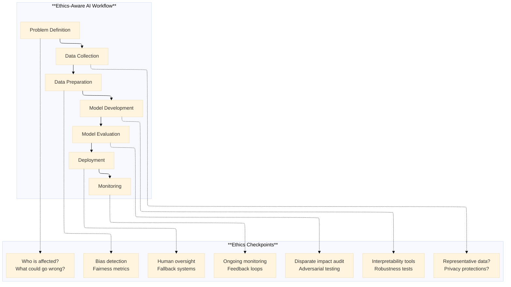

# Integrate ethics into every stage of your AI workf

```mermaid
---
config:
  theme: base
  layout: elk
---
graph TD
    subgraph "**Ethics-Aware AI Workflow**"
        A[Problem Definition] --> B[Data Collection]
        B --> C[Data Preparation]
        C --> D[Model Development]
        D --> E[Model Evaluation]
        E --> F[Deployment]
        F --> G[Monitoring]
    end
    
    subgraph "**Ethics Checkpoints**"
        A1[Who is affected?<br/>What could go wrong?]
        B1[Representative data?<br/>Privacy protections?]
        C1[Bias detection<br/>Fairness metrics]
        D1[Interpretability tools<br/>Robustness tests]
        E1[Disparate impact audit<br/>Adversarial testing]
        F1[Human oversight<br/>Fallback systems]
        G1[Ongoing monitoring<br/>Feedback loops]
    end
    
    A -.-> A1
    B -.-> B1
    C -.-> C1
    D -.-> D1
    E -.-> E1
    F -.-> F1
    G -.-> G1
```
