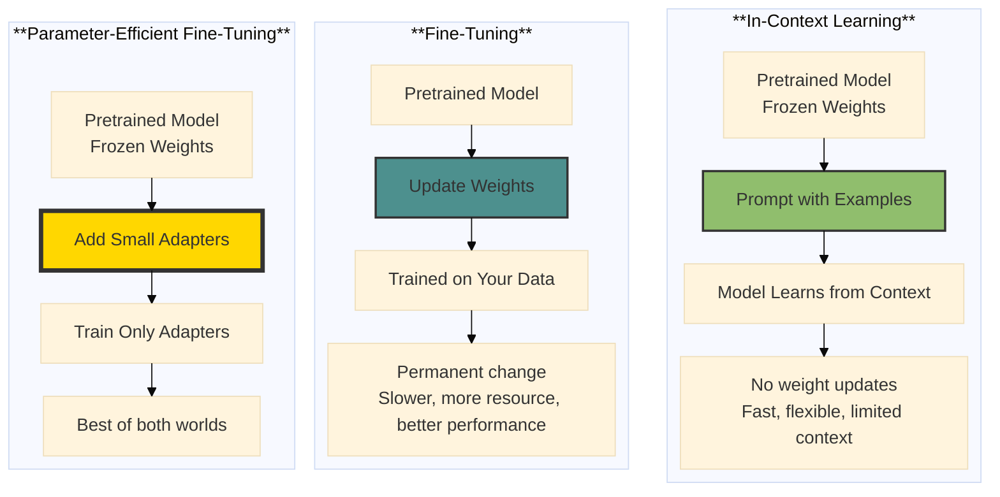

# When you have a pretrained model, you have two way

```mermaid
---
config:
  theme: base
  layout: elk
---
graph TD
    subgraph "**In-Context Learning**"
        P[Pretrained Model<br/>Frozen Weights] --> I[Prompt with Examples]
        I --> O[Model Learns from Context]
        O --> R[No weight updates<br/>Fast, flexible, limited context]
    end
    
    subgraph "**Fine-Tuning**"
        P2[Pretrained Model] --> F[Update Weights]
        F --> T[Trained on Your Data]
        T --> R2[Permanent change<br/>Slower, more resource, better performance]
    end
    
    subgraph "**Parameter-Efficient Fine-Tuning**"
        P3[Pretrained Model<br/>Frozen Weights] --> L[Add Small Adapters]
        L --> A[Train Only Adapters]
        A --> B[Best of both worlds]
    end
    
    style I fill:#90be6d,stroke:#333,stroke-width:2px
    style F fill:#4d908e,stroke:#333,stroke-width:2px
    style L fill:#ffd700,stroke:#333,stroke-width:4px
```
