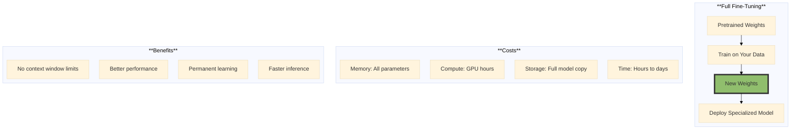

# Fine-tuning updates the model's weights to special

```mermaid
---
config:
  theme: base
  layout: elk
---
graph TD
    subgraph "**Full Fine-Tuning**"
        P[Pretrained Weights] --> T[Train on Your Data]
        T --> N[New Weights]
        N --> D[Deploy Specialized Model]
    end
    
    subgraph "**Costs**"
        C1[Compute: GPU hours]
        C2[Storage: Full model copy]
        C3[Memory: All parameters]
        C4[Time: Hours to days]
    end
    
    subgraph "**Benefits**"
        B1[Better performance]
        B2[Permanent learning]
        B3[No context window limits]
        B4[Faster inference]
    end
    
    style N fill:#90be6d,stroke:#333,stroke-width:4px
```
